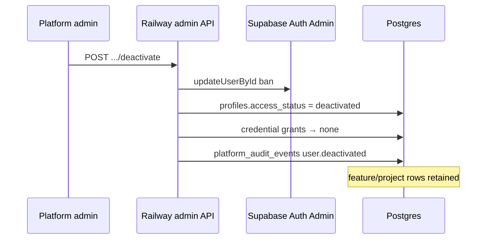

# Admin Data and API Contracts — Governance Scope

**Version:** 2.1  
Parent: [PRODUCTION_ADMIN_DASHBOARD_ARCHITECTURE.md](./PRODUCTION_ADMIN_DASHBOARD_ARCHITECTURE.md)

---

## 1. Existing structures (reuse)

| Object | Use |
|--------|-----|
| `user_roles`, `has_role()` | Platform admin only (`admin` — not `moderator`) |
| `profiles` | User directory; add `access_status` |
| `project_team_members`, `project_invitations` | Project access |
| `has_project_access`, `has_project_editor_access`, `has_project_admin_access` | Membership gates (unchanged semantics) |
| `tenant_memberships` | Feeds `has_project_access` only — **not** admin grant tables |
| `admin_list_member_directory()` | Directory listing (1 existing admin RPC) |
| `portal_credentials` | Encrypted storage; creator metadata only |
| `portal-credentials.routes.js` | 4 routes — extend with grant checks |
| `admin_activity_log` | Legacy read-only in Audit |

---

## 2. New / altered schema

### 2.1 `profiles.access_status` (alter)

| Column | Type | Notes |
|--------|------|-------|
| `access_status` | `TEXT NOT NULL DEFAULT 'active'` | `CHECK (access_status IN ('active', 'deactivated'))` |

### 2.2 `platform_audit_events`

| Column | Type | Notes |
|--------|------|-------|
| `id` | UUID PK | |
| `correlation_id` | TEXT | |
| `actor_id` | UUID | |
| `action` | TEXT | e.g. `feature_permission.changed`, `user.deactivated` |
| `target_type` | TEXT | user, project, credential, … |
| `target_id` | TEXT | |
| `project_id` | UUID nullable | |
| `feature_key` | TEXT nullable | |
| `before_json` | JSONB | **No secrets** |
| `after_json` | JSONB | **No secrets** |
| `result` | TEXT | success/failure |
| `created_at` | TIMESTAMPTZ | |

RLS: platform admin SELECT; inserts via SECURITY DEFINER only.

### 2.3 `user_feature_permissions`

| Column | Type | Notes |
|--------|------|-------|
| `id` | UUID PK | |
| `user_id` | UUID FK | |
| `project_id` | UUID FK nullable | NULL = platform default template |
| `feature_key` | TEXT | |
| `access_level` | TEXT | **`none` \| `read` \| `write` only** |
| `granted_by` | UUID | |
| `created_at`, `updated_at` | TIMESTAMPTZ | |

UNIQUE `(user_id, project_id, feature_key)`.

### 2.4 `user_scraped_data_scope`

| Column | Type | Notes |
|--------|------|-------|
| `id` | UUID PK | |
| `user_id` | UUID FK | |
| `scope_type` | TEXT | `project`, `jurisdiction`, `portal_source` |
| `scope_ref` | TEXT | UUID or slug |
| `granted_by` | UUID | |
| `created_at` | TIMESTAMPTZ | |

**No `tenant` scope_type.**

### 2.5 `user_portal_credential_grants`

| Column | Type | Notes |
|--------|------|-------|
| `id` | UUID PK | |
| `user_id` | UUID FK | Grant holder |
| `credential_id` | UUID FK → portal_credentials | |
| `grant_level` | TEXT | **`none` \| `use` \| `manage` only** |
| `project_id` | UUID nullable | Scope |
| `jurisdiction` | TEXT nullable | Scope |
| `granted_by` | UUID | |
| `created_at`, `updated_at` | TIMESTAMPTZ | |

UNIQUE `(user_id, credential_id)`.

**Authorization:** sole source for credential access. `portal_credentials.user_id` not used in access checks.

### 2.6 `user_access_reviews` (Phase 2)

| Column | Type |
|--------|------|
| `user_id` | UUID |
| `reviewed_by` | UUID |
| `reviewed_at` | TIMESTAMPTZ |

---

## 3. New RPCs and functions

| RPC / function | Purpose |
|----------------|---------|
| `is_user_active(p_user_id UUID)` | Returns false when deactivated |
| `admin_get_effective_permissions(p_user_id)` | JSON effective view |
| `admin_set_feature_permission(...)` | Upsert `none`/`read`/`write` + audit |
| `admin_set_scraped_data_scope(...)` | Upsert scope + audit |
| `admin_set_credential_grant(...)` | Upsert `none`/`use`/`manage` + audit; revocable from creator |
| `admin_deactivate_user(p_user_id, p_reason)` | Ban + status + revoke credential grants + audit |
| `admin_activate_user(p_user_id, p_reason)` | Unban + status + audit |
| `admin_copy_permissions(p_from, p_to)` | Bulk template |
| `admin_list_audit_events(filters, cursor)` | Paginated audit |
| `admin_overview_metrics()` | Overview KPIs |
| `assert_feature_access(p_user, p_project, p_feature, p_level)` | Product enforcement |
| `assert_credential_grant(p_user, p_credential, p_level)` | Grant check (not owner) |
| `assert_credential_use(p_user, p_credential, p_purpose)` | Use + audit |
| `assert_scraped_data_access(p_user, p_project, p_jurisdiction?, p_source?)` | Scope check |

---

## 4. RLS changes

| Table | Change |
|-------|--------|
| `portal_credentials` | Replace owner-only SELECT/UPDATE/DELETE with grant-level checks via `assert_credential_grant` |
| `projects` | portal_data reads via `assert_scraped_data_access` wrapper |
| `scrape_jobs` | Existing project access + `assert_feature_access(..., 'scraper.run', ...)` |

**Pattern:** SECURITY DEFINER functions; avoid complex JSON RLS.

---

## 5. Railway Admin API `/api/admin/v1`

**Auth:** Bearer JWT + `requirePlatformAdmin` + `is_user_active`.

| Method | Path | Purpose |
|--------|------|---------|
| GET | `/overview` | Metrics + risks |
| GET | `/access/users` | Paginated directory |
| GET | `/access/users/:id/effective` | Effective permissions JSON |
| POST | `/access/users/:id/activate` | Unban + `access_status=active` + audit |
| POST | `/access/users/:id/deactivate` | Ban + deactivate + revoke credential grants + audit |
| POST | `/access/users/:id/platform-role` | Grant/revoke admin |
| PUT | `/access/users/:id/projects/:projectId/role` | Project role |
| PUT | `/access/users/:id/features` | Batch feature permissions |
| PUT | `/access/users/:id/scraped-data-scope` | Scope rows |
| PUT | `/access/users/:id/credential-grants` | Grant rows (revoke creator) |
| POST | `/access/users/:id/copy-from/:sourceId` | Template copy |
| GET | `/access/export` | CSV (no secrets) |
| GET | `/audit/events` | Paginated audit |
| GET | `/audit/export` | CSV |

**Deactivation implementation:** Railway service-role client calls `supabase.auth.admin.updateUserById` + RPC `admin_deactivate_user`.

Platform settings continue existing Supabase direct calls from retained components.

---

## 6. Credential flows

### 6.1 Create (bootstrap grant)

On `POST /api/portal-credentials` success:

1. Insert `portal_credentials` row (`user_id` = creator metadata)
2. Insert `user_portal_credential_grants(creator, credential_id, 'manage')`
3. Audit `credential.manage.created`

### 6.2 Use (backend only)

```
Product → Railway → assert_credential_use → service-role fetch → decrypt → scrape
                  → platform_audit_events (credential.use)
                  → password NEVER in response
```

### 6.3 Admin revoke creator

```
Admin UI → PUT /api/admin/v1/access/users/:creatorId/credential-grants
         → grant_level = 'none'
         → creator loses manage; credential row remains
```

---

## 7. Deactivation sequence



Reactivation reverses ban + status only; grants require explicit re-assignment.

---

## 8. Indexes

| Index | Table |
|-------|-------|
| `(user_id, project_id)` | user_feature_permissions |
| `(user_id, scope_type)` | user_scraped_data_scope |
| `(credential_id)`, `(user_id)` | user_portal_credential_grants |
| `(created_at DESC)` | platform_audit_events |
| `(access_status)` | profiles |

---

## 9. Not building

- Tenant-level grant tables
- `moderator` admin UI or permissions
- Admin ops endpoints (scrape queues, ingestion, billing ops)
- Credential password in API or audit
- Owner-based credential authorization
