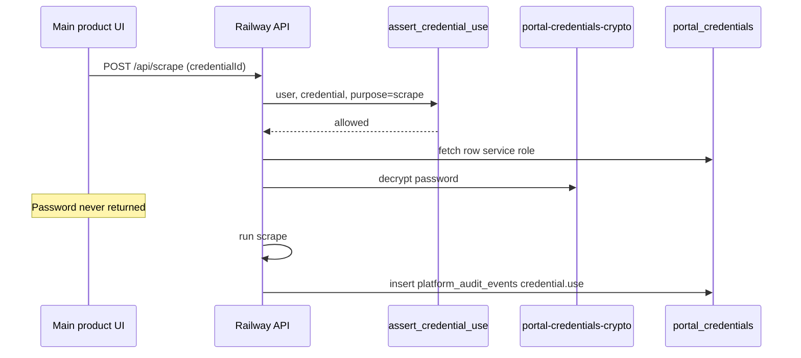
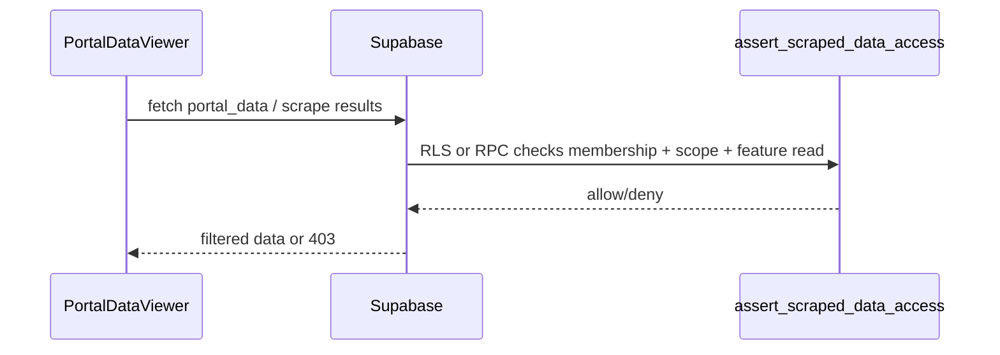

# Admin Data and API Contracts — Governance Scope

Parent: [PRODUCTION_ADMIN_DASHBOARD_ARCHITECTURE.md](./PRODUCTION_ADMIN_DASHBOARD_ARCHITECTURE.md)

---

## 1. Existing structures (reuse)

| Object | Use |
|--------|-----|
| `user_roles`, `has_role()` | Platform admin |
| `profiles` | User directory |
| `project_team_members`, `project_invitations` | Project access |
| `has_project_access`, `has_project_editor_access`, `has_project_admin_access` | Membership gates |
| `admin_list_member_directory()` | Directory listing |
| `portal_credentials` | Credential storage (encrypted password column) |
| `portal-credentials.routes.js` | Extend with grant checks |
| `admin_activity_log` | Legacy read-only in Audit |

---

## 2. New tables (migrations required)

### 2.1 `platform_audit_events`

| Column | Type | Notes |
|--------|------|-------|
| `id` | UUID PK | |
| `correlation_id` | TEXT | |
| `actor_id` | UUID | |
| `action` | TEXT | e.g. `feature_permission.changed` |
| `target_type` | TEXT | user, project, credential, … |
| `target_id` | TEXT | |
| `project_id` | UUID nullable | |
| `feature_key` | TEXT nullable | |
| `before_json` | JSONB | No secrets |
| `after_json` | JSONB | No secrets |
| `result` | TEXT | success/failure |
| `created_at` | TIMESTAMPTZ | |

Index: `(created_at DESC, action)`, `(actor_id, created_at DESC)`.

RLS: platform admin SELECT; inserts via SECURITY DEFINER only.

### 2.2 `user_feature_permissions`

| Column | Type | Notes |
|--------|------|-------|
| `id` | UUID PK | |
| `user_id` | UUID FK | |
| `project_id` | UUID FK nullable | NULL = global template |
| `feature_key` | TEXT | |
| `access_level` | SMALLINT | 0 none, 1 read, 2 write, -1 deny optional |
| `granted_by` | UUID | |
| `created_at`, `updated_at` | TIMESTAMPTZ | |

UNIQUE `(user_id, project_id, feature_key)`.

### 2.3 `user_scraped_data_scope`

| Column | Type | Notes |
|--------|------|-------|
| `id` | UUID PK | |
| `user_id` | UUID FK | |
| `scope_type` | TEXT | project, jurisdiction, portal_source |
| `scope_ref` | TEXT | UUID or slug |
| `granted_by` | UUID | |
| `created_at` | TIMESTAMPTZ | |

### 2.4 `user_portal_credential_grants`

| Column | Type | Notes |
|--------|------|-------|
| `id` | UUID PK | |
| `user_id` | UUID FK | |
| `credential_id` | UUID FK → portal_credentials | |
| `grant_level` | SMALLINT | 0 none, 1 use, 2 manage |
| `project_id` | UUID nullable | Scope |
| `jurisdiction` | TEXT nullable | Scope |
| `granted_by` | UUID | |
| `created_at`, `updated_at` | TIMESTAMPTZ | |

UNIQUE `(user_id, credential_id)`.

### 2.5 `user_access_reviews` (optional Phase 2)

| Column | Type |
|--------|------|
| `user_id` | UUID |
| `reviewed_by` | UUID |
| `reviewed_at` | TIMESTAMPTZ |

---

## 3. New RPCs

| RPC | Purpose |
|-----|---------|
| `admin_get_effective_permissions(p_user_id)` | JSON effective view |
| `admin_set_feature_permission(...)` | Upsert with audit |
| `admin_set_scraped_data_scope(...)` | Upsert with audit |
| `admin_set_credential_grant(...)` | Upsert with audit |
| `admin_copy_permissions(p_from, p_to)` | Bulk template |
| `admin_list_audit_events(filters, cursor)` | Paginated audit |
| `admin_overview_metrics()` | Overview KPIs |
| `assert_feature_access(p_user, p_project, p_feature, p_level)` | Product enforcement |
| `assert_credential_use(p_user, p_credential, p_purpose)` | Railway helper |

---

## 4. RLS changes (product tables)

| Table | Change |
|-------|--------|
| `portal_credentials` | SELECT: owner OR grant use/manage OR platform admin via RPC |
| `projects` | portal_data read via RPC wrapper or policy using scope function |
| `scrape_jobs` | Existing project access + `scraper.results` feature check |

**Pattern:** Add `SECURITY DEFINER` functions rather than complex RLS on JSON columns where possible.

---

## 5. Railway Admin API `/api/admin/v1`

**Auth:** Bearer Supabase JWT + `requirePlatformAdmin`.

| Method | Path | Purpose |
|--------|------|---------|
| GET | `/overview` | Overview metrics + risks |
| GET | `/access/users` | Paginated directory |
| GET | `/access/users/:id/effective` | Effective permissions JSON |
| POST | `/access/users/:id/activate` | Activate |
| POST | `/access/users/:id/deactivate` | Deactivate |
| POST | `/access/users/:id/platform-role` | Grant/revoke admin |
| PUT | `/access/users/:id/projects/:projectId/role` | Project role |
| PUT | `/access/users/:id/features` | Batch feature permissions |
| PUT | `/access/users/:id/scraped-data-scope` | Scope rows |
| PUT | `/access/users/:id/credential-grants` | Grant rows |
| POST | `/access/users/:id/copy-from/:sourceId` | Template copy |
| GET | `/access/export` | CSV |
| GET | `/audit/events` | Paginated audit |
| GET | `/audit/export` | CSV |

Platform settings (jurisdictions, notifications) continue using **existing Supabase direct calls** from retained components until migrated.

---

## 6. Credential use flow (backend only)

---

## 7. Scraped-data read flow

---

## 8. Indexes

| Index | Table |
|-------|-------|
| `(user_id, project_id)` | user_feature_permissions |
| `(user_id, scope_type)` | user_scraped_data_scope |
| `(credential_id)` | user_portal_credential_grants |
| `(created_at DESC)` | platform_audit_events |

---

## 9. What we are not building

- Admin endpoints for scrape jobs, ingestion, filing, billing operations
- Service-role key in frontend
- Credential password in audit JSON or API responses
