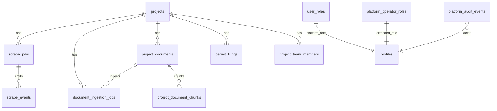
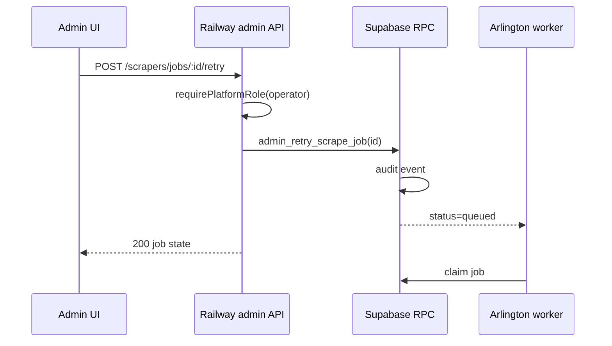

# Admin Data and API Contracts

Parent: [PRODUCTION_ADMIN_DASHBOARD_ARCHITECTURE.md](./PRODUCTION_ADMIN_DASHBOARD_ARCHITECTURE.md)

---

## 1. Data architecture principles

| Principle | Implementation |
|-----------|----------------|
| Server-side aggregation | SQL views + RPCs; Railway admin API composes |
| Pagination | Keyset on `(created_at, id)` for job tables |
| Project scoping | All queries filter `tenant_id` / project access unless platform_admin |
| No browser service-role | Frontend uses user JWT only |
| Realtime | Subscribe to `scrape_jobs`, `document_ingestion_jobs` for ops tables |
| Retention | Job rows 90d hot; archive to `scrape_jobs_archive` (future) |

---

## 2. Entity relationship (operational core)

---

## 3. Existing tables (reuse)

| Table | Admin use |
|-------|-----------|
| `scrape_jobs`, `scrape_events` | E Scraper ops |
| `document_ingestion_jobs` | H Ingestion |
| `project_documents`, `project_document_chunks` | G, H, J |
| `permit_filings`, `agent_runs` | F Filing |
| `projects`, `project_team_members`, `project_invitations` | B, C |
| `user_roles`, `profiles` | C Access |
| `admin_activity_log` | Historical import to Q |
| `portal_credentials` | D, G — metadata only |
| `jurisdictions` | D |
| `microsoft_mailbox_connections` | L — status only |
| QuickBooks connection table (encrypted) | K — status via API |
| UCI coordination tables | M |

---

## 4. New database objects (migrations)

| Object | Type | Purpose |
|--------|------|---------|
| `platform_operator_roles` | table | Extended platform roles |
| `platform_feature_flags` | table | Server feature flags |
| `platform_audit_events` | table | Unified audit |
| `integration_health_snapshots` | table | Integration module |
| `platform_health_heartbeats` | table | Worker/API heartbeats |
| `jurisdiction_maintenance` | table | D maintenance mode |
| `scraper_schedules` | table | E cron definitions (future cron runner) |
| `admin_v_scrape_jobs_list` | view | Paginated scrape list with project name |
| `admin_v_ingestion_jobs_list` | view | Paginated ingestion list |
| `admin_v_project_ops_summary` | view | B project directory KPIs |
| `admin_v_integration_status` | view | N card data |

### `platform_audit_events` (canonical)

| Column | Type |
|--------|------|
| `id` | UUID PK |
| `correlation_id` | TEXT |
| `actor_id` | UUID FK |
| `actor_role` | TEXT |
| `environment` | TEXT default `production` |
| `project_id` | UUID nullable |
| `module` | TEXT |
| `action` | TEXT |
| `target_type` | TEXT |
| `target_id` | TEXT |
| `before_json` | JSONB nullable — no secrets |
| `after_json` | JSONB nullable |
| `result` | TEXT — success/failure |
| `failure_code` | TEXT nullable |
| `ip_address` | INET nullable |
| `created_at` | TIMESTAMPTZ |

**Reuse:** Migrate new writes from `admin_activity_log` pattern; keep old table read-only.

---

## 5. RPC catalog (Supabase)

| RPC | Purpose | Auth |
|-----|---------|------|
| `admin_list_scrape_jobs(p_filter, p_cursor, p_limit)` | E job list | platform role |
| `admin_list_ingestion_jobs(...)` | H queue | platform role |
| `admin_project_ops_summary(...)` | B directory | platform role |
| `admin_grant_platform_role(...)` | C | platform_admin |
| `admin_revoke_platform_role(...)` | C | platform_admin + final-admin guard |
| `admin_append_audit_event(...)` | All mutations | SECURITY DEFINER internal |
| `admin_list_audit_events(...)` | Q | auditor+ |
| Existing `admin_list_member_directory()` | C | admin — **keep** |

---

## 6. Railway Admin API `/api/admin/v1`

**Auth header:** `Authorization: Bearer <supabase_jwt>`  
**Middleware:** `requirePlatformRole(minRole)`  
**Rate limit:** 120 req/min per user (configurable)

### 6.1 Overview and health

| Method | Path | Purpose | Response highlights |
|--------|------|---------|---------------------|
| GET | `/overview` | Command center | `{ healthScore, incidents[], jobCounts, integrationSummary, recentActivity[] }` |
| GET | `/health/services` | O module | `{ services: [{ name, status, lastHeartbeat, version }] }` |
| GET | `/health/queues` | Queue depth | `{ scrape: { pending, oldestAge }, ingestion: {...} }` |

### 6.2 Projects

| Method | Path | Purpose |
|--------|------|---------|
| GET | `/projects` | Paginated directory with ops columns |
| GET | `/projects/:id/timeline` | Unified event stream |
| PATCH | `/projects/:id/archive` | Soft archive |

### 6.3 Access

| Method | Path | Purpose |
|--------|------|---------|
| GET | `/access/users` | User directory |
| POST | `/access/invites` | Platform invite |
| POST | `/access/users/:id/roles` | Grant platform role |
| DELETE | `/access/users/:id/roles/:role` | Revoke |
| POST | `/access/users/:id/deactivate` | Deactivate |

### 6.4 Scrapers

| Method | Path | Purpose | Idempotent |
|--------|------|---------|------------|
| GET | `/scrapers/jobs` | List/filter | — |
| GET | `/scrapers/jobs/:id` | Detail + events | — |
| POST | `/scrapers/jobs/:id/retry` | Retry | Yes |
| POST | `/scrapers/jobs/:id/cancel` | Cancel | Yes |
| POST | `/scrapers/jobs/:id/acknowledge` | Ack partial | Yes |
| POST | `/scrapers/run` | Manual enqueue | No |
| GET | `/scrapers/schedules` | List schedules | — |
| PATCH | `/scrapers/schedules/:id` | Enable/disable | — |

### 6.5 Ingestion

| Method | Path | Purpose |
|--------|------|---------|
| GET | `/ingestion/jobs` | Queue list |
| POST | `/ingestion/enqueue` | `{ documentId }` |
| POST | `/ingestion/jobs/:id/retry` | Retry |
| POST | `/ingestion/documents/:id/reindex` | Re-index |

### 6.6 Filing, documents, billing, integrations

| Method | Path | Purpose |
|--------|------|---------|
| GET | `/filing` | Filing queue |
| GET | `/documents` | Cross-project inventory |
| GET | `/billing/summary` | QB + milestone summary (no secrets) |
| POST | `/billing/projects/:id/reconcile-uncertain` | QB reconcile |
| GET | `/integrations` | All integration cards |
| POST | `/integrations/:key/test` | Probe |

### 6.7 Config and audit

| Method | Path | Purpose |
|--------|------|---------|
| GET | `/config/flags` | List server flags |
| PATCH | `/config/flags/:key` | Toggle with reason |
| GET | `/audit/events` | Paginated audit |
| GET | `/audit/export` | CSV export |

### 6.8 Error codes

| Code | HTTP | Meaning |
|------|------|---------|
| `ADMIN_FORBIDDEN` | 403 | Insufficient platform role |
| `ADMIN_NOT_FOUND` | 404 | Resource missing |
| `ADMIN_CONFLICT` | 409 | Idempotency / state conflict |
| `ADMIN_FINAL_ADMIN` | 409 | Last admin protection |
| `ADMIN_PROVIDER_BLOCKED` | 502 | External provider blocked |
| `ADMIN_RETRY_NOT_ALLOWED` | 422 | State not retryable |

---

## 7. Edge Functions (admin-related)

| Function | Admin use | Change |
|----------|-----------|--------|
| `admin-drip-campaigns` | P notifications | Add platform role check in code |
| `shadow-metrics` | Dev only | No change |
| `ingest-project-document` | H enqueue target | Called by admin API |
| `generate-grounded-response` | J regenerate | Called via admin proxy |

**Security backlog PP-004:** Audit all Edge Functions `verify_jwt = false` — admin must not bypass.

---

## 8. Refresh and realtime strategy

| Module | Strategy |
|--------|----------|
| Command Center | Poll 60s + Realtime on job inserts |
| Scraper jobs | Realtime on `scrape_jobs` UPDATE + poll fallback 30s |
| Ingestion | Realtime on `document_ingestion_jobs` |
| Integrations | Poll 5min + manual test |
| Audit | Poll on filter change only |

---

## 9. Indexes required

| Index | Table | Columns |
|-------|-------|---------|
| `idx_scrape_jobs_admin_list` | scrape_jobs | `(created_at DESC, id)` WHERE status != completed |
| `idx_scrape_jobs_stale` | scrape_jobs | `(last_heartbeat_at)` WHERE status IN (running, resuming) |
| `idx_ingestion_jobs_admin` | document_ingestion_jobs | `(created_at DESC, status)` |
| `idx_audit_events_admin` | platform_audit_events | `(created_at DESC, module, action)` |

---

## 10. Data flow: scrape retry

