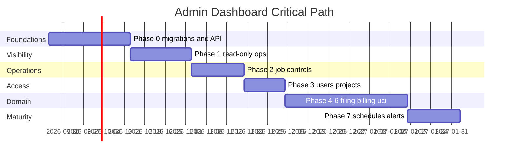

# Admin Dashboard Implementation Roadmap

**Target:** Complete architecture in [PRODUCTION_ADMIN_DASHBOARD_ARCHITECTURE.md](./PRODUCTION_ADMIN_DASHBOARD_ARCHITECTURE.md)  
**Method:** AI-assisted engineering with human review of security, portals, and production verification

Parent documents: all `ADMIN_*.md` in this folder.

---

## 1. Shared foundations (Phase 0) — build first

| Deliverable | Description |
|-------------|-------------|
| F-01 | `platform_operator_roles`, `platform_audit_events`, `platform_feature_flags` migrations |
| F-02 | Railway `admin.routes.js` + `requirePlatformRole` middleware |
| F-03 | `AdminShell` layout, nav tree, environment banner |
| F-04 | Admin API client + TanStack Query hooks pattern |
| F-05 | Operational SQL views (`admin_v_*`) |
| F-06 | Liveness route `/api/admin/v1/health/live` |
| F-07 | Heartbeat writer in workers |
| F-08 | Authorization integration test harness |

**Phase 0 AI-assisted estimate**

| Task | Build | Test/UAT | Deploy/docs | Total h | Confidence |
|------|------:|---------:|------------:|--------:|------------|
| DB migrations + RPCs | 16 | 8 | 4 | 28 | Medium |
| Admin API middleware + skeleton | 20 | 12 | 4 | 36 | Medium |
| AdminShell + routing | 24 | 8 | 4 | 36 | High |
| Views + overview endpoint | 16 | 8 | 4 | 28 | Medium |
| Heartbeats + health | 12 | 6 | 4 | 22 | Medium |
| **Phase 0 total** | **88** | **42** | **20** | **150** | **Medium** |

Calendar: **4–5 weeks** at 30–40 h/wk · **8–10 weeks** at 15–20 h/wk

---

## 2. Phase 1 — Command Center + read-only ops visibility

**Modules:** A Command Center, O System Health (read-only), E Scraper jobs (read-only), H Ingestion (read-only), N Integrations (status cards)

| Module | Delivered |
|--------|-----------|
| A | Overview page, incident ack (basic), activity feed |
| O | Service health table, queue depth |
| E | Cross-project job list, filters, detail drawer (events) |
| H | Ingestion queue list |
| N | Integration status from snapshots |

Redirects: link Dashboard scrape widget → E

**Phase 1 incremental hours:** 120 (build 70, test 30, deploy/docs 20)

**Cumulative after Phase 1:** ~270 h

---

## 3. Phase 2 — Controlled scraper and ingestion operations

**Modules:** E (write: retry, cancel, ack), H (enqueue, retry, reindex), D maintenance mode, Q Audit (read new events)

| Control IDs | SCR-002–005, ING-001–004, SCR-007 |
|-------------|-------------------------------------|
| Feature flags | Migrate localStorage → server (CFG-001/002) |
| Audit viewer | Replace old admin audit page |

**Phase 2 incremental hours:** 100

**Cumulative:** ~370 h

---

## 4. Phase 3 — Users, access, projects

**Modules:** C Users and Access (full), B Projects directory + timeline

| Migrations | Final-admin RPC guards |
|------------|------------------------|
| Merge | `/admin/members`, remove authorizations placeholder |

**Phase 3 incremental hours:** 80

**Cumulative:** ~450 h

---

## 5. Phase 4 — Documents, filing, billing ops

**Modules:** G Documents, F Filing queue, K QuickBooks ops (status, uncertain reconcile, safe retry UI)

| Deprecate | `/operations` mock panels → redirect |
|-----------|--------------------------------------|
| Integrate | Existing QB dry-run/live trigger with admin wrapper |

**Phase 4 incremental hours:** 110

**Cumulative:** ~560 h

---

## 6. Phase 5 — Communications, response matrix, code analyzer

**Modules:** L Communications, J Response Matrix, I Code Analyzer admin views

| Replace | `/permit-queue`, `/messages` placeholders |

**Phase 5 incremental hours:** 90

**Cumulative:** ~650 h

---

## 7. Phase 6 — UCI admin, config, capacity

**Modules:** M UCI (with readiness banner), P Configuration (notifications merge from AdminPanel), R Backups/capacity informational

| Merge | uci-action-tracker, AdminPanel notification tools |

**Phase 6 incremental hours:** 70

**Cumulative:** ~720 h

---

## 8. Phase 7 — Schedules, metrics, alerting automation

**Modules:** E schedules (SCR-006), daily metrics aggregates, email alerts (ALT Phase 2)

| Optional | Scraper schedule cron runner on Railway |

**Phase 7 incremental hours:** 80

**Cumulative:** ~800 h

---

## 9. Complete architecture totals

| Metric | Optimistic | Realistic | Upper bound |
|--------|----------:|----------:|------------:|
| AI-assisted engineering | 620 h | **780 h** | 960 h |
| Calendar @ 30–40 h/wk | 16 wk | **20–22 wk** | 28 wk |
| Calendar @ 15–20 h/wk | 31 wk | **39–44 wk** | 56 wk |

**Note:** External portal UAT and Edge Function security audit (PP-004) add parallel calendar time, not all engineering hours.

---

## 10. Critical path

**Blockers:** PP-001 Supabase env fix merge (affects all admin Supabase reads); PP-004 Edge auth review.

---

## 11. Parallel workstreams (after Phase 0)

| Stream | Can parallelize with |
|--------|---------------------|
| Frontend module UI | Backend endpoints per module |
| SQL views | RPC implementation |
| Integration probes | N module cards |
| UCI admin (Phase 6) | Phases 4–5 if separate developer |

---

## 12. Recommended first implementation slice

**After architecture approval, start Phase 0 then immediately Phase 1:**

1. Phase 0 weeks 1–3: migrations, admin API skeleton, AdminShell
2. Phase 1 weeks 4–6: Command Center + read-only scrape/ingestion/health

**First user-visible outcome:** Platform operator opens `/admin`, sees production health, all active scrape and ingestion jobs across projects, integration status — without SQL or Railway CLI.

**Not in first slice:** Role management writes, live QB retry, UCI live gate, filing submit.

---

## 13. Testing plan per phase

| Phase | Tests |
|-------|-------|
| 0 | Auth middleware unit; RPC role guards; migration rollback dry-run |
| 1 | Integration: overview API; pagination; Realtime subscription |
| 2 | Idempotency retry/cancel; audit event inserted |
| 3 | Final-admin protection; invitation flow |
| 4 | QB reconcile; filing list accuracy |
| 5 | RAG regenerate proxy auth |
| 6 | UCI banner; flag toggle audit |
| 7 | Alert trigger simulation |

**Production smoke:** platform_admin → Command Center → filter failed scrape jobs → open detail → verify events load.

---

## 14. Production acceptance checklist

### Functional
- [ ] All 18 nav modules reachable (developer routes excluded)
- [ ] Zero mock data badges in admin modules
- [ ] Every control in registry has working backend
- [ ] Pagination on all tables >50 rows

### Security
- [ ] Pen test: non-admin JWT rejected on all admin API routes
- [ ] RLS: project user cannot call admin RPCs
- [ ] No secret in network responses (verified by scan)
- [ ] Final-admin protection tested

### Operational
- [ ] Stale job appears within 15min test
- [ ] Heartbeat loss surfaces ALT-004
- [ ] Environment banner on all pages

### Quality
- [ ] ≥80% route coverage on admin API auth tests
- [ ] Rollback plan documented per migration
- [ ] Operator runbook in `docs/admin-dashboard/RUNBOOK.md` (create at Phase 1)

---

## 15. Documentation deliverables per phase

| Phase | Docs |
|-------|------|
| 0 | API OpenAPI fragment; migration notes |
| 1 | Operator runbook draft |
| 2 | Scraper ops procedures |
| 3 | Access management guide |
| 4 | Billing ops + QB reconciliation |
| 6 | UCI admin limitations |
| 7 | Alert response playbook |

Update `docs/diligence-readiness/ARCHITECTURE.md` admin section at Phase 1 completion.

---

## 16. Business decisions still required

| ID | Decision |
|----|----------|
| BC-01 | Approve five platform roles or reduce set |
| BC-02 | Email alert recipients for P0/P1 |
| BC-03 | Scraper schedule cron: in-process vs external scheduler |
| BC-04 | Metrics retention period (90d default) |
| BC-05 | Whether auditors get production access or read-replica |

---

## 17. Dependencies on existing backlog

| Backlog ID | Relationship |
|------------|--------------|
| PP-005 | **This architecture resolves** |
| PP-004 | Must complete in parallel with Phase 0–2 |
| PP-001 | Should merge before Phase 1 production UAT |
| PP-014 | Permit queue replaced Phase 5 |
| PP-015 | Operations board de-mocked Phase 4 |
