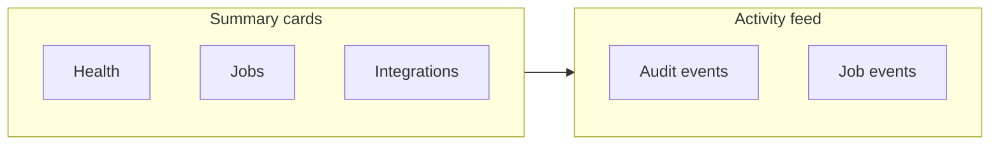

# Admin Information Architecture

**Canonical navigation and page specifications for the complete PermitPilot Admin Dashboard.**

Parent: [PRODUCTION_ADMIN_DASHBOARD_ARCHITECTURE.md](./PRODUCTION_ADMIN_DASHBOARD_ARCHITECTURE.md)

---

## 1. Global UX conventions

### 1.1 Layout

| Element | Specification |
|---------|---------------|
| Desktop | Fixed left nav (240px), top bar with environment banner + global search, content area max-width 1440px |
| Tablet | Collapsible nav drawer |
| Mobile | Read-only health acceptable; destructive actions require desktop (warn if viewport <768px) |
| Environment banner | Red-tinted strip: `PRODUCTION — InsightDC — actions affect live data` |
| Status colors | `success` green, `warning` amber, `error` red, `neutral` gray, `info` blue |
| Severity | P0 incident, P1 degraded, P2 warning, P3 info |
| Loading | Skeleton rows for tables; spinner only for full-page first load |
| Empty states | Actionable copy + link to relevant module or runbook |
| Partial success | Amber badge + expandable failure list (attachments, pages, chunks) |
| Stale data | Gray clock icon if `updated_at` > refresh SLA (60s command center, 30s job tables) |

### 1.2 Global features

| Feature | Behavior |
|---------|----------|
| Global search | Cmd+K: projects by name/id, users by email, jobs by id, permit numbers |
| Global filters | Persist in URL query params (`?env=production&status=failed`) |
| Pagination | Server-side default 25 rows; options 25/50/100 |
| Bulk actions | Checkbox column where registry marks bulk-safe; confirm modal with count |
| Drawers | Right 480px detail drawer for job/user/project row |
| Modals | Destructive actions: title + consequence + typed confirm for high risk |
| Notification badges | Nav item badge = count of actionable items in module |
| Accessibility | WCAG 2.1 AA: focus order, aria labels on status badges, table headers |

---

## 2. Navigation tree

```
/admin
├── (A) Command Center                    /admin
├── (B) Projects                          /admin/projects
│   └── Project detail                    /admin/projects/:projectId
├── (C) Users and Access                  /admin/access
│   ├── Users                             /admin/access/users
│   ├── Invitations                       /admin/access/invitations
│   └── Platform roles                    /admin/access/roles
├── (D) Jurisdictions and Portals         /admin/jurisdictions
│   └── Portal health                     /admin/jurisdictions/health
├── (E) Scraper Operations                /admin/scrapers
│   ├── All jobs                          /admin/scrapers/jobs
│   ├── Schedules                         /admin/scrapers/schedules
│   └── By jurisdiction                   /admin/scrapers/jurisdictions/:slug
├── (F) Permit Filing                     /admin/filing
│   └── Filing detail                     /admin/filing/:filingId
├── (G) Documents and Storage             /admin/documents
│   └── Storage recovery                  /admin/documents/storage
├── (H) Ingestion and RAG                 /admin/ingestion
│   └── Document detail                   /admin/ingestion/documents/:documentId
├── (I) AI Code Analyzer                  /admin/code-analyzer
├── (J) Response Matrix                   /admin/response-matrix
├── (K) QuickBooks and Billing            /admin/billing
├── (L) Communications                    /admin/communications
├── (M) UCI Administration                /admin/uci
├── (N) Integrations                      /admin/integrations
├── (O) System Health                     /admin/health
├── (P) Configuration                     /admin/config
│   ├── Feature flags                     /admin/config/flags
│   └── Branding and notifications        /admin/config/notifications
├── (Q) Audit and Security                /admin/audit
└── (R) Backups and Capacity              /admin/capacity
```

**Developer-only (retained, not in ops nav):**

- `/admin/shadow-mode`
- `/admin/architecture-replication`

---

## 3. Module specifications

### A. Command Center — `/admin`

| Field | Value |
|-------|-------|
| **Roles** | All platform roles (read); actions per registry |
| **Purpose** | Single-pane operational situational awareness |

**Summary cards:** System health score, active incidents, failed jobs (24h), stuck jobs, integration degraded count, pending operator actions, ingestion queue depth, scrape success rate (24h).

**Main table:** Recent critical activity (from `platform_audit_events` + job state changes).

**Filters:** Time range, severity, module.

**Actions:** Acknowledge incident, jump to job, jump to integration.

**Alerts strip:** P0/P1 items with dismiss (audited).

**Data sources:** `GET /api/admin/v1/overview`, Realtime subscriptions on job tables.



---

### B. Projects — `/admin/projects`

| Page | Primary purpose | Summary cards | Main table | Key filters | Row detail | Actions |
|------|-----------------|---------------|------------|-------------|------------|---------|
| Directory | Cross-project ops view | Total active, stale scrape, ingest backlog, filing blocked | Projects with ops columns | Jurisdiction, status, owner, has failures | Drawer: timeline | Open project, archive |
| Detail | Single-project ops | Scrape, ingest, filing, billing, UCI flags | Unified event timeline | Event type | Full timeline | Trigger scrape, enqueue ingest |

**Warnings:** Project with failed job >24h; missing billing data; UCI synthetic-only badge.

---

### C. Users and Access — `/admin/access`

| Page | Purpose | Table | Actions |
|------|---------|-------|---------|
| Users | Directory | Email, platform role, last sign-in, project count | Invite, deactivate, assign role |
| Invitations | Pending invites | Project, email, role, status, expires | Resend, revoke |
| Platform roles | Admin roster | User, roles, granted by | Promote/demote (with final-admin guard) |

**Replaces:** `/admin/members`, `/admin/authorizations` placeholder.

---

### D. Jurisdictions and Portals — `/admin/jurisdictions`

**Retains existing** `JurisdictionManager` functionality; adds:

| Addition | Purpose |
|----------|---------|
| Portal health table | Last successful scrape per jurisdiction, credential readiness % |
| Maintenance mode toggle | Per-jurisdiction scrape pause (server flag) |
| Portal incident log | Manual notes + auto-detected failure spikes |

---

### E. Scraper Operations — `/admin/scrapers`

| Page | Purpose | Table columns | Actions |
|------|---------|---------------|---------|
| All jobs | Cross-project queue | id, project, jurisdiction, mode, status, progress, started, heartbeat, attachments | Retry, cancel, view events |
| Schedules | Future: cron definitions | jurisdiction, cron, enabled, next run | Enable/disable schedule |
| Jurisdiction | Per-portal health | success rate, avg duration, last failure | Drill to jobs |

**Architecture note:** Arlington + UCI use durable `scrape_jobs`; other jurisdictions may be session-only — UI shows `execution_model: durable | session` column.

**Wireframe (jobs list):**

```
┌─────────────────────────────────────────────────────────────┐
│ [Failed: 3] [Running: 2] [Stuck: 1]          [Refresh 30s] │
├─────────────────────────────────────────────────────────────┤
│ Status ▼  Jurisdiction ▼  Project ▼  Date ▼                  │
│ ☐  job_id   Arlington   test_project   running   45/120  ⋮  │
└─────────────────────────────────────────────────────────────┘
```

---

### F. Permit Filing — `/admin/filing`

| Page | Purpose | Data |
|------|---------|------|
| Queue | Cross-project filings | `permit_filings` + `agent_runs` |
| Detail | Pre-flight → submit trail | Status history, missing requirements, credentials readiness |

**States:** Align to `filing_status` in DB (see state machines doc).

---

### G. Documents and Storage — `/admin/documents`

| Page | Purpose |
|------|---------|
| Inventory | Cross-project documents: source (scrape/manual), size, ingestion status |
| Storage | Bucket usage, orphan detection, recovery status (informational) |

**Actions:** Safe archive (soft delete), re-enqueue ingestion — not hard delete without typed confirm.

---

### H. Ingestion and RAG — `/admin/ingestion`

| Page | Purpose |
|------|---------|
| Queue | `document_ingestion_jobs` all projects |
| RAG readiness | Projects with chunks vs documents missing ingestion |
| Document detail | Chunk count, embedding status, OCR flag, re-index |

**Gap addressed:** Manual ingest trigger today — admin exposes bulk enqueue for scraped-not-ingested.

---

### I. AI Code Analyzer — `/admin/code-analyzer`

| Page | Purpose |
|------|---------|
| Runs | Analysis runs, sheet findings, failures |
| Quality | Evaluation status (when tests exist) |

**Scope:** Standard Compliance + Code Modification paths; links to project Code Mod UI.

---

### J. Response Matrix — `/admin/response-matrix`

| Page | Purpose |
|------|---------|
| Pipeline | Comment intake → classification → RAG → draft → review |
| Failures | Generation failures with evidence gaps |

---

### K. QuickBooks and Billing — `/admin/billing`

| Page | Purpose |
|------|---------|
| Connection | Status, environment — no tokens |
| Milestones | Projects with M1/M2/M3 state, `qb_uncertain` queue |
| Test visibility | Labelled test projects only |

**Actions:** Preview (existing), safe retry, reconcile uncertain — per control registry.

---

### L. Communications — `/admin/communications`

| Page | Purpose |
|------|---------|
| Graph | Mailbox connection, last poll, unmatched count |
| Notifications | Jurisdiction notifications (from existing AdminPanel) |
| Delivery | Failed email log |

---

### M. UCI Administration — `/admin/uci`

| Element | Requirement |
|---------|---------------|
| Banner | `UCI PROTOTYPE — NOT CLIENT-READY — synthetic/mock validation only` |
| Coverage | Provider readiness, live-submit gate, coordination records, Graph ingestion |
| Data | Show `synthetic_test` vs production checklist mode |

**Merge:** `/admin/uci-action-tracker` into this module.

---

### N. Integrations — `/admin/integrations`

Card per integration: Supabase, Railway API, ingestion worker, QuickBooks, Graph, OpenAI, Resend, Mapbox, Stripe, portals.

Each card: configured, connected, last success, last error (sanitized), reconnect/test action.

---

### O. System Health — `/admin/health`

| Section | Content |
|---------|---------|
| Services | Epermit-main, ingestion-worker, Edge probe results |
| Queues | Depth, oldest pending, stuck count |
| Deploy | Git SHA, deployed at (from Railway metadata API) |

---

### P. Configuration — `/admin/config`

| Page | Purpose |
|------|---------|
| Feature flags | Server `platform_feature_flags` — replaces localStorage |
| Notifications/branding | Existing drip + jurisdiction notification tools |

---

### Q. Audit and Security — `/admin/audit`

| Page | Purpose |
|------|---------|
| Event log | `platform_audit_events` searchable |
| Access changes | Filter action types: role, invite, credential metadata |

**Replaces:** narrow `admin_activity_log` viewer.

---

### R. Backups and Capacity — `/admin/capacity`

**Informational only** — no restore button.

| Card | Source |
|------|--------|
| DB backups | Last physical backup date, PITR status |
| Storage | Size, recovery gap warning |
| Egress | Supabase quota (when API available) |
| Last restore drill | Manual entry / runbook link |

---

## 4. Page specification template (all modules)

Every page implements:

| Aspect | Requirement |
|--------|-------------|
| Primary purpose | One sentence in page header |
| Summary cards | 3–6 KPIs above fold |
| Main table | Sortable, filterable, paginated |
| Row details | Drawer with tabs: Overview, Events, Related |
| Actions | Role-gated per registry |
| Warnings | Inline alerts for stale, partial, blocked-by-provider |
| Error state | Retry fetch + correlation ID |
| Empty state | Explain prerequisite (e.g. no jobs in filter) |

---

## 5. Existing surface migration map

| Existing surface | Decision | New destination | Data preserved | Redirect | Timing |
|------------------|----------|-----------------|----------------|----------|--------|
| `/admin` AdminPanel | Merge | `/admin` Command Center + `/admin/config/notifications` | Notifications, branding | Yes | Phase 1 |
| `/admin/jurisdictions` | Keep | `/admin/jurisdictions` | Full | No | Phase 1 |
| `/admin/feature-flags` | Replace | `/admin/config/flags` | None (localStorage abandoned) | Yes | Phase 2 |
| `/admin/shadow-mode` | Keep dev | Hidden from ops nav | Full | No | N/A |
| `/admin/architecture-replication` | Keep dev | Hidden from ops nav | Full | No | N/A |
| `/admin/uci-action-tracker` | Merge | `/admin/uci` | Tracker data | Yes | Phase 6 |
| `/admin/authorizations` | Remove | `/admin/access` | N/A | Yes | Phase 3 |
| `/admin/members` | Merge | `/admin/access/roles` | Full | Yes | Phase 3 |
| `/admin/audit` | Replace | `/admin/audit` expanded | Historical log read-only import | No | Phase 2 |
| `/operations` | Deprecate | `/admin/projects/:id` | Real finance scalars | Yes | Phase 4 |
| `/portal-data` | Keep link | Linked from E job detail | Full | No | N/A |
| `/settings` | Keep user | User-scoped settings | Full | No | N/A |
| Dashboard scrape widget | Link | E Scrapers | Full | No | Phase 1 |
| `/permit-queue` | Replace | `/admin/filing` | N/A | Yes | Phase 5 |
| `/messages` | Replace | `/admin/communications` | N/A | Yes | Phase 5 |
| Baltimore mock routes | Remove nav | Archive | Reference only | 404 or archive | Phase 7 |
| `/demo/*` | Keep | Outside admin | Demo | No | N/A |

**Source of truth rule:** Each operational metric has exactly one primary module; other surfaces link rather than duplicate controls.
