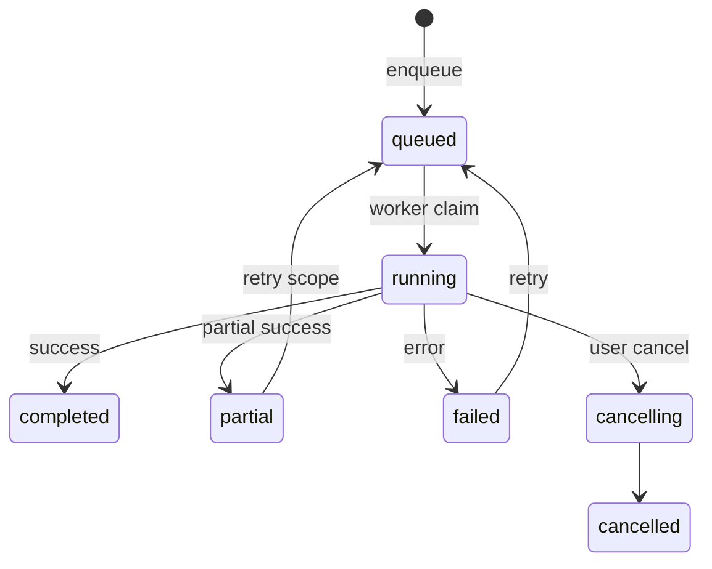

# Admin Operational State Machines

States align with **current database values** where they exist. UI labels may simplify display but must map 1:1 to stored values. New states require migrations.

Parent: [PRODUCTION_ADMIN_DASHBOARD_ARCHITECTURE.md](./PRODUCTION_ADMIN_DASHBOARD_ARCHITECTURE.md)

---

## 1. Scraper jobs (`scrape_jobs.status`)

**Verified values** (migration `20260730120000_scrape_job_cancelling_status.sql`):

`queued`, `running`, `resuming`, `rate_limited`, `partial`, `waiting_user`, `cancelling`, `completed`, `completed_with_warnings`, `partial_external_blocker`, `failed`, `failed_unrecoverable`, `cancelled`

### UI grouping

| UI group | DB statuses | Color | Severity |
|----------|-------------|-------|----------|
| Pending | `queued` | gray | info |
| Active | `running`, `resuming`, `paginating`* , `downloading`* | blue | info |
| Waiting | `waiting_user`, `rate_limited` | amber | warning |
| Cancelling | `cancelling` | amber | warning |
| Success | `completed`, `completed_with_warnings` | green | success |
| Partial | `partial`, `partial_external_blocker` | amber | warning |
| Failed | `failed`, `failed_unrecoverable` | red | error |
| Cancelled | `cancelled` | gray | neutral |

\*Sub-states tracked in `current_stage` / `metadata` — not separate DB status (display only).

### Transitions (operator actions)

| From | Action | To | Owner | Retry | Audit event |
|------|--------|-----|-------|-------|-------------|
| `failed`, `failed_unrecoverable` | Retry (if retryable) | `queued` | operator+ | Yes idempotent | `scraper.job.retry` |
| `running`, `queued`, `resuming` | Cancel | `cancelling` → `cancelled` | operator+ | N/A | `scraper.job.cancel` |
| `*` | Stale (no heartbeat > threshold) | UI flag `stale` | system | Auto-suggest retry | `scraper.job.stale_detected` |
| `partial*` | Acknowledge | no status change | operator+ | Optional retry | `scraper.job.ack_partial` |

**Timeout:** `last_heartbeat_at` stale threshold — Arlington: env `ARLINGTON_WORKER_POLL_MS` × 6 (configurable in admin P module).

**Irreversible:** `cancelled`, `failed_unrecoverable` (retry creates new job row per dedup rules).

---

## 2. Attachment processing (derived — not single column)

Tracked in scrape job `attachments_state` JSON + `scrape_file_results` patterns.

| State | Meaning | UI label |
|-------|---------|----------|
| `discovered` | Listed in portal, not queued | Discovered |
| `pending` | Queued for download | Pending |
| `downloading` | In progress | Downloading |
| `downloaded` | In Storage + DB record | Downloaded |
| `failed` | Error recorded | Failed |
| `skipped` | Policy skip (size/type) | Skipped |
| `duplicate` | Fingerprint match | Duplicate |
| `ingested` | Linked to ingestion job completed | Ingested |

**Action:** `attachment.retry_download` — operator+ — preconditions: parent job not terminal cancelled.

---

## 3. Document ingestion (`document_ingestion_jobs.status`)

**Verified CHECK:** `pending`, `processing`, `completed`, `failed`, `partial`, `cancelled`

| From | Action | To | Audit |
|------|--------|-----|-------|
| `failed`, `partial` | Retry | `pending` | `ingestion.job.retry` |
| `processing` | Stale (worker timeout) | UI `stale` | `ingestion.job.stale` |
| `pending` | Cancel | `cancelled` | `ingestion.job.cancel` |

**Related:** `project_documents.ai_ingestion_status` — keep in sync on job completion (existing worker behavior).

**OCR:** Not implemented — UI shows `ocr_required: unknown` until PP backlog OCR work lands.

---

## 4. Permit filing (`permit_filings.filing_status`)

**Verified CHECK** (migration `20260307000003`): `preflight`, `awaiting_approval`, `approved`, `filing`, `submitted`, `failed`, `cancelled`

**Extended UI states** (mapped from agent_runs + UI, not all separate DB columns):

| UI state | DB / source |
|----------|-------------|
| `draft` | pre-preflight (no row or early) |
| `needs_information` | preflight gaps |
| `ready_for_review` | `awaiting_approval` |
| `submitting` | `filing` |
| `confirmation_received` | post-submit agent success |
| `corrections_received` | external — manual flag |
| `resubmission_required` | operator flag |
| `closed` | terminal success |

**Actions:** `filing.approve`, `filing.submit` — project admin+ or operator with project scope.

---

## 5. QuickBooks milestone invoices (project columns)

**Verified columns:** `m1_triggered`, `m1_invoice_trigger_status`, `qb_invoice_id_m1`, `m1_qb_pending_invoice_id`, etc.

### Canonical UI states

| UI state | DB condition |
|----------|--------------|
| `not_started` | `m1_triggered = false` AND status NULL |
| `previewed` | dry-run success (client-side log / audit) |
| `processing` | `m1_invoice_trigger_status = 'processing'` |
| `completed` | `m1_invoice_trigger_status = 'completed'` AND invoice id set |
| `failed_before_creation` | failed, no invoice id, no customer created |
| `uncertain_external_result` | `qb_uncertain` or timeout rule (see QB E2E doc) |
| `reconciled` | operator marked after manual QB lookup |
| `voided_external` | informational — QB void not synced (webhooks out of scope) |

**Blocked by provider:** subscription inactive → UI `blocked_by_provider` overlay on retry action.

---

## 6. Integration health (`integration_health_snapshots.status` — new)

| State | Meaning |
|-------|---------|
| `not_configured` | Required env missing |
| `connected` | Last op success within SLA |
| `degraded` | Intermittent failures |
| `disconnected` | Auth expired / revoked |
| `expired` | Token past refresh window |
| `blocked_by_provider` | External billing/subscription |
| `unknown` | Probe not run |

**Probe SLA:** 5 minutes for Command Center; manual refresh on Integrations page.

---

## 7. State machine diagram (scraper + ingestion)

---

## 8. Migrations required

| Change | Reason |
|--------|--------|
| `integration_health_snapshots` table | Integration module |
| Optional `scrape_jobs.admin_ack_at` | Partial acknowledge timestamp |
| `platform_audit_events` | Unified audit |
| No change to `scrape_jobs.status` enum | Already comprehensive |
