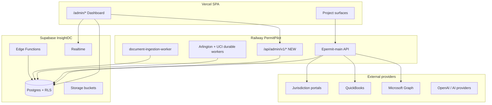

# Production Admin and Operations Dashboard Architecture

**Version:** 1.0 (canonical)  
**Date:** 2026-09-09  
**Scope:** PermitPilot platform — complete admin product (not an MVP subset)  
**Implementation status:** Architecture only — no code in this document

---

## 1. Executive summary

PermitPilot requires a **unified Admin and Operations Dashboard** under `/admin` that lets authorized staff operate the platform without routine Supabase SQL, Railway CLI, hidden routes, or developer scripts.

Today, platform administration is **fragmented**: ten `/admin/*` routes gated by `user_roles.admin`, operator surfaces outside admin (`/operations`, `/portal-data`, `/settings`, Dashboard scrape widget), **no `/api/admin/*` backend**, and **no cross-project job or integration health aggregation** (diligence item **PP-005**).

This document defines **one canonical architecture** that:

1. Consolidates operational visibility and safe controls into a single admin product.
2. Introduces a **server-side platform authorization layer** on Railway (not frontend-only).
3. Reuses proven job infrastructure (`scrape_jobs`, `document_ingestion_jobs`, durable workers).
4. Preserves project-scoped RBAC for project-level actions.
5. Never exposes raw secrets, tokens, or provider payloads in the UI.

Implementation is **phased for safety** (see [ADMIN_IMPLEMENTATION_ROADMAP.md](./ADMIN_IMPLEMENTATION_ROADMAP.md)); every phase implements portions of **this same target**, not disposable prototypes.

---

## 2. Dashboard purpose and boundaries

### 2.1 What the dashboard must enable

| Responsibility | Operator outcome |
|----------------|------------------|
| **Platform administration** | Manage platform roles, invitations policy, jurisdiction catalog, server feature flags |
| **Daily operations** | Monitor and act on scrape jobs, ingestion queue, filing submissions, attachment failures |
| **Project administration** | Cross-project directory, access review, archive/deactivate, operational timeline |
| **Technical monitoring** | Backend/worker health, queue depth, stale jobs, deployment version, integration connectivity |
| **Security and audit** | Immutable audit trail for admin and destructive actions; access change history |
| **Configuration** | Safe toggles (maintenance mode, live gates) with reason and history — not env-var editing |

### 2.2 What stays outside the dashboard (developer-only)

| Excluded capability | Reason |
|---------------------|--------|
| Raw secrets, DB passwords, service-role keys | Security — vault + deployment platforms only |
| Production database restore execution | Destructive — runbook + Supabase dashboard with break-glass |
| Arbitrary SQL / ad-hoc table edits | Data integrity — use controlled RPCs and migrations |
| Railway/Vercel/Supabase env-var editing | Deployment scope — documented in `DEPLOY.md` |
| Raw OAuth tokens, QuickBooks realm IDs | Provider security — masked status only |
| Unreviewed bulk deletion across tenants | Requires migration scripts with review |
| Deployment triggers | CI/CD ownership — informational deploy version only |

---

## 3. Architecture decisions (verified vs assumed)

| ID | Decision | Basis | Status |
|----|----------|-------|--------|
| AD-01 | Single admin shell at `/admin` with nested routes | Existing `AdminLayout` + `useRequireAdmin` | **Verified** |
| AD-02 | New Railway `/api/admin/v1/*` namespace with platform auth middleware | No admin API exists today | **Required new work** |
| AD-03 | Platform role stored in `user_roles.role = 'admin'` maps to `platform_admin` | Migration `20260112170034` | **Verified** |
| AD-04 | Extend platform roles via new `platform_operator_roles` table (not overloading `app_role` enum) | `app_role` only has admin/moderator/user | **New migration** |
| AD-05 | Operational reads via SECURITY DEFINER RPCs + materialized views, not browser service-role | RLS + least privilege | **Required** |
| AD-06 | Scraper ops unify `scrape_jobs` (Arlington + UCI durable) and legacy session scrapes via job bridge | Code paths differ by jurisdiction | **Verified** |
| AD-07 | Feature flags move from localStorage to server table `platform_feature_flags` | `useFeatureFlags.ts` is client-only today | **Required** |
| AD-08 | `/operations` mock sections removed; real data merged into admin Projects + Billing modules | `operations-demo-data.ts` | **Verified mock** |
| AD-09 | UCI admin module shows synthetic/live gates explicitly — not production-ready | Diligence + code gates | **Verified** |
| AD-10 | Audit consolidates into `platform_audit_events` (superset of `admin_activity_log`) | Current log is notification-only | **New table** |
| AD-11 | Realtime: Supabase Realtime on `scrape_jobs`, `scrape_events`, `document_ingestion_jobs` for ops tables | Tables exist; Realtime partial | **Extend** |
| AD-12 | Edge Function health via scheduled probe + `integration_health_snapshots` | No heartbeat table today | **New** |

**Business confirmation required:** BC-01 final role count (5 platform roles proposed); BC-02 whether `moderator` app_role is used or deprecated; BC-03 production invoice retry policy in admin UI.

---

## 4. System context

---

## 5. Layered architecture

### 5.1 Presentation layer (frontend)

- **Shell:** `AdminShell` (replaces/extends `AdminLayout`) — environment banner, global search, nav from [ADMIN_INFORMATION_ARCHITECTURE.md](./ADMIN_INFORMATION_ARCHITECTURE.md).
- **Data fetching:** TanStack Query hooks calling `/api/admin/v1/*` for ops aggregation; direct Supabase only where existing admin RPCs already exist (`admin_list_member_directory`, role grant/revoke).
- **No service-role key in browser** — ever.

### 5.2 Admin API layer (Railway — new)

- Mount: `scraper-service/app/routes/admin.routes.js` → `/api/admin/v1`
- Middleware chain: `requireAuthenticatedUser` → `requirePlatformRole(...)` → rate limit → handler
- All mutations idempotent where possible (client supplies `Idempotency-Key` header)
- Structured errors: `{ code, message, correlationId, retryable }`

### 5.3 Data layer (Supabase)

- **Read models:** SQL views `admin_v_*` (paginated, indexed)
- **Writes:** SECURITY DEFINER RPCs `admin_*` with role checks inside function body
- **RLS:** Platform admin RPCs bypass row scope only when explicitly platform-scoped; project actions still verify `has_project_admin_access` or equivalent

### 5.4 Worker and scheduler layer

- Existing: Arlington durable worker, UCI durable worker, ingestion poll worker, UCI Graph poller, UCI lifecycle scheduler
- New: `platform_health_heartbeat` writer in each long-running process (see monitoring doc)

---

## 6. Module overview (A–R)

Complete navigation and page specs: [ADMIN_INFORMATION_ARCHITECTURE.md](./ADMIN_INFORMATION_ARCHITECTURE.md).

| Module | Route prefix | Primary data sources |
|--------|--------------|---------------------|
| A Command Center | `/admin` | Aggregated health, incidents, job summaries |
| B Projects | `/admin/projects` | `projects`, team, scrape/ingest/filing status |
| C Users and Access | `/admin/access` | `profiles`, `user_roles`, invitations RPCs |
| D Jurisdictions and Portals | `/admin/jurisdictions` | Existing jurisdiction admin + portal health |
| E Scraper Operations | `/admin/scrapers` | `scrape_jobs`, `scrape_events` |
| F Permit Filing | `/admin/filing` | `permit_filings`, `agent_runs` |
| G Documents and Storage | `/admin/documents` | `project_documents`, Storage metadata |
| H Ingestion and RAG | `/admin/ingestion` | `document_ingestion_jobs`, chunks |
| I AI Code Analyzer | `/admin/code-analyzer` | Code mod / analyzer run tables |
| J Response Matrix | `/admin/response-matrix` | Comment intake, grounded response pipeline |
| K QuickBooks and Billing | `/admin/billing` | `projects` milestone cols, QB status API |
| L Graph and Communications | `/admin/communications` | Graph connections, notifications |
| M UCI Administration | `/admin/uci` | UCI coordination, gates, synthetic flags |
| N Integrations | `/admin/integrations` | Health snapshots, OAuth status |
| O System Health and Jobs | `/admin/health` | Heartbeats, queue metrics |
| P Feature Flags and Config | `/admin/config` | `platform_feature_flags` |
| Q Audit and Security | `/admin/audit` | `platform_audit_events` |
| R Backups and Capacity | `/admin/capacity` | Informational backup/egress (read-only) |

---

## 7. Authorization model (summary)

Full matrix: [ADMIN_ROLE_AND_PERMISSION_MATRIX.md](./ADMIN_ROLE_AND_PERMISSION_MATRIX.md).

| Role | Scope | Notes |
|------|-------|-------|
| `platform_admin` | Full platform | Maps to existing `user_roles.admin` |
| `operations_manager` | All ops modules; limited role management | Cannot remove final admin |
| `operator` | Run/retry/cancel jobs; no role changes | Day-to-day ops |
| `support` | Read-mostly + user/project access help | No billing retry |
| `auditor` | Read-only audit and health | No mutations |
| Project owner/admin/editor/viewer | Unchanged | Project tab actions remain project-scoped |

**Enforcement:** Every admin API handler and RPC re-checks role server-side. Frontend `useRequireAdmin` becomes `usePlatformRole(minRole)` — UI gate only.

---

## 8. State machines (summary)

Full definitions: [ADMIN_STATE_MACHINES.md](./ADMIN_STATE_MACHINES.md).

Operational UI labels map to **existing DB values** where present (`scrape_jobs.status`, `document_ingestion_jobs.status`, `permit_filings.filing_status`, QuickBooks milestone columns). New canonical labels added only via migration when DB lacks a state (e.g. `qb_uncertain` already documented in QB E2E guide).

---

## 9. API architecture (summary)

Full contract: [ADMIN_DATA_AND_API_CONTRACTS.md](./ADMIN_DATA_AND_API_CONTRACTS.md).

Organized REST under `/api/admin/v1`:

- `GET /overview` — command center payload
- `GET /projects`, `GET /projects/:id/ops-timeline`
- `GET|POST /access/users`, invitations, role changes
- `GET /scrapers/jobs`, `POST /scrapers/jobs/:id/{retry,cancel,acknowledge}`
- `GET /ingestion/jobs`, `POST /ingestion/jobs/:id/retry`
- `GET /filing`, `GET /documents`, `GET /integrations`, `GET /health`
- `GET|PATCH /config/flags`
- `GET /audit/events`

Plus Supabase RPCs for bulk reads and RLS-safe writes documented in data contract doc.

---

## 10. Monitoring and audit (summary)

- [ADMIN_MONITORING_AND_ALERTS.md](./ADMIN_MONITORING_AND_ALERTS.md) — alert catalog, heartbeats
- [ADMIN_CONTROL_REGISTRY.md](./ADMIN_CONTROL_REGISTRY.md) — every button/action
- Unified audit table `platform_audit_events` with correlation IDs

---

## 11. Existing surface migration (summary)

| Surface | Decision |
|---------|----------|
| `/admin` (AdminPanel) | **Merge** → Command Center + retain notification/branding as sub-routes |
| `/admin/jurisdictions` | **Keep** — move under D module |
| `/admin/feature-flags` | **Replace** — server flags in P module; deprecate localStorage |
| `/admin/shadow-mode` | **Keep** — link from Q Audit / internal metrics |
| `/admin/architecture-replication` | **Keep developer-only** — not ops dashboard |
| `/admin/uci-action-tracker` | **Merge** into M UCI |
| `/admin/authorizations` | **Remove placeholder** — absorb into C Access |
| `/admin/members` | **Merge** into C Users and Access |
| `/admin/audit` | **Replace** with Q Audit (expanded) |
| `/operations` | **Deprecate** — redirect to `/admin/projects/:id` or B Projects |
| `/portal-data` | **Keep** as project tool; link from E Scrapers job detail |
| `/settings` | **Keep** user-scoped; admin credential overview in D/G |
| `/permit-queue`, `/messages` | **Replace** with F and L modules when built |
| Baltimore mock routes | **Remove** from nav; archive reference |
| Demo routes | **Keep** — excluded from admin |

Full migration table in [ADMIN_INFORMATION_ARCHITECTURE.md](./ADMIN_INFORMATION_ARCHITECTURE.md) §12.

---

## 12. Safety boundaries

| Action | Dashboard treatment |
|--------|---------------------|
| Retry QuickBooks live invoice | Allowed with subscription check + typed confirm + dry-run history visible |
| Cancel scrape job | Allowed for `operator+` if job in cancellable state |
| Revoke platform admin | Blocked if last admin |
| Production restore | **Informational only** + link to runbook |
| View portal password | **Never** — metadata only (`password_configured`) |
| Enable UCI live submit | **platform_admin** + reason + env confirmation banner |

---

## 13. Production acceptance criteria (summary)

### Functional
- Every module loads real scoped data via admin API or RPC — no mock badges in admin UI
- Every control in registry has backend contract and audit event
- Pagination and filters on all tables >50 rows
- Partial failures visible (attachment skipped, ingestion partial, scrape partial)

### Security
- Server-side authorization on every mutation
- RLS unchanged for project users; admin reads via views/RPCs
- No secrets in responses
- Final-admin and self-lockout protection

### Operational
- Stale job detection (< heartbeat threshold) visible in Command Center
- Environment banner (production) on all admin pages
- Provider blockers (QB subscription, Graph consent) surfaced in Integrations

### Quality
- Authorization integration tests per endpoint
- Idempotency tests for retry/cancel
- E2E smoke: platform_admin login → Command Center loads → scrape job list

Full checklist in §14 of [ADMIN_IMPLEMENTATION_ROADMAP.md](./ADMIN_IMPLEMENTATION_ROADMAP.md).

---

## 14. References

- [ADMIN_DASHBOARD_CURRENT_STATE_AND_PLAN.md](./ADMIN_DASHBOARD_CURRENT_STATE_AND_PLAN.md) — as-built audit
- `docs/diligence-readiness/PERMITPILOT_360_PRODUCTION_AUDIT.md` — feature connectivity
- `docs/diligence-readiness/ARCHITECTURE.md` — system architecture
- `docs/diligence-readiness/ENV.md` — URL configuration
