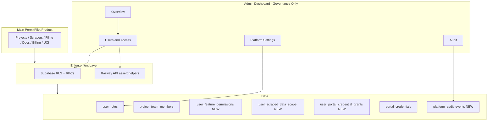

# Production Admin Dashboard Architecture — Governance Scope

**Version:** 2.0 (focused)  
**Date:** 2026-09-10  
**Supersedes:** 18-module operations architecture (v1.0)

---

## 1. Executive summary

PermitPilot Admin is a **governance console** for platform administrators. It answers:

- Who has access to the platform and each project?
- What features can they read or write?
- What scraped data and portal credentials can they see or use?
- What changed, when, and by whom?

It does **not** host scrape job queues, filing pipelines, document ingestion, billing operations, or UCI workflows. Those remain in the main product with permissions enforced by the model defined here.

---

## 2. Boundaries

### 2.1 In scope (admin)

| Area | Responsibility |
|------|----------------|
| **Overview** | Access summary, permission risks, recent admin activity, useful existing widgets |
| **Users & Access** | Directory, activate/deactivate, project roles, feature R/W, scraped-data scope, credential grants |
| **Audit** | Role, access, credential, and platform-admin action history |
| **Platform settings** | Retained working `/admin/*` features: jurisdictions, notifications/branding, drip campaigns |

### 2.2 Out of scope (main product)

| Area | Where it stays |
|------|----------------|
| Projects, scrapers, portal harvest | `/projects`, `/portal-data`, Dashboard widgets |
| Filing, Pre-Flight | Permit wizard surfaces |
| Documents, ingestion, RAG | Project document vault, Response Matrix |
| Billing, QuickBooks | Project Billing tab |
| UCI | `/uci/*` routes |
| System ops monitoring (queues, workers) | Future product ops surfaces or external monitoring — **not admin** |

### 2.3 Developer-only (excluded from production admin nav)

| Route | Disposition |
|-------|-------------|
| `/admin/shadow-mode` | Hidden — internal metrics |
| `/admin/architecture-replication` | Hidden — internal checklist |
| `/admin/uci-action-tracker` | **Removed from admin** — UCI status lives in product/docs |
| `/admin/authorizations` | **Removed** — placeholder; absorbed into Users & Access |
| `/admin/feature-flags` | **Removed from nav** — browser localStorage only today; not governance |

---

## 3. Authorization model (summary)

### 3.1 Dimensions

| Dimension | Levels | Storage (proposed) |
|-----------|--------|-------------------|
| **Platform admin** | none / manage | Existing `user_roles.admin` |
| **Project access** | none / viewer / editor / admin | Existing `project_team_members` + owner |
| **Feature access** | none / read / write | New `user_feature_permissions` |
| **Scraped-data scope** | projects, jurisdictions, portal sources | New `user_scraped_data_scope` |
| **Portal credentials** | none / use / manage | New `user_portal_credential_grants` |

### 3.2 Core rules

1. **Deny by default** — no implicit access from authentication alone (except platform admin manage-all).
2. **Project membership first** — feature permissions on a project require `has_project_access` (existing RPC).
3. **Server-side enforcement** — RLS policies and RPCs updated; Railway credential/scrape paths call `assert_*` helpers; admin UI is not security boundary.
4. **No secrets in browser** — passwords/tokens never returned; `use` invokes backend-only decrypt.
5. **Final platform admin protection** — cannot remove last `user_roles.admin`.
6. **Complete audit** — every grant/revoke and credential use/manage writes `platform_audit_events`.

Full precedence: [ADMIN_ROLE_AND_PERMISSION_MATRIX.md](./ADMIN_ROLE_AND_PERMISSION_MATRIX.md).

---

## 4. Architecture diagram

---

## 5. Existing assets to reuse

| Asset | Reuse |
|-------|-------|
| `user_roles`, `has_role()` | Platform admin |
| `project_team_members`, invitation RPCs | Project roles |
| `has_project_access`, `has_project_editor_access`, `has_project_admin_access` | Membership gates |
| `admin_list_member_directory()` | Users directory seed |
| `AdminMembers.tsx` | Extend → Users & Access |
| `AdminAudit.tsx` + `admin_activity_log` | Migrate/import → Audit |
| `AdminPanel.tsx` | Split: Overview widgets + Platform Settings |
| `JurisdictionAdmin.tsx` | Retain under Platform Settings |
| `portal_credentials` + crypto service | Credential storage; add grant table |
| `portal-credentials.routes.js` | Add grant checks before list/use |

**No feature-permission tables exist today** — new schema required (see data contracts doc).

---

## 6. Portal credential security

| Level | Meaning | Browser sees |
|-------|---------|--------------|
| **none** | Cannot use or manage | Credential row hidden or metadata-only |
| **use** | Backend may decrypt for approved scrape/filing action on scoped project/jurisdiction | `password_configured: true`, username, jurisdiction — **no password** |
| **manage** | Create, replace, test connection, disable, reassign grants | Same — never plaintext password |

Every **use**: audit `{ action: credential.use, credential_id, project_id, purpose: scrape|filing }`  
Every **manage**: audit `{ action: credential.manage.*, before/after metadata only }`

---

## 7. Scraped-data visibility

Controls which `portal_data`, scrape results, and attachment metadata a user sees **within projects they belong to**.

| Scope type | Example |
|------------|---------|
| `project` | User sees scraped data only for listed project IDs |
| `jurisdiction` | User sees data for permits in Arlington only |
| `portal_source` | User sees Accela-sourced vs ProjectDox-sourced subsets |

**Default for new project members:** inherit project team's default template (configurable by platform admin). **Deny** jurisdictions/portals not granted even if project member.

Enforcement: RLS on `projects.portal_data` JSON access paths or RPC wrapper for portal-data reads; align with `PortalDataViewer` fetches.

---

## 8. Feature keys (initial set)

| Feature key | Product surface | read | write |
|-------------|-----------------|------|-------|
| `project.core` | Project detail basics | view project | edit project fields |
| `scraper.run` | Scrape triggers | view jobs/results | enqueue scrape |
| `scraper.results` | Portal data / attachments | view scraped data | — |
| `filing.submit` | Permit wizard | view filing status | submit |
| `documents.vault` | Document list/upload | view | upload/delete |
| `ingestion.rag` | Ingestion / Response Matrix | view | trigger ingest/generate |
| `billing.quickbooks` | Billing tab | view | trigger invoice |
| `code.analyzer` | Code Mod / analyzer | view | run analysis |
| `uci.workspace` | UCI routes | view | stage actions (when enabled) |
| `credentials.self` | Settings own credentials | manage own | manage own |

Platform admin `manage` bypasses explicit feature rows.

---

## 9. Acceptance criteria (governance)

### Functional
- [ ] Overview shows user count, open permission risks, last 20 admin events
- [ ] Users & Access shows **effective permissions** per user (computed server-side)
- [ ] Bulk access review exports CSV without secrets
- [ ] Audit filters: user, action, project, feature, date range
- [ ] Retained platform settings (jurisdictions, notifications) still work

### Security
- [ ] Non-admin cannot call admin API or admin RPCs
- [ ] Credential password never in API response or audit JSON
- [ ] Feature write denied when project membership missing
- [ ] Final-admin protection tested

### Quality
- [ ] Authorization integration tests per RPC
- [ ] Effective-permission golden tests for sample users
- [ ] Audit completeness test on grant/revoke flows

---

## 10. Business decisions required

| ID | Question |
|----|----------|
| BC-01 | Default feature template for new project members |
| BC-02 | Whether `moderator` app_role retains meaning |
| BC-03 | Tenant-level grants vs per-user only (tenant tables exist) |
| BC-04 | User deactivation: Supabase ban vs soft flag |

---

## 11. References

- [ADMIN_INFORMATION_ARCHITECTURE.md](./ADMIN_INFORMATION_ARCHITECTURE.md)
- [ADMIN_DATA_AND_API_CONTRACTS.md](./ADMIN_DATA_AND_API_CONTRACTS.md)
- [ADMIN_IMPLEMENTATION_ROADMAP.md](./ADMIN_IMPLEMENTATION_ROADMAP.md)
- `docs/diligence-readiness/ARCHITECTURE.md`
