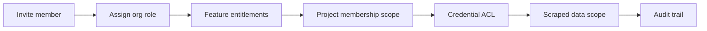

# Admin Members & Access Flow Plan

> Audit date: 2026-08-05  
> Branch context: `feat/lovable-ui-replication` (Admin Preview placeholders) + PermitPilot main capabilities  
> Scope: platform-wide plan for invite → role → feature visibility → credential scope → scraped-data scope → audit  
> Status: **P0 shipped** — Members directory + thin Audit on `main`; Authorizations remains Preview

---

## 0. Explicit answers (“from Admin today, can you already do X?”)

| Desired capability | From `/admin` today? | Partial path elsewhere? |
|--------------------|----------------------|-------------------------|
| Invite a workspace/org member | **No** (Members = Preview) | **No** org-level invite UI. Closest: **project** team invite |
| Invite someone to a project | **No** | **Yes** — Projects → project detail → Team tab (`ProjectTeamSection` + Resend edge) |
| Assign platform admin role | **No** UI | **Partial** — RLS allows admins to insert/delete `user_roles`; no Admin UI for it |
| Assign project team role (owner/admin/editor/viewer) | **No** | **Yes** — project Team invite + role change in `useProjectTeam` |
| Control which **features** a member sees | **No** | **No** server entitlements. Feature Flags admin is **browser localStorage** only (`showDemoVideo`) |
| Decide which **portal credentials** a member can use/see | **No** | Credentials are **user-owned** (`portal_credentials.user_id`). Bind via Settings / `ActiveProjectControl`. Team members do **not** inherit owner credentials |
| Grant access to **scraped / portal_data** | **No** dedicated admin ACL | **Indirect** — project membership (`has_project_access`) unlocks project-scoped `portal_data`, scrape jobs, UCI rows |
| Review / approve LOAs | **No** (Authorizations Preview) | LOA UI at `/onboarding/authorization` is **non-persistent** (PD-4) |
| Platform access audit export | **No** (Audit Preview) | **Partial** — `admin_activity_log` on Admin Overview for **jurisdiction notification** actions only; shadow `audit_trail` is project-scoped AI pipeline, not member access |

**Bottom line:** There is **no coherent Admin “members + access matrix”** today. Working pieces are scattered: platform `user_roles` gate, project team invites, per-user credentials, project-scoped data RLS, and a thin Admin ops console (notifications / jurisdictions / shadow).

---

## 1. Current state (evidence)

### 1.1 Admin routes & UI

| Route | Status | Implementation |
|-------|--------|----------------|
| `/admin` | **Live** | `src/pages/AdminPanel.tsx` — jurisdiction subscribers, notifications, email branding, drip campaigns, activity log for those ops |
| `/admin/jurisdictions` | **Live** | `src/pages/JurisdictionAdmin.tsx` |
| `/admin/feature-flags` | **Live but local-only** | `src/pages/FeatureFlagsAdmin.tsx` + `src/hooks/useFeatureFlags.ts` → `localStorage` key `permitpulse_feature_flags` |
| `/admin/shadow-mode` | **Live** | `src/pages/ShadowModeDashboard.tsx` — AI shadow metrics |
| `/admin/architecture-replication` | **Internal live** | Checklist workspace (admin-gated) |
| `/admin/authorizations` | **Preview** | `AdminAuthorizationsPlaceholder` — PD-4/PD-5; not LOA |
| `/admin/members` | **Preview** | `AdminPreviewPlaceholder` — “keep PP `user_roles` / project invites” |
| `/admin/audit` | **Preview** | Placeholder — needs `access_audit_log` (does not exist in PP migrations) |

**Gates**

- Layout: `src/components/admin/AdminLayout.tsx` → `useRequireAdmin`
- Hook: `src/hooks/useRequireAdmin.ts` — `user_roles.role = 'admin'`
- Nav: `src/components/layout/hybridNav.ts` Admin group (`requiresAdmin: true`); Authorizations/Members/Audit marked `comingSoon` + `adminPreview`
- Routes: `src/App.tsx` under `<Route path="/admin" element={<AdminLayout />}>`

**Product decisions (docs)**

- PD-2: keep PP roles `admin` / `moderator` / `user` (do **not** silently adopt Lovable `admin`/`staff`/`client`)
- PD-4: LOA / `client_authorizations` **exclude v1** unless legal requires
- PD-5: defer Lovable Members/Audit; keep AdminPanel ops  
  Sources: `docs/ui-replication-plan.md`, `docs/lovable-ui-frontend-implementation-plan.md`

### 1.2 Auth roles (platform)

| Piece | Reality |
|-------|---------|
| Enum | `public.app_role`: `'admin' \| 'moderator' \| 'user'` — `supabase/migrations/20260112170034_989b3e73-9c41-4500-b09a-7f0b0c56c2f6.sql` |
| Table | `user_roles (user_id, role)` |
| Helper | `has_role(uid, role)` used widely in RLS |
| FE gate | Binary: is admin or not (`useRequireAdmin`) |
| Admin UI to manage roles | **Missing** (Lovable reference has `approve_member` / Members UI under `reference/lovable-ui/` only) |

Platform admin unlocks: Admin nav, jurisdictions CRUD, provider directory admin policies, architecture checklist, notification ops — **not** automatic access to every user’s projects/credentials (those stay owner/team RLS).

### 1.3 Team / project membership (working E2E)

| Piece | Location |
|-------|----------|
| UI | `ProjectTeamSection` inside `ProjectDetailDialog` (Projects page) |
| Hook | `src/hooks/useProjectTeam.ts` |
| Roles | `owner` \| `admin` \| `editor` \| `viewer` — `src/types/team.ts` |
| Tables | `project_team_members`, `project_invitations` |
| Edge | `supabase/functions/send-project-team-invitation` (Resend) |
| RPCs | `create_project_team_invitation`, `resend_project_team_invitation`, accept/decline/revoke — `20260715130000_project_team_invitation_flow.sql` |
| Accept route | `/invite/:token` → `InviteAccept.tsx` |
| Access helper | `has_project_access` = project owner **or** team member |

**Not present:** firm/org invite console, workspace approval queue, or Admin-centric member directory.

### 1.4 Tenant / org model (foundation, incomplete UX)

| Piece | Reality |
|-------|---------|
| Tables | `tenants`, `tenant_memberships` (`owner`/`admin`/`member`/`viewer`) — `20260715140000_row2_tenant_foundation.sql` |
| Project link | `projects.tenant_id` nullable (staged rollout) |
| Helpers | `can_access_tenant`, `has_uci_row_access`, demo isolation |
| FE Admin for tenants | **None** |

Tenants are the right long-term “org” layer for feature/credential/data scope, but membership management is not exposed in Admin today.

### 1.5 Feature flags / entitlements / visibility

| Layer | Today |
|-------|-------|
| Admin Feature Flags | Browser `localStorage` — **not** per-user, **not** server-enforced |
| Subscription | `profiles.subscription_*` via `useAuth` (billing/tier signal; not a fine-grained feature matrix) |
| Nav visibility | Mostly role (`isAdmin`) + static hybrid nav; no per-member feature ACL |
| Route guards | AdminLayout for `/admin/*`; most product routes are any authenticated user with project access |

**Gap:** no `feature_entitlements` / `member_feature_grants` table.

### 1.6 Portal credentials

| Piece | Reality |
|-------|---------|
| Table | `portal_credentials` — RLS **own rows only** (`auth.uid() = user_id`) |
| API | Scraper `GET/POST/PATCH/DELETE /api/portal-credentials` — filters `user_id = JWT user` (`scraper-service/app/routes/portal-credentials.routes.js`) |
| Secrets | Password encrypted server-side; FE sees `password_configured`, never plaintext (`portalCredentialsApi.ts`) |
| Manage UI | `/settings` → `PortalCredentialsManager` |
| Bind UI | Header `ActiveProjectControl` — lists **current user’s** credentials; writes `projects.credential_id` |
| Share with team | **Not supported** — binding a credential does not grant teammates password/list access; scrape runs use bound credential via service role / job path |

### 1.7 Scraped data / portal harvest ownership

| Asset | Scope | Access rule |
|-------|-------|-------------|
| `projects.portal_data` / `portal_status` / `portal_data_hash` | Project JSONB | Anyone with `has_project_access` (owner + team) |
| `scrape_jobs` / `scrape_events` / `scrape_file_results` | Project | Project (+ tenant helpers when `tenant_id` set) |
| UCI coordination_* | Project | `has_project_access` / `has_uci_row_*` |
| Portal Data Viewer | `/portal-data` | Selected project’s harvest payload |
| Storage docs from harvest | Project buckets | Project document RLS |

There is **no separate “scraped data ACL”** — it piggybacks on project (and eventually tenant) membership. Platform admin is **not** a backdoor to all `portal_data` via documented FE paths.

### 1.8 LOA / authorizations (WIP)

| Surface | Status |
|---------|--------|
| `/admin/authorizations` | Preview placeholder |
| `/onboarding/authorization` (+ delivery alias if routed) | UI + client validation only; **no** `client_authorizations` table in PP migrations |
| Lovable reference | Has `client_authorizations` + signatures in `reference/lovable-ui/supabase/migrations/` — **not** production PP |

### 1.9 Audit surfaces today

| Log | Purpose | Not for |
|-----|---------|---------|
| `admin_activity_log` | Jurisdiction notify / email ops from AdminPanel | Member/role/credential changes |
| Shadow `audit_trail` / `baseline_actions` | AI validation | Access control |
| `project_activity` | Project events | Platform admin audit export |
| Lovable `access_audit_log` | Reference only | Missing in PP |

---

## 2. Target admin flow (UX — step by step)

Design principle: **Admin Console owns org identity & policy; project surfaces own day-to-day collaboration.** Do not replace project invites; nest them under org policy.

### Step 1 — Invite member (Admin → Members)

1. Admin opens `/admin/members`.
2. Invite by email + **org role** (see §3) + optional note / expiry.
3. System creates pending invite; Resend (reuse patterns from `send-project-team-invitation`).
4. Invitee accepts → `profiles` + `tenant_memberships` (+ optional default `user_roles`).
5. Optional approval queue (Lovable-style) **only if** product wants gated signup — default recommend: invite-only, no open approval backlog.

### Step 2 — Assign / change role

- Org roles on `tenant_memberships` (or platform `user_roles` for true platform operators).
- Clear labels: **Platform Admin** vs **Org Admin** vs **Member** vs **Viewer** (avoid overloading “admin”).
- Project roles remain owner/admin/editor/viewer when adding to projects.

### Step 3 — Feature visibility / entitlements

Admin toggles (server-backed) which product areas the member may open, e.g.:

- Portal Harvest, Response Matrix, Comment Review  
- UCI hub / Application Builder  
- Permit Filing  
- DesignCheck / Code Analyzer  
- Analytics, Jurisdictions tools  
- Admin Console (platform only)

Nav + route guards read entitlements; **RLS/API must enforce** the same (UI hide ≠ security).

### Step 4 — Project scope

- Bulk-add member to selected projects **or** inherit “all projects in tenant”.
- Preserve existing Team tab for project-local invites (editors inviting viewers).
- Org Admin can see membership matrix; Project Admin cannot elevate org roles.

### Step 5 — Portal credential scope

Explicit ACL (new), not silent sharing of passwords:

| Grant | Meaning |
|-------|---------|
| **Use (bind/run)** | May select credential for harvest/filing on allowed projects; password never returned to FE |
| **View metadata** | See jurisdiction / username / `password_configured` |
| **Manage** | Create/rotate/delete (usually owner or org admin) |

Default: credentials stay private to creator; org admin can **delegate use** without revealing secrets.

### Step 6 — Scraped data scope

- Default: access follows **project membership** (today’s model).
- Optional hardening: **viewer** sees redacted harvest (status only); **editor+** sees full `portal_data` / files.
- Never grant platform-wide scrape dump via Admin without tenant filter.

### Step 7 — Audit

Admin `/admin/audit` lists: invites, role changes, entitlement changes, credential ACL grants, credential use (scrape start), project membership changes, LOA events (if PD-4 later). Export CSV; filter by actor/target/date.

---

## 3. Data model / permission layers

Keep five **orthogonal** layers (do not collapse into one “role” enum):

| Layer | Purpose | Existing | Needed |
|-------|---------|----------|--------|
| **L1 Platform role** | Operate Admin Console / global catalogs | `user_roles` + `has_role` | Admin UI to grant/revoke; audit writes |
| **L2 Org / tenant membership** | Firm boundary, demo isolation | `tenants`, `tenant_memberships` | Invite + Admin Members UI; backfill `projects.tenant_id` |
| **L3 Project membership** | Collaborate on a project | `project_team_members` + invites | Optional Admin matrix; keep Project Team UX |
| **L4 Feature entitlements** | Which apps/routes | localStorage flags (non-ACL) | New: e.g. `feature_definitions` + `member_feature_grants` (tenant- or user-scoped) + FE guard helper |
| **L5 Credential ACL** | Who may use which vault entry | User-owned credentials only | New: e.g. `portal_credential_grants (credential_id, user_id, can_use, can_manage)` + scraper/API checks |
| **L6 Data ACL** | Harvest/docs sensitivity | Project RLS via `has_project_access` | Optional role-based column/file redaction; optional `data_access_level` on team role |
| **L7 Audit** | Accountability | `admin_activity_log` (narrow) | New `access_audit_log` (or generalize admin log) with writers on all L1–L5 mutations |

**LOA (optional L8):** `client_authorizations` — only if PD-4 flips; Admin Authorizations then becomes review of signed LOAs, not member ACL.

**Anti-pattern to avoid:** Porting Lovable `admin/staff/client` + `approval_status` as a drop-in replacement for PP `user_roles` + project invites (PD-2/PD-5 explicitly warn). Map labels in UI if needed; keep PP enums.

---

## 4. Phased implementation

### P0 — Coherent Admin Members without over-building (reuse first)

**Goal:** Real `/admin/members` that manages **what already exists**, clearly labeled.

| Work | Reuse | New |
|------|-------|-----|
| Replace Members Preview with directory of users (profiles + `user_roles`) | `user_roles` RLS for admin insert/delete | Lightweight Members page (not Lovable Cloud RPCs) |
| Grant/revoke **platform** admin/moderator | Existing policies | UI + confirm + write `admin_activity_log` or new audit rows |
| Cross-link “Project teams” | `useProjectTeam` / RPCs | Read-only matrix: user → projects/roles; deep-link to Projects Team tab |
| Document credential reality in UI | — | Copy: credentials are personal; share project access separately |
| Keep Authorizations/Audit as Preview **or** show read-only `admin_activity_log` under Audit | AdminPanel log query | Thin Audit page wrapping existing log |

**Out of P0:** server feature matrix, credential sharing, LOA persistence.

### P1 — Org membership + feature entitlements + audit spine

| Work | Reuse | New |
|------|-------|-----|
| Tenant-aware invite (email → `tenant_memberships`) | Resend edge patterns, invite token design from project invites | `tenant_invitations` table + edge function; Admin Members as primary UX |
| Server feature entitlements | hybridNav structure as catalog seed | Tables + `useFeatureEntitlements` + route guard; migrate off localStorage for product gates |
| `access_audit_log` | — | Schema + RLS (admin read; service/RPC write) |
| Backfill / enforce `projects.tenant_id` | Row 2 helpers | Migration + admin tooling |

### P2 — Credential ACL + scraped-data nuance + LOA (if approved)

| Work | Reuse | New |
|------|-------|-----|
| Credential grants | Crypto + portal-credentials routes | Grant table; list endpoint returns owned **∪** granted; bind/scrape authorize `can_use` |
| Data ACL refinements | Team roles | Viewer redaction policies; optional export restrictions |
| LOA | Lovable UI reference | PD-4 schema + Admin Authorizations live review |
| Credential use audit | scrape_jobs already reference `credential_id` | Join into Audit UI |

---

## 5. Risks

| Risk | Why it matters | Mitigation |
|------|----------------|------------|
| **Shared Supabase prod/dev** | Railway `development` may share production Supabase; Admin membership changes are live | Demo accounts only; no prod credential rotation from preview; explicit env banners |
| **Credential secrets** | Encrypted passwords; over-broad “share credential” = account takeover at agencies | Grant **use** without FE password; never log secrets; prefer project bind + service decrypt |
| **Over-broad platform admin** | `has_role(admin)` already powerful on catalogs; tempting to add “see all projects” | Keep platform admin ≠ data admin; require tenant scope for member/data ops |
| **Role enum collision** | Project `admin` vs platform `admin` vs tenant `admin` | Distinct UI labels; never reuse one enum across layers |
| **UI-only entitlements** | Hiding nav without RLS/API checks | Pair every entitlement with API/RLS denial |
| **Lovable port trap** | `reference/lovable-ui` Members/LOA look complete | Treat as UX reference only; PP schema differs (PD-2/4/5) |
| **Team invite email fragility** | Resend domain/secrets | Surface invitation_created vs email_sent (already partially modeled) |
| **Staged tenant_id NULL** | Mixed legacy project access | Don’t claim org-wide ACL until backfill complete |

---

## 6. Recommended IA for Admin Console (target)

| Nav item | Purpose |
|----------|---------|
| Overview | Ops health + shortcuts (keep notification/drip tools or move under “Comms”) |
| Members | Invites, org roles, feature entitlements, project matrix |
| Credentials (policy) | Org-level view of vault metadata + grants (**not** password display) |
| Authorizations | LOA review when PD-4 ships; until then Preview |
| Audit | Access + admin actions |
| Jurisdictions / Shadow / Flags | Keep; Flags become server entitlements catalog over time |
| Architecture Replication | Internal only |

Project Team tab remains the **collaborator** path; Admin Members is the **governance** path.

---

## 7. File & doc pointers

| Area | Paths |
|------|-------|
| Admin shell / gates | `src/components/admin/AdminLayout.tsx`, `src/hooks/useRequireAdmin.ts`, `src/App.tsx` |
| Placeholders | `src/pages/placeholders/AdminPreviewPlaceholders.tsx` |
| Admin ops | `src/pages/AdminPanel.tsx`, `JurisdictionAdmin.tsx`, `FeatureFlagsAdmin.tsx`, `ShadowModeDashboard.tsx` |
| Nav | `src/components/layout/hybridNav.ts` |
| Project team | `src/components/team/*`, `src/hooks/useProjectTeam.ts`, `src/pages/InviteAccept.tsx` |
| Credentials | `src/lib/portalCredentialsApi.ts`, `PortalCredentialsManager.tsx`, `ActiveProjectControl.tsx`, `scraper-service/app/routes/portal-credentials.routes.js` |
| Data model audit | `docs/current-data-model.md` |
| Feature inventory | `docs/audits/main-functional-features-and-ui-migration-audit.md` §3–4 |
| Parity / PD | `docs/audits/main-vs-feat-functional-parity-audit.md`, `docs/ui-replication-plan.md` (PD-2/4/5) |
| Lovable reference (do not copy blindly) | `reference/lovable-ui/src/pages/AdminMembers.tsx`, `AdminAuthorizations.tsx`, `AdminAuditLog.tsx` |

---

## 8. Suggested product decisions to lock before P1

1. **Org unit of membership:** tenant (`tenants`) vs “all users in one Commun-ET workspace”?  
2. **Who may invite:** platform admin only vs org admin vs project admin (project-local already yes)?  
3. **Feature entitlements:** subscription tiers only vs per-member toggles?  
4. **Credential sharing:** allow delegated **use**, or require each user to store their own portal login?  
5. **PD-4 LOA:** build or keep excluded?  
6. **Platform admin data access:** break-glass to any project, or never?

Until those are locked, ship **P0** (honest Members directory + platform role + project matrix links) and keep Preview labels on LOA/full audit/feature matrix.
