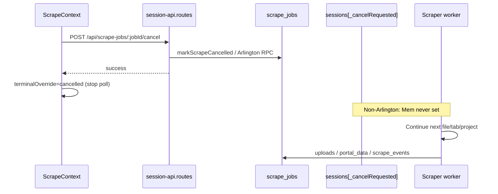

# Scraper Cancellation — Deep Audit

**Date:** 2026-07-30  
**Repo:** `epermitarthouse-rgb/Epermit-main`  
**Scope:** Cancel behavior across PGC / ProjectDox (Washington DC), Accela (Baltimore, Fairfax, Arlington), Montgomery, Howard, shared session workers, Arlington durable jobs, and UCI durable portal-sync jobs  
**Constraints honored:** No code changes, commits, pushes, or deployments in this task. Creating this audit document is the only write performed.

---

## Observed failure (matches code)

- User triggered Cancel from the progress widget.
- Railway logs continued processing **new files** afterward.
- Required behavior: cancellation must stop the active scraper **before the next unit of work**.

Primary explanation (evidence below): the widget prefers durable **`POST /api/scrape-jobs/:jobId/cancel`**. For every non-Arlington scraper that path only marks `scrape_jobs` cancelled in Supabase and **never sets** the in-memory `session._cancelRequested` flag that all session workers actually poll. Work continues (downloads, uploads, portal sync, progress event inserts) until the scrape naturally finishes.

---

## Shared cancellation contract (target — not current behavior)

These are the acceptance criteria any fix plan must meet.

| # | Requirement |
|---|-------------|
| 1 | Cancel request transitions the job through **`cancelling`** (in-flight) then durable **`cancelled`** |
| 2 | Active waits are aborted safely (Playwright navigations/downloads interrupted or exited at the next safe boundary) |
| 3 | **No new** file / report / tab / project / phase unit of work starts after cancel is observed |
| 4 | Open browser resources (pages, popups, contexts, browsers) are closed |
| 5 | Remaining undispatched / not-yet-attempted items stay **pending** (not failed, not completed) |
| 6 | Partial completed work already checkpointed is **preserved** |
| 7 | Final durable status is **`cancelled`** (not overwritten by later `completed` / `running`) |
| 8 | **No further** progress events after cancel is finalized |
| 9 | Frontend widget stops polling and auto-closes correctly for cancel |
| 10 | Cancel works across Railway replicas (DB-authoritative signal, not process-local only) |

**Current status enum gap:** `scrape_jobs.status` has `cancelled` but **no `cancelling`** value anywhere in migrations, scraper-service, or frontend types (`src/lib/scrapeJobTypes.ts`). UI `cancelling` is only a local button-disabled flag in `ScrapeContext`.

---

## Executive summary

Cancellation is **split-brained**:

1. **Durable path (jobId):** marks `scrape_jobs` cancelled (and for Arlington, a dedicated RPC). Frontend always prefers this when `activeJobId` exists.
2. **Worker path (session):** most scrapers only stop when `session._cancelRequested === true`, which is set **only** by legacy `POST /api/scrape/cancel/:sessionId`.

Because the widget uses (1) and workers listen for (2), cancel appears successful in the UI while Railway keeps harvesting files. Arlington durable workers are the exception: they poll `scrape_jobs` via `pollArlingtonJobCancelled`. Even Arlington still lacks a `cancelling` phase and can finish the current Playwright unit before stopping.

---

## 1. Exact root cause per scraper

### 1.1 PGC ePlan / ProjectDox (`portalSubtype: pgc-eplan`)

**Root cause:** Cancel via jobId never sets `session._cancelRequested`. PGC harvest only stops when `harvestOpts.isCancelRequested()` returns true, which is wired as `() => !!session._cancelRequested` in `scrapePgcAll`.

**Evidence:**

- Frontend: `src/contexts/ScrapeContext.tsx` → `cancelScrape` prefers `/api/scrape-jobs/${jid}/cancel` when `jid && projectId`.
- Job cancel (non-Arlington): `scraper-service/app/routes/session-api.routes.js` → `markScrapeCancelled` + `stopHeartbeat` only; **no session lookup**, **no `_cancelRequested`**.
- Worker signal: `register-execution-routes.js` `scrapePgcAll` passes `isCancelRequested: () => !!session._cancelRequested`.
- File-loop checks: `pgc-eplan-scraper.js` (`pgcHarvestIsCancelled`, before folder, before file attempt, during retries).

**Observed symptom match:** After jobId cancel, `isCancelRequested()` stays false → Task 6 continues starting new file downloads → Railway logs show new files.

**Secondary gaps (even if flag were set):**

- Mid-file download already in flight is not aborted via AbortSignal/Playwright cancel; stop is at next file/folder boundary.
- After harvest returns, `scrapePgcAll` still runs `syncPortalDataToSupabase` before the final cancel check (~L6145–6156).
- Session cancel path sets the flag then immediately `cleanupSession` (browser close) — can race with `relaunchBrowserAndRecover`, which does not re-check cancel before relaunch.

---

### 1.2 Washington DC / generic ProjectDox (`scrapeAll`, including `dc-planreview`)

**Root cause:** Same jobId/session signal split. Worker only checks `session._cancelRequested` between **projects** and **tabs**, not between files inside a tab harvest.

**Evidence:**

- Dispatch: `register-execution-routes.js` → `scrapeAll(...)`.
- Checks: project loop (~L6249) and tab loop (~L6268) only.
- On cancel early-return, caller still does `.then(() => finalizeSessionScrapeJob("done"))` (~L2894) — does **not** finalize as `cancelled`.
- Sync still runs before end cancel check (~L6713–6724).

**Secondary:** No cancel hooks inside Washington scrapers under `scraper-service/scrapers/washington` (none found). Long file/report work inside a tab continues after cancel.

---

### 1.3 Baltimore Accela

**Root cause:** JobId cancel does not signal the running `scrapeAccelaRecord` session. Foreground Accela scrape body has **no** cooperative cancel poll for Baltimore attachment/info work.

**Evidence:**

- Dispatch: `register-execution-routes.js` → `scrapeAccelaRecord(...)` for Accela portals including Baltimore.
- `_cancelRequested` / `isCancelRequested` in `accela-scraper.js` appear mainly in Arlington plan-review continue / durable worker helpers — not as a Baltimore unit-of-work gate inside the main scrape.
- Post-run: Accela `.then` checks `session._cancelRequested` only **after** `scrapeAccelaRecord` resolves (~L2326).

**Effect:** Cancel marks DB cancelled; Baltimore continues searching/extracting/uploading until the function finishes.

---

### 1.4 Fairfax Accela

**Root cause:** Identical to Baltimore — same `scrapeAccelaRecord` path, same missing mid-scrape cancel polls, same jobId signal gap.

---

### 1.5 Arlington Accela (durable worker path)

**Root cause (partial — best of the set):** Durable cancel **does** persist and workers **do** poll DB. Gaps are unit-of-work coarseness, missing `cancelling`, and jobId cancel not forcing immediate browser teardown on a foreground session if one exists.

**Evidence (working parts):**

- RPC: `supabase/migrations/20260630400000_arlington_cancel_scrape_job.sql` → `cancel_arlington_scrape_job`.
- Helpers: `lib/arlington-job-store.js` → `isArlingtonJobCancelled`, `pollArlingtonJobCancelled`, `cancelArlingtonScrapeJob`.
- Worker: `lib/arlington-worker-executor.js` polls before session create, before phase, after phase, on heartbeat skip, in `finally` disposes session (`sessionHandle.dispose()` closes browser).
- Bounded phase: `accela-scraper.js` `runArlingtonWorkerBoundedPhase` → `stopIfCancelled` / passes `isCancelRequested` into attachments.
- Tests: `scraper-service/tests/arlington-cancel.test.js`.

**Gaps:**

- Cancel is observed between phases / before next download, not by aborting an in-flight Playwright download wait.
- JobId cancel for Arlington does **not** set in-memory `_cancelRequested` or call `cleanupSession` for a live session; relies on next `pollArlingtonJobCancelled`.
- No `cancelling` status; jumps straight to `cancelled`.
- Foreground/legacy Arlington `scrapeAccelaRecord` path still depends on `_cancelRequested` for some plan-review loops; durable path is the intended production path.

---

### 1.6 Montgomery ProjectDox

**Root cause:** JobId cancel never sets `_cancelRequested`. Even when the flag is set, cancel is only checked **between projects**, not inside `runMontgomeryProductionPipeline` / file harvest.

**Evidence:**

- `scrapeMontgomeryAll` cancel checks at project loop (~L5321) and before marking done (~L5402).
- `scrapers/montgomery/**` has **zero** `isCancelRequested` / `_cancelRequested` references.
- Success handler always `finalizeSessionScrapeJob("done")` (~L2694) even if the scraper returned early due to cancel (early return does not surface `cancelled` to the promise chain the way PGC does).
- File progress reconcile can still run after cancel if cancel flag is only checked before sync in some paths; Montgomery checks cancel before sync (~L5402) then syncs — but jobId cancel never sets the flag, so full pipeline + sync + `done` finalize proceed.

---

### 1.7 Howard ProjectDox

**Root cause:** Same as Montgomery.

**Evidence:**

- `scrapeHowardAll` project-loop check (~L5072) and post-sync check (~L5151).
- `scrapers/howard/**` has **zero** cancel hooks.
- `.then(() => finalizeSessionScrapeJob("done"))` (~L2773) ignores cancel outcome.
- Pipeline `runHowardProductionPipeline` has no cancel callback.

---

### 1.8 UCI durable portal sync (shared durable job path)

**Root cause:** Cancel is durable (`cancel_uci_portal_sync_job` / `pollUciPortalSyncJobCancelled`), but the executor only polls **before** `runPortalSync`, not during it.

**Evidence:**

- `app/services/uci/uci-durable-worker-executor.js` (~L69, ~L89) then `await runPortalSync(...)` with no mid-sync cancel.
- Store: `uci-portal-sync-job-store.js` → `pollUciPortalSyncJobCancelled`, `cancelUciPortalSyncJob`.
- Migration: `supabase/migrations/20260714120000_uci_durable_portal_sync_jobs.sql`.

**Effect:** Once sync starts, it runs to completion; cancel only prevents the next claim/start.

---

## 2. Shared root causes

### SRC-1 — Frontend prefers jobId cancel; workers listen for session flag (primary)

| Layer | Behavior |
|-------|----------|
| UI | `ScrapeContext.cancelScrape`: if `jobId` → `/api/scrape-jobs/:jobId/cancel`; else session cancel |
| Job cancel (non-Arlington) | Persist `cancelled` only |
| Job cancel (Arlington) | RPC + event; still no session `_cancelRequested` |
| Session cancel | Sets `_cancelRequested`, status `cancelled`, persist, then `cleanupSession` |
| Workers (PGC/Mont/Howard/DC/Accela foreground) | Poll `_cancelRequested` only |

**Files:**  
`src/contexts/ScrapeContext.tsx` (`cancelScrape`)  
`scraper-service/app/routes/session-api.routes.js` (`/api/scrape-jobs/:jobId/cancel`, `/api/scrape/cancel/:sessionId`)

### SRC-2 — Cancel signal is process-local for session scrapers

- Sessions live in `scraper-service/app/session/in-memory-store.js` (`sessions` map).
- `_cancelRequested` is a property on that in-memory object.
- Multiple Railway replicas: jobId cancel updates Supabase (visible everywhere) but **non-Arlington workers never re-read job status**.
- Session cancel only works if the HTTP request hits the replica holding the session; otherwise `404 Session not found` while work continues elsewhere.

### SRC-3 — No shared durable cancel poll for non-Arlington scrapers

Arlington/UCI have `poll*JobCancelled(supabase, jobId)`.  
PGC / Washington / Baltimore / Fairfax / Montgomery / Howard have **no** equivalent poll of `scrape_jobs.status === 'cancelled'`.

### SRC-4 — JobId cancel does not resolve `scraper_session_id` → live session

`scrape_jobs.scraper_session_id` is written at job create (`scrape-events.js` `createScrapeJob`) but **never used** by `/api/scrape-jobs/:jobId/cancel` to locate `sessions[sid]` and set `_cancelRequested` / close browser.

### SRC-5 — Progress / completion can continue after DB cancel

- `updateScrapeJob` guards with `.neq("status", "cancelled").is("completed_at", null)` — good for row status.
- `publishScrapeProgress` still **inserts** `scrape_events` via `emitScrapeEvent(..., { skip_job_patch: true })` — events continue.
- `publish_scrape_event` SQL RPC (`20260623140000_scrape_progress_publisher.sql`) updates `scrape_jobs.status` with **no** cancelled/completed_at guard — `markScrapeCompleted` → `emitScrapeEvent` can **revive** a cancelled job to `completed` if the worker finishes afterward.
- Heartbeat timer is stopped on cancel endpoint, but workers still call `mirrorSessionProgress` / file upserts / storage uploads.

### SRC-6 — No `cancelling` state; UI goes optimistic-terminal while worker runs

- Cancel endpoint writes `cancelled` immediately.
- UI sets `terminalOverride = "cancelled"`, disables `useScrapeJob` polling (`enabled: !terminalOverride`), clears persistence, auto-closes panel.
- Backend worker is unaware → **UI/widget contract looks fine while server keeps working**.

### SRC-7 — Browser cleanup is incomplete / racy

- Session cancel: `cleanupSession` closes browser and nulls `page`/`context`/`browser` but **does not delete** the session object (flag remains — good) and does not wait for the scrape promise to settle.
- JobId cancel: **does not** close browser at all for non-Arlington.
- Arlington worker: dispose in `finally` is solid for durable cycles.
- PGC can **relaunch** browser on recovery after an external close.

### SRC-8 — AbortController unused for scrape cancellation

`AbortController` appears only in UCI territory/document helpers, not in portal scrape loops. Long Playwright waits are not cooperatively aborted by cancel.

---

## 3. Scraper-specific gaps

| Scraper | Receives jobId cancel? | Cooperative checks | Granularity | Browser close on cancel | Pending items | Post-cancel side effects |
|---------|------------------------|--------------------|-------------|-------------------------|---------------|--------------------------|
| **PGC** | DB only; flag not set | Yes, if flag set | Before folder/file/retry | Session path only (immediate close); jobId: none | Unprocessed files left in harvest checkpoint; SFR rows not marked cancelled | Uploads + sync + events continue when flag unset |
| **Washington / generic PD** | DB only | Between project/tab | Coarse | Session path only | Remaining tabs/projects skipped only if flag set | Sync then finalize `"done"` |
| **Baltimore** | DB only | Essentially none mid-scrape | Whole `scrapeAccelaRecord` | Session path only | N/A / all-or-nothing run | Full scrape + possible completed event |
| **Fairfax** | Same as Baltimore | Same | Same | Same | Same | Same |
| **Arlington durable** | RPC + DB poll | Before/after phase; before attachment download | Per download / phase | Worker `dispose()` | Remaining attachments stay pending by design | Mostly stops; current unit may finish |
| **Montgomery** | DB only | Between projects only | Whole project pipeline | Session path only | Later projects skipped only if flag set | Pipeline has no cancel; finalize `"done"` |
| **Howard** | DB only | Between projects only | Whole project pipeline | Session path only | Same | Same |
| **UCI portal sync** | Durable RPC | Before sync only | Whole sync | N/A (non-Playwright sync) | Next job not claimed | In-flight sync completes |

---

## 4. Relevant files / functions

### Cancel routing & persistence

| Path | Symbols / role |
|------|----------------|
| `src/contexts/ScrapeContext.tsx` | `cancelScrape`, `terminalOverride`, `cancelling` UI flag |
| `src/components/scrape/ScrapeProgressPanel.tsx` | Cancel button → `onCancel` |
| `src/hooks/useScrapeJob.ts` | Polling stops when `isTerminal` / `enabled` false |
| `src/lib/scrapeJobTypes.ts` | Terminal includes `cancelled`; no `cancelling` |
| `src/lib/scrapeTerminalLifecycle.ts` | Auto-close delay for cancelled |
| `scraper-service/app/routes/session-api.routes.js` | `POST /api/scrape/cancel/:sessionId`, `POST /api/scrape-jobs/:jobId/cancel` |
| `scraper-service/lib/scrape-events.js` | `markScrapeCancelled`, `updateScrapeJob`, `emitScrapeEvent`, `finalizeScrapeJob` / `attachScrapeJobBridge`, `stopHeartbeat` |
| `scraper-service/lib/scrape-progress-publisher.js` | `publishScrapeProgress` (events after cancel) |
| `scraper-service/lib/session-progress.js` | `mirrorSessionProgress` |
| `scraper-service/app/session/in-memory-store.js` | `sessions` map |
| `scraper-service/sessions/session-lifecycle.js` | `cleanupSession` (browser close; no map delete) |
| `supabase/migrations/20260620140000_scrape_jobs_and_events.sql` | `scrape_jobs`, `cancelled_at`, `scraper_session_id` |
| `supabase/migrations/20260623140000_scrape_progress_publisher.sql` | `publish_scrape_event` (no cancel guard) |
| `supabase/migrations/20260630400000_arlington_cancel_scrape_job.sql` | Arlington cancel RPC + lease guards |
| `supabase/migrations/20260714120000_uci_durable_portal_sync_jobs.sql` | UCI cancel RPC |

### Per-scraper workers

| Path | Symbols / role |
|------|----------------|
| `scraper-service/app/register-execution-routes.js` | `scrapePgcAll`, `scrapeMontgomeryAll`, `scrapeHowardAll`, `scrapeAll`, Accela `/api/scrape` orchestration, `finalizeSessionScrapeJob` |
| `scraper-service/pgc-eplan-scraper.js` | `pgcHarvestIsCancelled`, Task 6 folder/file cancel checks, `isCancelRequested` plumbing |
| `scraper-service/accela-scraper.js` | `scrapeAccelaRecord`, `runArlingtonWorkerBoundedPhase`, attachment `isCancelRequested` |
| `scraper-service/lib/arlington-job-store.js` | `pollArlingtonJobCancelled`, `cancelArlingtonScrapeJob` |
| `scraper-service/lib/arlington-worker-executor.js` | `executeArlingtonWorkerCycle` |
| `scraper-service/lib/arlington-worker-session.js` | Session create/dispose / `browser.close` |
| `scraper-service/lib/arlington-durable-worker-loop.js` | Background claim loop |
| `scraper-service/scrapers/montgomery/projectdox-scraper.js` | Pipeline (no cancel) |
| `scraper-service/scrapers/howard/projectdox-scraper.js` | Pipeline (no cancel) |
| `scraper-service/app/services/uci/uci-durable-worker-executor.js` | UCI cancel poll + `runPortalSync` |
| `scraper-service/app/services/uci/uci-portal-sync-job-store.js` | UCI cancel helpers |
| `scraper-service/lib/scrape-file-results.js` | File result upserts continue during cancelled runs |

### Tests (existing)

| Path | Coverage |
|------|----------|
| `scraper-service/tests/arlington-cancel.test.js` | Arlington RPC/poll/worker cancel contract; asserts frontend uses jobId cancel |
| *(missing)* | No cancel integration tests for PGC, Washington, Baltimore, Fairfax, Montgomery, Howard |

---

## 5. Is cancel state durable or memory-only?

| Mechanism | Durable? | Who reads it? |
|-----------|----------|---------------|
| `scrape_jobs.status = 'cancelled'` (+ `cancelled_at`, `completed_at`) | **Yes** (Supabase) | Frontend widget; Arlington/UCI workers; `updateScrapeJob` guard |
| Arlington `metadata.arlington.terminalReason = 'user_cancelled'` | **Yes** | Arlington poll/claim/release RPCs |
| UCI `metadata.uci.terminal_reason = 'user_cancelled'` | **Yes** | UCI poll/claim |
| `session._cancelRequested` | **Memory-only** (per Node process) | PGC, Washington, Montgomery, Howard, Accela foreground finalize / some PR loops |
| `session.status = 'cancelled'` | Memory-only (also set by session cancel route) | Legacy SSE `/api/progress` |
| UI `terminalOverride` / `cancelling` | Client-only | Widget polling gate |

**Verdict:** Cancel is **durable in the database** for all jobId cancels, but **authoritative for workers only for Arlington (and UCI)**. For all other portal scrapers, the durable row is a UI/bookkeeping signal; the **live stop signal is memory-only and usually never set** on the path the UI uses.

---

## 6. Checklist answers (audit questions)

1. **Cancel endpoint payload / routing**  
   - Session: `POST /api/scrape/cancel/:sessionId` — uses sessionId only.  
   - Job: `POST /api/scrape-jobs/:jobId/cancel` body `{ projectId }` — loads job, checks project match; Arlington vs non-Arlington branch on `jurisdiction`.  
   - Scraper type is **not** passed by the client; inferred from job row / session.

2. **Does each running worker receive the signal?**  
   - Arlington durable / UCI: yes (DB poll).  
   - All session scrapers when UI has a jobId: **no**.

3. **Memory vs `scrape_jobs`:** both exist; workers mostly ignore DB (except Arlington/UCI).

4. **Cancel checks before task / file / wait / retry:**  
   - PGC: yes (if flag).  
   - Washington: project/tab only.  
   - Mont/Howard: project only.  
   - Baltimore/Fairfax: no meaningful mid-scrape checks.  
   - Arlington: phase/download boundaries.  
   - Long waits: not aborted.

5. **Playwright close on cancel:** session cancel closes browser immediately; jobId cancel does not (non-Arlington). Arlington worker disposes in `finally`.

6. **Multi-replica:** yes — in-memory flag / session map miss is a real failure mode; jobId-only cancel worsens it for non-Arlington.

7. **Progress / portal / uploads after cancel:** yes for non-Arlington (and for Arlington until next poll boundary). `scrape_events` inserts can continue; RPC can even overwrite status to completed.

8. **Undispatched items pending:** intended in PGC checkpoints / Arlington attachment pending; not reliably enforced when cancel signal never arrives. Montgomery/Howard have no per-file pending cancel semantics.

9. **Widget polling after cancel:** **yes, stops correctly** via `terminalOverride` disabling `useScrapeJob` and auto-close timer — this hides the backend bug.

---

## 7. Minimal shared fix plan (ordered — do not implement)

1. **Unify cancel entrypoint**  
   - `/api/scrape-jobs/:jobId/cancel` must:  
     a) set durable job to `cancelling` then `cancelled` (or `cancelling` → workers flip to `cancelled` on ack);  
     b) resolve `scraper_session_id` (and/or scan local `sessions` for `_scrapeJobId`) and set `_cancelRequested = true` on the local replica;  
     c) optionally broadcast/pub-sub cancel for other replicas;  
     d) stop heartbeat;  
     e) request browser dispose without relying solely on idle cleanup.

2. **DB-authoritative cancel poll for every scraper**  
   - Shared helper e.g. `isScrapeCancelRequested(session) => session._cancelRequested || pollJobCancelled(jobId)` with light caching (e.g. every N seconds or before each unit).  
   - Wire into PGC, Washington, Montgomery, Howard, Accela Baltimore/Fairfax, Arlington (already has), UCI (extend mid-sync if feasible).

3. **Unit-of-work gates (hard requirement)**  
   - Before each file/report/tab/project/phase start: if cancelled → stop.  
   - After each unit: do not start the next.  
   - Retries: check before each retry attempt.

4. **Finalize contract**  
   - Promise `.then` handlers must finalize `cancelled` when cancel observed (fix Montgomery/Howard/Washington always-`done`).  
   - `finalizeScrapeJob` / `markScrapeCompleted` / `publish_scrape_event` must **refuse** to overwrite `cancelled` (patch RPC `WHERE status IS DISTINCT FROM 'cancelled' AND completed_at IS NULL`).  
   - Suppress `scrape_events` inserts after cancel (except a single terminal `scrape_cancelled` if not already emitted).

5. **Resource teardown**  
   - On cancel: close pages/popups/context/browser; disable PGC relaunch when cancelled; Accela dispose active downloads where possible.

6. **Pending preservation**  
   - Do not mark untouched SFR rows failed; leave pending/discovered.  
   - Do not wipe partial portal_data; skip aggressive “completed” sync that invents success.  
   - Optional: one final checkpoint sync of already-downloaded artifacts, then stop.

7. **Frontend alignment**  
   - Show `cancelling` until backend ack / terminal `cancelled`.  
   - Keep poll enabled through `cancelling`; stop on `cancelled`.  
   - Retain auto-close behavior once terminal.

8. **Replica safety**  
   - Prefer DB poll as source of truth so any replica’s worker stops even if session cancel HTTP hit the wrong instance.

---

## 8. Tests required for every scraper

Shared fixtures: start scrape → wait until first unit starts → call jobId cancel → assert no further units + browser closed + job `cancelled` + no later `completed` status + widget polling stopped.

| Scraper | Required tests |
|---------|----------------|
| **PGC** | Cancel before next file; cancel mid-folder; cancel during retry; SFR pending preserved; no storage upload after cancel gate; job stays `cancelled` after scrape promise settles |
| **Washington / DC ProjectDox** | Cancel between tabs; cancel between projects; finalize status `cancelled` not `done`; sync does not mark completed |
| **Baltimore** | Cancel during attachments loop (before next download); info-only run cancels before next section; browser closed |
| **Fairfax** | Same matrix as Baltimore |
| **Arlington** | Keep existing `arlington-cancel.test.js`; add: cancel mid-attachment download queue; cancel during plan_review cycle; lease release cannot revive; no progress events after terminal cancel; replica/DB-only cancel without session flag |
| **Montgomery** | Cancel mid-`runMontgomeryProductionPipeline` (needs new hook); cancel between projects; `.then` finalizes `cancelled` |
| **Howard** | Same as Montgomery |
| **UCI durable** | Cancel while queued; cancel while running before sync; cancel during sync (once mid-sync checks exist); claim excludes cancelled |
| **Shared / routing** | JobId cancel sets local `_cancelRequested` when session present; jobId cancel without local session still stops via DB poll; session cancel still works; multi-replica simulation (worker process ≠ cancel HTTP process); `publish_scrape_event` cannot overwrite `cancelled`; frontend prefers jobId but worker still stops |
| **Widget** | After cancel: polling disabled/stopped; panel shows cancelled; auto-close; no restore of cancelled job as active |

---

## 9. Explicit constraint

**This audit made no code changes, commits, pushes, or deployments.**  
Only this document was written: `docs/audits/scraper-cancellation-audit.md`.

---

## Appendix A — Cancel flow (current)



## Appendix B — Cancel flow (target contract)

```mermaid
sequenceDiagram
  participant UI as ScrapeContext
  participant API as cancel endpoint
  participant DB as scrape_jobs
  participant W as Scraper worker

  UI->>API: POST cancel (jobId + projectId)
  API->>DB: status=cancelling
  API->>W: local _cancelRequested + dispose browser
  W->>W: Abort waits; no new unit
  W->>DB: remaining items pending; partial preserved
  W->>DB: status=cancelled; stop events
  UI->>UI: poll until cancelled; close widget
```
