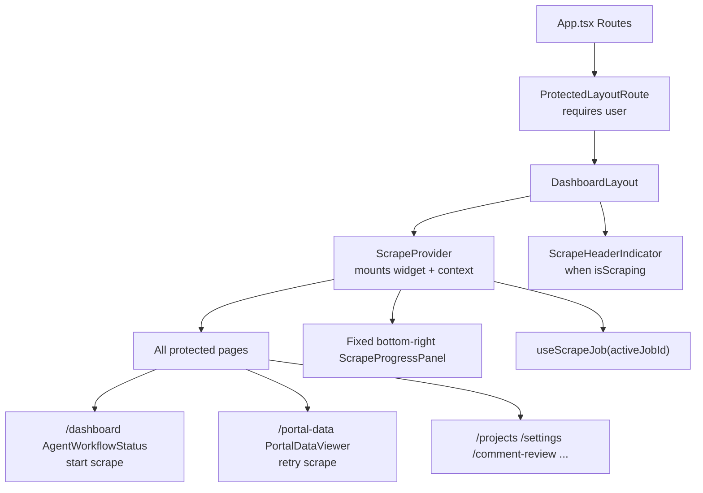
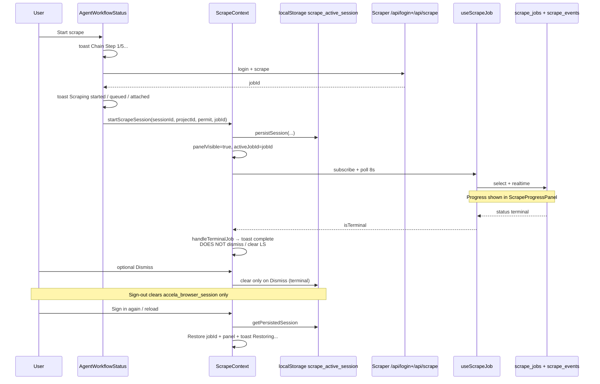
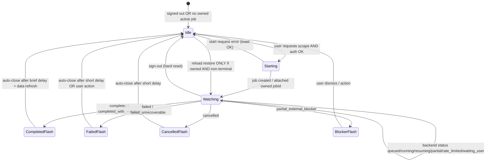

# Scraper Progress / Poll Widget — Deep Audit

**Date:** 2026-07-30  
**Repo:** `/Users/javerianaveed/epermit/Epermit-main`  
**Branch at audit time:** `feat/lovable-ui-replication`  
**Scope:** Global floating scrape progress widget (`ScrapeProgressPanel` + `ScrapeContext` + `useScrapeJob`) and related start/completion notification paths  
**Constraints honored:** No code changes, commits, pushes, or deployments in this task. Creating this audit document is the only write performed.

---

## Required final behaviour (target)

These are the acceptance criteria any fix plan must meet. They are **not** current behaviour.

| # | Requirement |
|---|-------------|
| 1 | No widget and no job polling while signed out |
| 2 | Sign-out clears active job UI state, timers/channels, and persisted job references |
| 3 | Signing in must not restore another session’s completed or unrelated scrape |
| 4 | Only jobs owned by the current authenticated user/tenant (and accessible project) may appear |
| 5 | One active job → one poller |
| 6 | Widget status comes from canonical backend `scrape_jobs.status` (not UI defaults / stale overlays) |
| 7 | Terminal states must stop polling |
| 8 | Completed jobs: briefly show completion, refresh relevant data, then auto-close |
| 9 | Failed / partial-blocker / cancelled: stop polling; remain only long enough to show result/action |
| 10 | Progress / warnings / completion messaging lives inside the widget only |
| 11 | Remove duplicate scrape toasts/notifications except immediate start-request errors that prevent job creation |
| 12 | Page reload may restore only a genuinely **active**, **owned** job |
| 13 | No historical completed job should reappear as active |

---

## Executive summary

The floating poll widget is owned by `ScrapeProvider` inside `DashboardLayout` and therefore appears on **every authenticated app route** under `ProtectedLayoutRoute`. Session continuity is driven by a **browser-global** `localStorage` key (`scrape_active_session`) that stores `jobId` / `sessionId` / `projectId` with **no `userId` or `tenantId`**. Reattach on mount blindly restores that job and shows the panel — including completed jobs — without ownership or “still active?” checks. Sign-out clears Accela browser session storage but **does not** clear `scrape_active_session`, so the next login restores the previous scrape. Terminal jobs are never auto-dismissed; `handleTerminalJob` fires toasts but leaves `panelVisible` and persistence intact. Scrape start emits a stack of Sonner toasts in addition to opening the widget. Polling (`useScrapeJob`) is ID-only (no `user_id` filter), can show a default `"running"` UI when the row is missing, and can race between realtime, 8s poll, and a secondary legacy `/api/data` poller.

---

## 1. Exact root causes

### RC-1 — Global persistence without user/tenant ownership (primary)

**Evidence:** `src/contexts/ScrapeContext.tsx`

```ts
const STORAGE_KEY = "scrape_active_session";
const ACCELA_BROWSER_SESSION_KEY = "accela_browser_session";

type PersistedScrapeSession = {
  sessionId: string;
  jobId: string | null;
  projectId: string;
  projectNum: string;
  startedAt: number;
};
```

- Persistence writes `sessionId`, `jobId`, `projectId`, `projectNum`, `startedAt` only.
- **No `userId`, `tenantId`, or ownership stamp.**
- Same browser profile → any later authenticated session restores the same keys.

### RC-2 — Mount reattach restores any persisted `jobId` without validating liveness or ownership

**Evidence:** `ScrapeContext.tsx` reattach `useEffect` (~L441–510)

On first mount (`reattachAttemptedRef`):

1. Reads `localStorage["scrape_active_session"]`.
2. If `persisted.jobId` exists:
   - `toast.info("Restoring scrape progress…")`
   - Sets `activeJobId`, `panelVisible=true`, permit/session refs
   - **Returns immediately** — no fetch to confirm status is non-terminal, no `auth.uid()` check, no compare of `scrape_jobs.user_id`.

This alone explains:

- Completed jobs remaining / reappearing after reload
- Old scrapes “resuming” after a new login
- Cross-user restore on a shared browser when User B has (or appears to have) project access

### RC-3 — Sign-out does not clear scrape persistence or widget state

**Evidence:** `src/components/layout/DashboardLayout.tsx` `handleSignOut` (~L189–194)

```ts
scrape?.clearAccelaBrowserSession(); // no projectId
await signOut();
```

**Evidence:** `clearAccelaBrowserSession` in `ScrapeContext.tsx` (~L251–261)

- Always clears `accela_browser_session` and in-memory Accela session id.
- Clears `scrape_active_session` **only when `projectId` is passed**.
- Sign-out calls it **without** `projectId` → **`scrape_active_session` survives sign-out.**

Also never called on sign-out:

- `clearPersistedSession()` / `localStorage.removeItem("scrape_active_session")`
- `setActiveJobId(null)` / `setPanelVisible(false)`
- `stopLegacyPoll()` via a full teardown
- `useScrapeJob` channel teardown is only via unmount (layout leaves when `user` becomes null)

**“Widget appears while signed out” — precise interpretation with evidence:**

1. **Persistence across signed-out time:** Job UI state survives in `localStorage` while the user is signed out; on next sign-in the widget remounts and reattaches immediately (user-visible as “it was still there”).
2. **In-session auth loss:** `ScrapeProvider` has **zero** `useAuth` dependency. While `user` is still truthy, the widget and pollers keep running even if JWT/RLS starts failing (stale `"running"` UI — see RC-7). When `user` finally becomes null, `ProtectedLayoutRoute` unmounts `DashboardLayout`, so the widget is not mounted on `/auth` itself.
3. **Protected routes do gate mount:** `ProtectedLayoutRoute` only renders `DashboardLayout` when `user` is set (`src/components/auth/ProtectedRoute.tsx`). A fully signed-out visit to `/auth` does not mount the widget — the bug is **persistence + restore**, not a public mount of `ScrapeProvider`.

### RC-4 — Terminal completion does not dismiss the widget or clear persistence

**Evidence:** `handleTerminalJob` (~L264–286) + terminal effect (~L288–291)

On terminal status:

- Fires `toast.success("Scraping complete…")` or `toast.error(...)`
- Sets `lastScrapeOutcome` / pending completion for pipeline chain
- **Does not** `setPanelVisible(false)`, **does not** `clearPersistedSession()`, **does not** `setActiveJobId(null)`

**Evidence:** `ScrapeProgressPanel.tsx` (~L303–313)

- Terminal UI offers a manual **Dismiss** button only.
- No auto-close timer.

**Evidence:** `handleDismissPanel` (~L431–439)

- Clears persistence / `activeJobId` only when `jobState.isTerminal`.
- Until the user clicks Dismiss, completed jobs stay on screen and remain in `localStorage`, so reload restores them again (RC-2).

### RC-5 — Duplicate notification stack on scrape start (and completion)

Start path in `AgentWorkflowStatus.tsx` `runManualCheck` stacks Sonner toasts **before/while** opening the global widget:

| Toast | When |
|-------|------|
| `Chain Step 1/5: Portal Scraping...` | Always at start of check (~L1153) |
| `Logging into portal...` / `Reconnecting...` / `Using active portal session...` | Login path |
| `Your scrape is queued…` / `Scrape already running — attached…` / `Scraping started — you can continue using the app.` | After `/api/scrape` success (~L1358–1365) |
| Widget opens via `startScrapeSession` | Same success path (~L1367) |
| Header chip `ScrapeHeaderIndicator` | While `isScraping` |

Completion path adds more:

| Source | Message |
|--------|---------|
| `ScrapeContext.handleTerminalJob` | `Scraping complete. Data saved to your project.` / error toast |
| `AgentWorkflowStatus` pipeline | `Running post-scrape pipeline...`, pipeline complete, `View scraped data on the Portal Data page.` |
| Realtime portal hash change | `Portal data updated — auto-triggering agent chain...` |

Portal Harvest retry (`PortalDataViewer.tsx` ~L1796) also toasts `Retry started for N failed item(s).` while calling `startScrapeSession` (widget).

### RC-6 — Frontend never verifies job ownership against current user/tenant

**Evidence:**

- `useScrapeJob` selects by `id` only (`src/hooks/useScrapeJob.ts` ~L75–84). No `.eq("user_id", …)`, no tenant check.
- `ScrapeJob` TypeScript type (`src/lib/scrapeJobTypes.ts`) omits `user_id` / `tenant_id` even though the table has `user_id` (`supabase/migrations/20260620140000_scrape_jobs_and_events.sql`) and later `tenant_id` (UCI migrations / RLS hardening).
- RLS (`has_project_access` / `has_uci_row_access`) allows **any project member**, not only the requesting user. So a teammate (or a later login on the same browser that can access the project) can poll and see another user’s scrape via restored `jobId`.

### RC-7 — Stale / incorrect status when job row is missing or lagging

**Evidence:** `ScrapeProgressPanel.tsx` ~L132

```ts
const status = job?.status ?? "running";
```

If RLS returns null, fetch fails, or restore races ahead of the first successful fetch, the panel **defaults to “Running”**.

**Evidence:** `resolveScrapeCurrentMessage` (`src/lib/scrapeJobMessage.ts`)

- When `isStale` (no activity for `STALE_ACTIVITY_MS = 2 * 60 * 1000`), message becomes `"Still working…"` **replacing** the real `current_user_message` — can disagree with backend stage text.

**Evidence:** Poll vs realtime races in `useScrapeJob.ts`

- Realtime `UPDATE` sets `payload.new` immediately.
- Poll every `POLL_INTERVAL_MS = 8000` with backoff up to `30000`.
- No request-generation / abort guard: an in-flight poll can `setJob` after a newer realtime update or after `jobId` change.
- Terminal effect (~L237–240) calls `refetch()` again when status becomes terminal — extra source of ordering races.

### RC-8 — Multiple overlapping poll / monitor loops

| Loop | Interval | Location | Trigger |
|------|----------|----------|---------|
| Durable job poll | 8s (+ backoff) | `useScrapeJob` | `activeJobId` set, status non-terminal |
| Supabase realtime | push | `useScrapeJob` | `scrape_jobs` UPDATE + `scrape_events` INSERT |
| Legacy session poll | 5s | `ScrapeContext.monitorLegacySession` | `startScrapeSession` **without** `jobId` |
| Arlington portal refresh | 5s | `useArlingtonLivePortalRefresh` | Portal Data page while scrape live |
| File results poll/realtime | separate | `useScrapeFileResults` | Portal Data while job active |
| Elapsed timer | 1s | `useScrapeJob` | non-terminal |

“One active job → one poller” is **not** true today for Arlington / Portal Harvest flows.

### RC-9 — `cleanupScrapeState` is incomplete

**Evidence:** `ScrapeContext.tsx` ~L219–223

```ts
const cleanupScrapeState = useCallback(() => {
  stopLegacyPoll();
  activeSessionIdRef.current = null;
  activeProjectIdRef.current = null;
}, [stopLegacyPoll]);
```

Does **not** clear `activeJobId`, `panelVisible`, `permitNumber`, `localStorage`, Accela storage, or terminal refs. Callers (e.g. `AgentWorkflowStatus` catch ~L1382) that only call `cleanupScrapeState` can leave inconsistent UI/persistence.

### RC-10 — Outcome mapping gaps for some terminal statuses

**Evidence:** `scrapeOutcomeFromJobStatus` (`scrapeJobTypes.ts` ~L178–191)

- Maps `completed`, `completed_with_warnings`, `partial_external_blocker` → `"done"`.
- Maps `cancelled` → `"cancelled"`, `failed` → `"error"`.
- **`failed_unrecoverable` returns `null`** → terminal UI may show, but `handleTerminalJob` takes no toast/outcome branch for it.

`partial` (non-terminal durable status used by Arlington workers) keeps polling indefinitely by design of `isScrapeJobTerminal` — correct for in-progress partial phases, but easy to confuse with “completed partial” user language.

---

## 2. Component / hook / API / state flow map

### Mount & routes



**Mount point:** `src/components/layout/DashboardLayout.tsx` wraps children in `<ScrapeProvider>` (~L220–234).

**Routes with widget available:** every child of `ProtectedLayoutRoute` in `src/App.tsx` (~L122–193), including `/dashboard`, `/portal-data`, `/projects`, `/settings`, `/comment-review`, `/response-matrix`, admin routes, etc. The widget is **global**, not portal-data-only.

**Start entry points that call `startScrapeSession`:**

1. `src/components/dashboard/AgentWorkflowStatus.tsx` — primary Intake Pipeline / Quick Scrape (~L1367)
2. `src/pages/PortalDataViewer.tsx` — PGC failed-artifacts retry (~L1786)
3. Reattach path inside `ScrapeProvider` itself (~L481)

### State sources

| Source | Key / API | Owner | Cleared on sign-out? |
|--------|-----------|-------|----------------------|
| React context | `activeJobId`, `panelVisible`, `permitNumber`, `startedAtMs`, `isScraping`, outcomes | `ScrapeProvider` | Unmount only (not explicit clear) |
| `localStorage` | **`scrape_active_session`** | `ScrapeContext` | **No** |
| `localStorage` | **`accela_browser_session`** | `ScrapeContext` | Yes (via `clearAccelaBrowserSession()`) |
| Supabase table | `scrape_jobs` (canonical status) | Backend / RLS | N/A |
| Supabase table | `scrape_events` | Backend / RLS | N/A |
| Supabase realtime | channels `scrape-job-{id}`, `scrape-events-{id}` | `useScrapeJob` | On channel cleanup / unmount |
| HTTP poll | `GET {SCRAPER_URL}/api/data/{sessionId}` | Legacy path in `ScrapeContext` | Timer stopped on unmount / `stopLegacyPoll` |
| HTTP cancel | `POST /api/scrape-jobs/{id}/cancel` or `/api/scrape/cancel/{sid}` | `cancelScrape` | N/A |
| React Query | pipeline / dashboard queries | `AgentWorkflowStatus` | Separate from widget |
| Activity bell | `jurisdiction_notifications` | Unrelated to scrape jobs | N/A |

### Lifecycle (as implemented today)



---

## 3. Canonical job-status source

**Canonical source of truth for durable scrapes:** PostgreSQL `public.scrape_jobs.status` (and related columns: `current_user_message`, `progress_*`, `last_activity_at`, `error_user_message`, `completed_at`, `cancelled_at`).

**Event stream (supplementary):** `public.scrape_events` ordered by `sequence` — used for activity feed and as a fallback message when newer than job message (`resolveScrapeCurrentMessage`).

**Frontend consumer:** `useScrapeJob` → `jobState.job.status` → `ScrapeProgressPanel` / `scrapeJobStatus` on context.

**Legacy non-durable path:** scraper session status from `GET /api/data/:sessionId` (`status`: `scraping` / `done` / `partial_success*` / `cancelled` / `error`). Used only when `startScrapeSession` is called **without** `jobId`.

**Not canonical (must not drive widget status):**

| Source | Why not canonical |
|--------|-------------------|
| `job?.status ?? "running"` default in panel | Invents “Running” when row missing |
| `isStale` → `"Still working…"` | Overrides real messages |
| AgentWorkflowStatus local `portalStatus` / `portalStatusText` | Parallel UI state for Intake Pipeline steps |
| Toast copy | Ephemeral, duplicated |
| `localStorage` persisted session | Stale pointer; may point at completed jobs |
| `projects.portal_status` / harvest “Live” flags | Project-level, not job-level |

**Terminal statuses (frontend):** `SCRAPE_JOB_TERMINAL_STATUSES` in `src/lib/scrapeJobTypes.ts`:

`completed`, `completed_with_warnings`, `partial_external_blocker`, `failed`, `failed_unrecoverable`, `cancelled`.

Polling stops when `isScrapeJobTerminal(job?.status)` is true (`useScrapeJob` poll effect ~L194–235). **Realtime channels remain subscribed until `jobId` clears** — and today `jobId` often stays set until manual Dismiss.

---

## 4. Duplicate notification inventory

### A. Global widget / header (keep as primary UX)

| Surface | File | Role |
|---------|------|------|
| Floating `ScrapeProgressPanel` | `ScrapeContext.tsx` + `ScrapeProgressPanel.tsx` | Progress, feed, cancel, dismiss |
| Header chip | `DashboardLayout.tsx` `ScrapeHeaderIndicator` | Expand minimized scrape while `isScraping` |

### B. Sonner toasts — scrape start (`AgentWorkflowStatus`)

| Message | Approx. line | Keep / remove (target) |
|---------|--------------|------------------------|
| `Chain Step 1/5: Portal Scraping...` | ~1153 | **Remove** (widget covers progress) |
| `Scrape request already in progress.` | ~1142 | Keep as **start-request error/guard** |
| `Scrape already running for this project.` | ~1214 | Keep as guard / or surface in widget only |
| `Reconnecting to Arlington Accela...` | ~1233 | Remove or fold into widget |
| `Logging into portal...` / `Reconnecting to portal...` | ~1242–1243 | Remove or fold into widget |
| `Using active portal session...` | ~1275 | Remove |
| Queue / attached / started success toasts | ~1358–1365 | **Remove** success/info; keep only hard failures |
| Login / scraper offline / start failures | ~1397–1404 | **Keep** (prevents job creation) |

### C. Sonner toasts — scrape session lifecycle (`ScrapeContext`)

| Message | When | Target |
|---------|------|--------|
| `Restoring scrape progress…` | Reattach with jobId | Remove; silent restore of **active owned** jobs only |
| `Scraping complete. Data saved to your project.` | Terminal done | Remove; show in widget then auto-close |
| `Scraping failed` / job error | Terminal error | Prefer widget; optional single error toast if dismissed immediately |
| `Scrape cancelled` | Cancel success | Prefer widget |
| Cancel / reachability errors | Cancel failures | Keep (action failed) |

### D. Sonner toasts — post-scrape pipeline (`AgentWorkflowStatus`)

| Message | Notes |
|---------|-------|
| `Running post-scrape pipeline...` | Pipeline, not scrape progress — separate concern; do not double-announce scrape completion |
| Pipeline complete / view portal data | OK as pipeline UX; must not restate “scraping complete” |
| `Portal data updated — auto-triggering agent chain...` | Realtime duplicate risk with completion handler |

### E. Portal Harvest retry (`PortalDataViewer`)

| Message | Notes |
|---------|-------|
| `Retry started for N failed item(s).` | Duplicates widget open via `startScrapeSession` — remove under target rules |

### F. Activity / notification bell

`NotificationBell` reads `jurisdiction_notifications` only — **not** scrape-job notifications. No scrape completion rows found in that component. Duplicate “activity” for scrapes is primarily **Sonner + widget + Intake Pipeline step text**, not the bell.

### G. Intake Pipeline step UI

`AgentWorkflowStatus` mirrors scrape status into `portalStatus` / `portalStatusText` via `durableScrapePortalLabel` — a third live surface alongside widget + toasts.

---

## 5. Auth and tenant-isolation risks

| Risk | Severity | Evidence |
|------|----------|----------|
| `scrape_active_session` shared across users on one browser | **High** | No user/tenant in persisted payload; restore unconditional |
| Sign-out leaves scrape persistence | **High** | `clearAccelaBrowserSession()` without projectId |
| Widget/poller not gated on `useAuth().user` inside provider | **High** | `ScrapeProvider` never reads auth |
| Job fetch by id only; no `user_id` check | **High** | `useScrapeJob.fetchJob` |
| RLS is project-access based, not requester-only | **Medium** | `has_project_access` / `has_uci_row_access` — teammates can read jobs |
| Cross-tenant restore if User B lacks access | **Medium** | Panel still shows with default `"running"` / “Waiting for updates…” while poll fails |
| Accela session key also global | **Medium** | `accela_browser_session` — cleared on sign-out, but scrape key is not |
| Cancel API trusts client `projectId` body | **Medium** | `cancelScrape` posts `{ projectId }` from ref — not re-validated against auth in the frontend |

**Anonymous / signed-out polling:** With `ProtectedLayoutRoute`, `ScrapeProvider` should not mount when `user` is null. Persistence still allows the **next** authenticated principal to inherit the previous job pointer. During JWT/RLS failure with `user` still set, polls continue against inaccessible rows → stale UI (RC-7).

---

## 6. Polling accuracy issues

1. **Default status `"running"`** when `job` is null — false active state.
2. **Stale-message override** hides real backend `current_user_message` after 2 minutes without activity.
3. **No in-flight request cancellation** in `useScrapeJob` poll loop — late responses can overwrite newer state.
4. **Poll effect restarts on every `job?.status` change** (`deps` include `job?.status`) — can stack schedule/cleanup; generally OK but increases race windows.
5. **Realtime + poll dual writers** to the same `job` / `events` state without versioning.
6. **Legacy 5s `/api/data` poll** can diverge from `scrape_jobs.status` when both session and job exist (reattach path can set `jobId` from `/api/data` then durable hook takes over; start-without-jobId uses legacy only).
7. **Arlington 5s job poll** on Portal Data can show a different “active job” than the global widget if `scrapeJobId` prop differs from latest project job query.
8. **`failed_unrecoverable` outcome gap** — terminal polling stops, but completion handler may no-op.
9. **Elapsed time** uses `startedAtMs` from localStorage restore (client clock at original start) which can disagree with `job.started_at` if restore skips refetch ordering.

---

## 7. Terminal-state cleanup issues

| Expected | Actual |
|----------|--------|
| Stop polling | Durable poll stops when status terminal; **channels stay** until `jobId` cleared |
| Clear persistence | **Not** cleared on terminal; only on Dismiss / cancel / some legacy paths |
| Auto-close widget | **No** — manual Dismiss only |
| Refresh data | `onScrapeCompleteRef` / `pendingCompletionProjectId` triggers pipeline + dashboard reload — good — but parallel toasts |
| Cancel path | Clears persistence, job id, panel (~L414–422) — **best current cleanup** |
| Sign-out | Does **not** clear scrape persistence or force dismiss |
| Reload after complete | Reattach restores completed `jobId` → panel + “Restoring…” toast |
| `cleanupScrapeState` | Incomplete (refs + legacy timer only) |

---

## 8. Recommended lifecycle / state machine



**Rules for the machine:**

1. Persist only `{ userId, tenantId?, jobId, projectId, permitNumber, startedAt }` under a **user-scoped** key, e.g. `scrape_active_session:${userId}`.
2. On provider mount: if no `user` → ensure Idle (no poll, no panel).
3. On restore: fetch job; require `job.user_id === user.id` (or stricter tenant policy) **and** `!isScrapeJobTerminal(status)`; else clear persistence.
4. Single poller module owned by `useScrapeJob` (realtime optional); kill legacy poll when durable `jobId` exists.
5. Terminal transition: stop poll, show result in widget, refresh data, auto-dismiss, clear persistence; **no** completion toast.
6. Sign-out / `SIGNED_OUT`: transition Idle — clear all scrape keys, timers, channels, React state.

---

## 9. Ordered fix plan

Do **not** implement in this audit task. Suggested order for a future change set:

1. **Hard reset API** in `ScrapeContext`: `resetScrapeUi({ clearPersistence: true })` clearing job id, panel, permit, timers, refs, both storage keys.
2. **Wire sign-out + `onAuthStateChange(SIGNED_OUT)`** to that reset (DashboardLayout + provider).
3. **Namespace persistence by `userId`**; migrate/delete bare `scrape_active_session`.
4. **Fix reattach:** validate ownership + non-terminal before showing panel; never toast “Restoring…” for completed jobs; clear bad pointers.
5. **Terminal auto-dismiss:** short delay for success; slightly longer for failed/cancelled with in-widget message; always clear persistence.
6. **Ownership checks** in `useScrapeJob` / restore: compare `user_id` (extend `ScrapeJob` type); hide panel if mismatch.
7. **Gate provider effects on auth:** no poll/realtime/reattach when `!user`.
8. **Collapse notifications:** remove start/complete/restore toasts listed in §4; keep start failures only.
9. **Polling hygiene:** abort/generation token; remove status default `"running"` (use `unknown`/`loading`); stop overriding messages with stale text (show badge instead); tear down channels when terminal or idle.
10. **Eliminate dual pollers:** legacy `/api/data` only when no jobId; ensure Arlington live refresh does not invent a second “active” job UI.
11. **Fix `scrapeOutcomeFromJobStatus`** for `failed_unrecoverable`.
12. **Make `cleanupScrapeState` call full reset** or rename and fix all callers.

---

## 10. Tests required

| # | Test | Asserts |
|---|------|---------|
| T1 | Sign-out clears `scrape_active_session` and `accela_browser_session` | Keys absent; no panel |
| T2 | Signed-out / `user=null` | No `useScrapeJob` poll timers; no panel render |
| T3 | Reattach with completed job in storage | Persistence cleared; panel not shown; no “Restoring” toast |
| T4 | Reattach with running job owned by current user | Panel shown; status matches fixture job |
| T5 | Reattach with job owned by other userId | Cleared; no panel (even if RLS would allow project read) |
| T6 | User A scrape → sign out → User B sign in (same browser) | User A job must not appear for B |
| T7 | Terminal success | Poll stopped; brief completion UI; auto-close; storage cleared |
| T8 | Terminal failed / cancelled | Poll stopped; no infinite panel; storage cleared after dismiss/timeout |
| T9 | Start scrape | At most one success surface (widget); no `Chain Step 1/5` + `Scraping started` toast pair |
| T10 | Start failure (offline / 4xx) | Error toast allowed; no widget watching a fake job |
| T11 | Reload mid-scrape | Only active owned job restored |
| T12 | `useScrapeJob` race | Stale poll response after jobId change does not update state |
| T13 | Cancel | Matches current cancel cleanup; panel gone; storage cleared |
| T14 | `failed_unrecoverable` | Treated as error terminal with cleanup |
| T15 | Header indicator | Visible only while non-terminal owned job; hidden when signed out |

Suggested locations: unit tests beside `ScrapeContext` / `useScrapeJob` (storage + state machine), and a small RTL test for `DashboardLayout` sign-out wiring.

---

## 11. Explicit constraints for this task

- **No code fixes** were implemented.
- **No commit, push, or deploy** was performed.
- The **only** file write for this task is:

  `docs/audits/scraper-progress-widget-audit.md`

---

## Appendix A — Key file index

| Path | Role |
|------|------|
| `src/contexts/ScrapeContext.tsx` | Provider, persistence, panel mount, reattach, terminal toasts, legacy poll |
| `src/hooks/useScrapeJob.ts` | Canonical poll + realtime for one `jobId` |
| `src/components/scrape/ScrapeProgressPanel.tsx` | Floating widget UI |
| `src/components/layout/DashboardLayout.tsx` | Mounts provider; header indicator; sign-out (incomplete clear) |
| `src/components/auth/ProtectedRoute.tsx` | Auth gate around `DashboardLayout` |
| `src/components/dashboard/AgentWorkflowStatus.tsx` | Primary scrape start + toast storm + pipeline completion |
| `src/pages/PortalDataViewer.tsx` | Retry → `startScrapeSession` + toast |
| `src/lib/scrapeJobTypes.ts` | Terminal statuses, labels, outcome mapping |
| `src/lib/scrapeJobMessage.ts` | Current activity message resolution (+ stale override) |
| `src/adapters/scrapeStatusAdapter.ts` | Status → UI tone |
| `src/hooks/useArlingtonLivePortalRefresh.ts` | Secondary 5s job/portal poll on Portal Data |
| `src/hooks/useScrapeFileResults.ts` | File-result realtime/poll tied to `activeJobId` |
| `supabase/migrations/20260620140000_scrape_jobs_and_events.sql` | Table + initial RLS |
| `supabase/migrations/20260715140400_row2_tenant_rls_hardening.sql` | Tenant-aware scrape_jobs RLS |

## Appendix B — Storage keys (exact)

| Key | Storage | Shape (as coded) |
|-----|---------|------------------|
| `scrape_active_session` | `localStorage` | `{ sessionId, jobId, projectId, projectNum, startedAt }` |
| `accela_browser_session` | `localStorage` | `{ sessionId, projectId, portalType: "accela", permitNumber, savedAt }` |

## Appendix C — Mapping user-reported problems → root causes

| User report | Root cause IDs |
|-------------|----------------|
| Widget appears while signed out | RC-3 (persistence survives); RC-7 (stale UI if auth/RLS dies mid-session); mount gated so `/auth` itself has no provider |
| After signing back in, resumes old scrape | RC-1, RC-2, RC-3 |
| Completed jobs remain visible | RC-4, RC-2 |
| Duplicate notifications + poll widget | RC-5 |
| Poll shows stale/incorrect status | RC-7, RC-8 |
| Global state without user/tenant ownership | RC-1, RC-6 |
