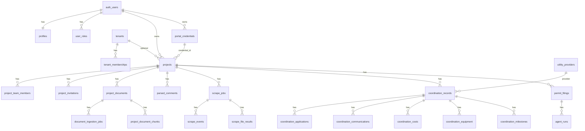

# PermitPilot — Current Data Model

> Audit date: 2026-07-21  
> Source of truth: `supabase/migrations/` (94 files)  
> Caveat: `src/integrations/supabase/types.ts` is **stale** (omits UCI, scrape_jobs, portal_credentials, tenants, etc.)

---

## 1. Entity relationship overview

---

## 2. Table inventory

For each table: PK, FKs, ownership, status columns, FE pages, BE services.

### Identity & access

| Table | PK | FKs | Tenant/ownership | Status / key columns | FE pages | BE services |
|-------|-----|-----|------------------|----------------------|----------|-------------|
| `auth.users` | `id` | — | Supabase Auth | — | Auth | All JWT validation |
| `profiles` | `id` | `user_id` → auth.users | 1:1 user | subscription fields used in code (migration may be out-of-band) | Dashboard, Settings, Pricing | `useAuth`, Stripe webhook |
| `user_roles` | `id` | `user_id` | Platform role | `role`: admin/moderator/user | Admin routes, sidebar | `useRequireAdmin`, Edge admin |
| `tenants` | `id` | — | Org | `is_demo`, `is_active` | (indirect) | UCI access RPCs |
| `tenant_memberships` | `id` | tenant, user | `(tenant_id,user_id)` | `role`: owner/admin/member/viewer | — | Row 2 RPCs |

### Projects & collaboration

| Table | PK | FKs | Ownership | Status | FE | BE |
|-------|-----|-----|-----------|--------|----|----|
| `projects` | `id` | user_id, tenant_id?, credential_id? | Owner user_id | enum draft/submitted/in_review/corrections/approved; `portal_status`; `portal_data` JSONB (runtime); shadow/QB fields | Projects, Dashboard, PortalData, UCI, almost all | Scrapers, UCI, Edge agents |
| `project_team_members` | `id` | project, user | Team | role owner/admin/editor/viewer | Team dialogs | Invitation RPCs, RLS |
| `project_invitations` | `id` | project | Invite email | pending/accepted/declined/expired/revoked | InviteAccept | SECURITY DEFINER RPCs |
| `project_share_links` | `id` | project | Token share | is_active | ClientPortal, Embed | Share policies |
| `project_activity` | `id` | project, user | Log | activity_type enum | Activity feeds | activityLogger |
| `staff_assignments` | `id` | project, user | Staff | — | — | Staff features |

### Credentials & integrations

| Table | PK | FKs | Ownership | Status | FE | BE |
|-------|-----|-----|-----------|--------|----|----|
| `portal_credentials` | `id` | user_id, project_id? | **Per-user** | encrypted password TEXT | Settings, sidebar select | portal-credentials.routes, scrapers, Edge decrypt |
| `quickbooks_connections` | `id` | user_id | Per realm | environment | BillingInvoicePanel | quickbooks.routes |
| `microsoft_mailbox_connections` | `id` | user_id unique | Per user | status; encrypted_token_json | Settings connector | microsoft.routes (PEPCO MFA) |

### Documents & comments

| Table | PK | FKs | Ownership | Status | FE | BE |
|-------|-----|-----|-----------|--------|----|----|
| `project_documents` | `id` | project, user, parent? | Project | document_type; ai_ingestion_status | Documents sections | Ingestion worker, UCI docs |
| `project_document_chunks` | `id` | project, document | Project | embeddings | — | Ingestion worker |
| `document_ingestion_jobs` | `id` | project, document, user | Queue | pending/processing/completed/failed/partial/cancelled | Documents UI | Edge enqueue + worker |
| `parsed_comments` | `id` | project | Project | status Pending Review/Pending/Approved/Rejected; response_status AI Generated/Draft/Awaiting Approval/Approved/Changes Requested | CommentReview, ResponseMatrix, ClassifiedComments | Edge agents |
| `document_comments` | `id` | project, document, user | Author | resolved | Collaboration | — |
| `document_annotations` | `id` | project, document, user | Author | — | Plan markups | — |
| `plan_markups` | `id` | project, comment | Project | pending/approved/rejected | Response flows | — |
| `response_package_drafts` | `id` | project, user | User | — | ResponseMatrix | Export Edge |
| `comment_quality_checks` | `id` | project | Project | — | Shadow/quality | Guardian agent |
| `company_branding` / `architect_profiles` | `id` | user | User | — | Settings | PDF export |

### Scraper jobs

| Table | PK | FKs | Ownership | Status | FE | BE |
|-------|-----|-----|-----------|--------|----|----|
| `scrape_jobs` | `id` | project, user, credential?, coordination_record? | Project (+ tenant?) | queued/running/resuming/rate_limited/partial/waiting_user/completed/completed_with_warnings/failed/failed_unrecoverable/cancelled; job_type e.g. uci_portal_sync | AgentWorkflowStatus, UCI sync UI | Arlington + UCI workers, register-execution-routes |
| `scrape_events` | `id` | job, project | Project | stage/status free text | Progress | scrape-events lib |
| `scrape_file_results` | `id` | project, scrape_job | Project | discovered/downloading/uploaded/retrying/failed/skipped | Portal/file UIs | scrape-file-results |
| `project_pipeline_runs` | `id` | project | Project | pending/running/completed/completed_with_warnings/failed/cancelled | AgentWorkflowStatus | intake-pipeline-agent |

### UCI

| Table | PK | FKs | Ownership | Status | FE | BE |
|-------|-----|-----|-----------|--------|----|----|
| `utility_providers` | `id` | tenant?, template? | Global templates or tenant | automation_status, is_active | UCI setup | listActiveProvidersForApi |
| `utility_provider_aliases` | `id` | provider | Follows provider | — | Alias resolve | resolveProviderAliasForApi |
| `coordination_records` | `id` | project, provider, user, tenant? | Project | current_stage 1–10; current_stage_state NOT_STARTED/IN_PROGRESS/AWAITING_UTILITY/BLOCKED/ESCALATED/COMPLETED; metadata.uci_provider_mapping | UciDashboard | All uci-*.service.js |
| `coordination_stage_transitions` | `id` | project+coordination | Audit | — | — | uci-transitions |
| `coordination_applications` | `id` | project+coordination | **Load profile JSONB `load_summary`** | draft_status draft/reviewed/needs_changes/submitted/failed | Load profile + app prep | load-profile, application-builder/submit |
| `coordination_communications` | `id` | project+coordination | Project | classification, needs_human_attention | Comms panels | portal sync, classifier |
| `coordination_costs` | `id` | project+coordination | Project | — | Limited FE | uci-costs.service |
| `coordination_equipment` | `id` | project+coordination | Project | — | Limited FE | uci-equipment.service |
| `coordination_milestones` | `id` | project+coordination | Project | — | Sync reads | portal sync |

**Not relational tables:**

- **Territory:** GeoJSON under `scraper-service/data/territory/` (+ Storage cache)
- **Provider mappings:** `coordination_records.metadata` JSON
- **Load profiles:** `coordination_applications.load_summary` JSONB + candidate metadata

### Permit wizard / ePermit

| Table | PK | FKs | Ownership | Status | FE | BE |
|-------|-----|-----|-----------|--------|----|----|
| `permit_filings` | `id` | project, user, credential? | User/project | filing_status preflight/awaiting_approval/approved/filing/submitted/failed/cancelled | PermitWizardFiling | permitwizard Edge + scraper |
| `agent_runs` | `id` | filing | Filing | pending/running/completed/failed/escalated/waiting_human | Wizard status | Agents |
| `property_intelligence` / `license_validations` / `filing_documents` / `filing_screenshots` / `filing_professionals` | ids | filing | Filing | various validation_status | Wizard | Agents |
| `municipality_configs` | municipality_key | — | Global | — | Wizard | Config |
| `epermit_submissions` | `id` | project, user | User | pending/submitted/under_review/additional_info_required/approved/denied/cancelled/expired | epermit components | epermit-submit |

### Inspections & checklists

| Table | Status highlights | FE | BE |
|-------|-------------------|----|----|
| `inspections` | scheduled/in_progress/passed/failed/conditional/cancelled | Projects / inspections | reminders Edge |
| `punch_list_items` | open/in_progress/resolved/verified | PunchList | — |
| `inspection_photos` | — | Inspections | Storage |
| `inspection_checklist_templates` / `saved_inspection_checklists` | — | ChecklistHistory | — |
| `scheduled_checklist_reports` / `scheduled_report_delivery_logs` | delivery status | Checklists admin | process-scheduled-* |

### Jurisdictions & marketing

| Table | Notes | FE |
|-------|-------|-----|
| `jurisdictions` | Global catalog `is_active` | Map, compare, admin |
| `jurisdiction_subscriptions` / `jurisdiction_notifications` | Per user / admin | Notifications |
| `coverage_requests` | Public insert; status pending | CoverageRequestForm |
| `saved_calculations` | roi / consolidation | ROI / Consolidation pages |

### Shadow / admin audit

| Table | Status | FE | BE |
|-------|--------|----|----|
| `shadow_predictions` | match/partial/mismatch/pending | ShadowModeDashboard | shadow-evaluator |
| `baseline_actions` / `audit_trail` | action_type | Shadow / audit | Evaluators |
| `admin_activity_log` / `scheduled_notifications` / `user_drip_campaigns` / `email_branding_settings` | campaign/delivery | AdminPanel | admin-drip, email Edge |

### Views

| Name | Use |
|------|-----|
| `project_analytics` | `useAnalytics` → Analytics page |

---

## 3. AuthZ summary (data plane)

| Pattern | Mechanism |
|---------|-----------|
| User-owned rows | `auth.uid() = user_id` (credentials, profiles, saved_calculations) |
| Project team | `has_project_access` / editor / admin helpers |
| UCI + scrape (Row 2) | `has_uci_row_*` when tenant_id set; legacy NULL tenant → project-only |
| Service-role writes | scrape_jobs/events/file_results, pipeline runs, OAuth token tables |
| Approval trigger | `enforce_parsed_comment_response_approval` requires project admin for Approved |
| Demo tenant isolation | `can_access_tenant` blocks demo↔prod crossover unless platform admin |

---

## 4. Schema drift / gaps (observed)

1. Generated types file incomplete vs migrations.
2. `profiles.subscription_*` used in `useAuth.tsx` / Stripe webhook — no matching migration found in repo.
3. `projects.portal_data` heavily used — `portal_data_hash` migrated; JSONB column may be out-of-band.
4. Territory not in Postgres.
5. Shadow RLS patterns lag team-aware helpers.

---

## 5. Storage buckets

| Bucket | Contents | Access |
|--------|----------|--------|
| `project-documents` | Project docs, UCI downloaded PDFs | Storage RLS by user folder + service role uploads |
