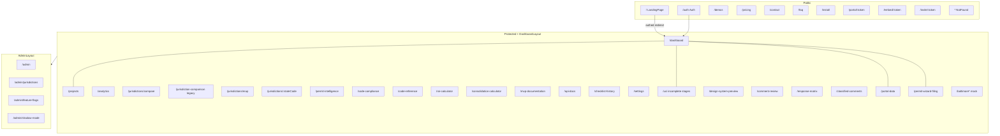

# PermitPilot — Current Page Architecture

> Audit date: 2026-07-21  
> Routes source: `src/App.tsx`  
> Nav source: `src/components/layout/AppSidebar.tsx`

---

## Route status legend

| Tag | Meaning |
|-----|---------|
| **active** | Routed and linked from primary nav (or expected entry) |
| **legacy-alias** | Alternate path to same page |
| **mock** | UI clone / mock data |
| **dev/internal** | Design system or docs preview |
| **unlinked** | Routed but not in main sidebar groups (or only command palette) |
| **unrouted** | Page file exists, no `App.tsx` route |
| **token-public** | Public via share/invite token |
| **incomplete** | Routed but partial backend capability |

---

## Page architecture diagram

---

## Navigation entry points

### Sidebar (`AppSidebar.tsx`)

| Group | Items |
|-------|-------|
| Main | Home `/`, Dashboard `/dashboard` |
| Intake & Review (auth) | Filing, UCI, Portal Harvest, Baltimore, Comment Review, Classified Comments, AI Compliance |
| Response | Response Matrix |
| Projects | Projects |
| Intelligence | Permit Intelligence, Code Library |
| Resources | ROI, Consolidation, Analytics, Map, Compare, Checklists, Demos, Pricing |
| Admin (`isAdmin`) | Overview, Jurisdictions, Feature Flags, Shadow Mode |
| Help | Design preview, API docs, FAQ, Contact |

### Mobile bottom nav (`MobileBottomNav.tsx`)

Home `/` · Projects `/projects` · Portal Harvest `/portal-data` · Filing `/permit-wizard-filing` · More (sidebar)

### Marketing header

Features anchor · Pricing · Demos · FAQ · CTA (dashboard or sign-in)

---

## Every routed page

### Public

| Route | Page name | Purpose | Role | Source | Main components | API deps | State deps | Major actions | Conditional states | Nav entry |
|-------|-----------|---------|------|--------|-----------------|----------|------------|---------------|--------------------|-----------|
| `/` | Landing | Brand landing (Commun-ET) | Public; redirects if authed | `pages/LandingPage.tsx` → `CommunETLanding.tsx` | Marketing sections, counters | None | Auth via PublicOnlyRoute | CTA to auth/demos | Authed → `/dashboard` | Sidebar Home; marketing |
| `/auth` | Auth | Login / signup | Public | `pages/Auth.tsx` | RHF+zod forms | Supabase auth | `useAuth` | Sign in/up | Redirect if session | Marketing CTA |
| `/demos` | Demos | Product demos | Public | `pages/Demos.tsx` | Demo widgets | Lead capture | `useLeadCapture`, `useAuth` | Run demos | Lead/subscription gate | Sidebar Resources; marketing |
| `/pricing` | Pricing | Subscription tiers | Public | `pages/Pricing.tsx` | Tier cards | Edge `create-checkout` | `useAuth` | Start checkout | Authed vs guest CTA | Sidebar; marketing |
| `/contact` | Contact | Contact form | Public | `pages/Contact.tsx` | Form | Edge `send-contact-email` | None | Submit | Success card | Sidebar; marketing |
| `/faq` | FAQ | FAQ accordion | Public | `pages/FAQ.tsx` | Accordion | None | Local search | Search | Empty search | Sidebar; marketing |
| `/install` | Install | PWA install help | Public | `pages/Install.tsx` | Instructions | beforeinstallprompt | None | Install | Browser support | Unlinked (direct) |
| `/portal/:token` | Client Portal | Client project view | Token | `pages/ClientPortal.tsx` | Portal status UI | Supabase share-link policies | Token param | View project | Invalid/expired token | Share link only |
| `/embed/:token` | Embed Widget | Embeddable status | Token | `pages/EmbedWidget.tsx` | Compact widget | Supabase + realtime | Token | Display status | Invalid token | Embed snippet |
| `/invite/:token` | Invite Accept | Accept/decline team invite | Token (+ auth to accept) | `pages/InviteAccept.tsx` | Accept UI | RPCs preview/accept/decline | `useAuth` | Accept/decline | Must sign in; expired | Email invite |
| `*` | Not Found | 404 | Public | `pages/NotFound.tsx` | Message | None | None | Go home | — | Catch-all |

### Protected app

| Route | Page name | Purpose | Role | Source | Main components | API deps | State deps | Major actions | Conditional states | Nav entry |
|-------|-----------|---------|------|--------|-----------------|----------|------------|---------------|--------------------|-----------|
| `/dashboard` | Dashboard | Home hub / onboarding | User | `pages/Dashboard.tsx` | Widgets, onboarding | Supabase profiles/calcs | `useAuth`, `useOnboarding`, `useSelectedProject`, `useGettingStarted` | Onboarding, open widgets | Loading skeletons; empty project | Sidebar |
| `/projects` | Projects | Kanban/list CRUD | User | `pages/Projects.tsx` | `ProjectFormDialog`, Kanban | `useProjects` | Selected project | Create/edit/move | Empty list | Sidebar; mobile |
| `/analytics` | Analytics | Portfolio analytics | User | `pages/Analytics.tsx` | Charts (`components/analytics`) | `useAnalytics` → `project_analytics` | Auth | Export views | Redirect if !user | Sidebar |
| `/jurisdictions/compare` | Jurisdiction Comparison | Side-by-side compare | User | `pages/JurisdictionComparison.tsx` | `JurisdictionComparisonTool` | Jurisdictions data | Auth | Compare | Loading gate | Sidebar |
| `/jurisdiction-comparison` | Jurisdiction Comparison | **legacy-alias** | User | same | same | same | same | same | same | Unlinked alias |
| `/jurisdictions/map` | Jurisdiction Map | Mapbox coverage | User | `pages/JurisdictionMapPage.tsx` | `JurisdictionMap` | Edge `get-mapbox-token` | Auth | Pan/zoom | Missing token error | Sidebar |
| `/jurisdictions/:stateCode` | State Landing | Per-state jurisdictions | User | `pages/StateLandingPage.tsx` | State cards | Supabase `jurisdictions` | Route param | Browse | Empty state | Linked from map/compare |
| `/permit-intelligence` | Permit Intelligence | Shovels search | User | `pages/PermitIntelligence.tsx` | `ShovelsPermitSearch` | Edge `shovels-api` | Auth | Search permits | Auth redirect | Sidebar |
| `/code-compliance` | Code Compliance | AI drawing analyzer | User | `pages/CodeCompliance.tsx` | `AIComplianceAnalyzer` | `/api/analyze-drawing` | Getting started | Upload/analyze | ErrorBoundary | Sidebar |
| `/code-reference` | Code Reference | Code library/matrix | User | `pages/CodeReferenceLibrary.tsx` | `CodeComparisonMatrix` | Mostly static | None | Browse | — | Sidebar |
| `/roi-calculator` | ROI Calculator | Savings calc + charts | User | `pages/ROICalculator.tsx` | Recharts form | `saved_calculations` insert | Auth | Save calc | — | Sidebar |
| `/consolidation-calculator` | Consolidation Calculator | Tool cost compare | User | `pages/ConsolidationCalculator.tsx` | Form + charts | `saved_calculations` | Auth | Save | — | Sidebar |
| `/mvp-documentation` | MVP Documentation | Docs + PDF export | User | `pages/MVPDocumentation.tsx` | Doc viewer | Static data + PDF lib | None | Export PDF | — | Unlinked / help |
| `/api-docs` | API Documentation | Interactive API docs | User | `pages/APIDocumentation.tsx` | Docs browser | Static `apiDocumentationData` | None | Search/export | Empty search | Sidebar Help |
| `/checklist-history` | Checklist History | Saved checklists | User | `pages/ChecklistHistory.tsx` | Checklist lists | `useSavedChecklists`, Edge report | Auth | Send report | Empty | Sidebar |
| `/settings` | Settings | Profile, password, credentials, branding | User | `pages/Settings.tsx` | Settings panels, `PortalCredentialsManager` | Supabase + `/api/portal-credentials` + MS mailbox | Auth | Update profile/creds | Validation errors | Header / unlisted sidebar (via settings entry patterns) |
| `/uci` | UCI Dashboard | Utility coordination lifecycle | User | `pages/UciDashboard.tsx` | `components/uci/*` | `uciApi.ts` → `/api/uci/*` | Project + Auth | Init, resolve, sync, submit | Stages partial/blocked; session expired | Sidebar Intake |
| `/design-system-preview` | Design System Preview | Theme showroom | User | `pages/EpermitDesignSystemPreview.tsx` | `EpdsSections` | None | Theme | Preview | — | Sidebar Help **dev/internal** |
| `/comment-review` | Comment Review | Plan review comments | User | `pages/CommentReview.tsx` | comment-review components | React Query + Edge parse agents | Projects | Upload/classify | Loading/empty | Sidebar |
| `/response-matrix` | Response Matrix | AI responses + package | User | `pages/ResponseMatrix.tsx` | response-matrix components | Edge generate-* | Projects | Approve/export | Approval gate | Sidebar |
| `/classified-comments` | Classified Comments | Discipline classification | User | `pages/ClassifiedComments.tsx` | Classification UI | Edge `discipline-classifier-agent` | Projects | Classify | Empty | Sidebar |
| `/portal-data` | Portal Data Viewer | View/harvest portal data | User | `pages/PortalDataViewer.tsx` | Accela/portal viewers | Scrape APIs + `projects.portal_data` | Scrape + SelectedProject | Start scrape | Empty portal_data | Sidebar; mobile |
| `/permit-wizard-filing` | Permit Wizard Filing | Multi-step filing | User | `pages/PermitWizardFiling.tsx` | permit-wizard components | Edge permitwizard-* + scraper filing | Projects | Preflight/execute | Status machine | Sidebar; mobile |

### Admin (requires `user_roles.admin`)

| Route | Page name | Purpose | Source | Main components | API deps | Nav |
|-------|-----------|---------|--------|-----------------|----------|-----|
| `/admin` | Admin Panel | Users, subscribers, drips | `AdminPanel.tsx` | Admin shells, drip manager | Supabase admin + Edge drip | Admin Overview |
| `/admin/jurisdictions` | Jurisdiction Admin | CRUD jurisdictions | `JurisdictionAdmin.tsx` | `JurisdictionManager` | `jurisdictions` | Admin |
| `/admin/feature-flags` | Feature Flags Admin | Client flags UI | `FeatureFlagsAdmin.tsx` | `FeatureFlagsPanel` | localStorage flags | Admin |
| `/admin/shadow-mode` | Shadow Mode | AI shadow metrics | `ShadowModeDashboard.tsx` | Shadow panels | shadow tables + Edge evaluator | Admin |

### Baltimore mock (comment in App.tsx: UI only)

| Route | Page | Source | Status |
|-------|------|--------|--------|
| `/baltimore` | Portal home | `baltimore/BaltimorePortalHome.tsx` | **mock** |
| `/baltimore/permits` | Permits | `BaltimorePermitsPage.tsx` | **mock** |
| `/baltimore/records` | Records list | `BaltimoreRecordsListPage.tsx` | **mock** |
| `/baltimore/records/:recordId` | Record detail | `BaltimoreRecordDetailPage.tsx` | **mock** |

---

## Unrouted / incomplete

| File | Status |
|------|--------|
| `src/pages/Index.tsx` | **unrouted** legacy marketing home |
| UCI stages 7–10 UI drawers | **incomplete** — APIs exist, dedicated FE drawers largely missing |
| UCI PEPCO live portal submit | **blocked** — env-gated; email fallback |
| Auto territory geocoding (D2.2) | **blocked/partial** — manual resolution path works |

---

## Layout nesting notes

- Most protected routes: `ProtectedLayoutRoute` → `DashboardLayout` → page
- `/uci` is inside protected layout but uses a custom `min-h-screen` wrapper + `ErrorBoundary` (still under DashboardLayout from parent)
- Marketing routes: `MarketingLayout` wrapping pages that often also use `Layout` (double chrome) — preserve behavior when replicating
