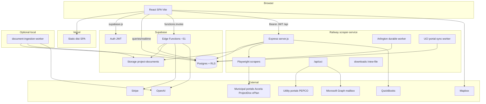
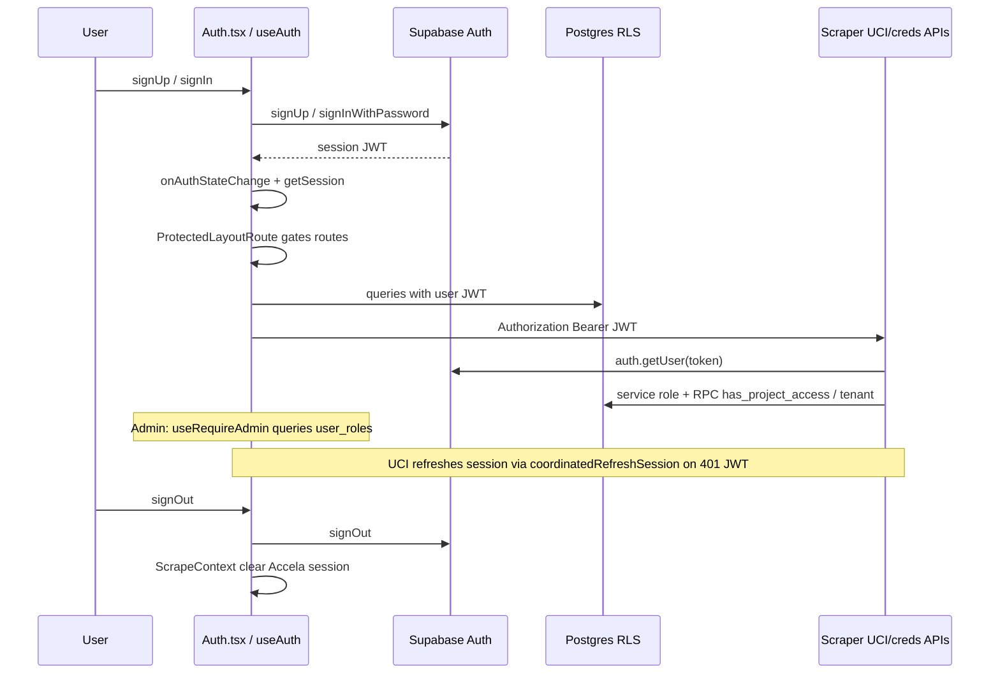
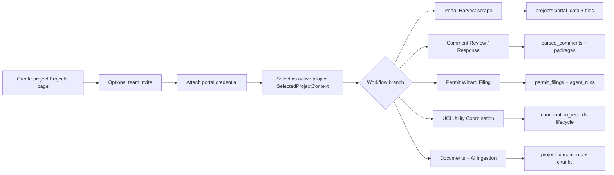
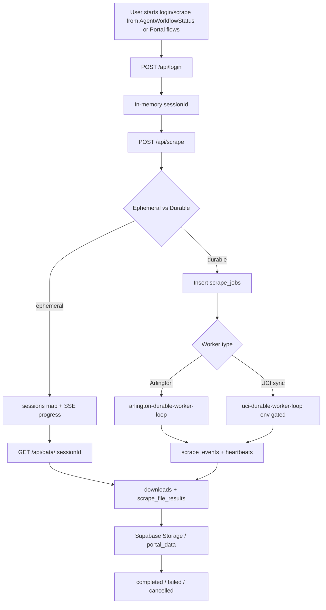
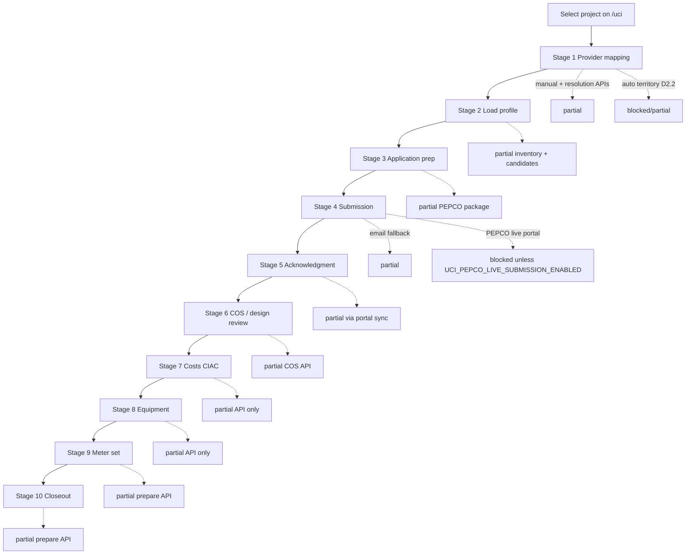
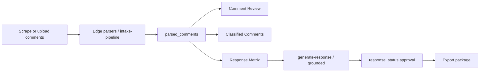
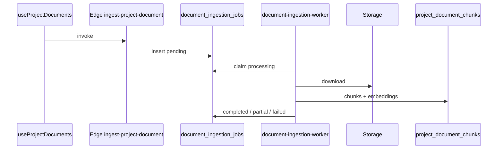
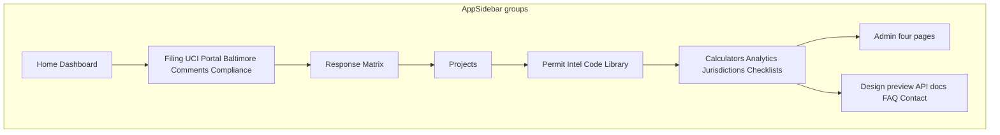

# PermitPilot — Current Workflow Diagrams

> Audit date: 2026-07-21  
> Status tags: **implemented** · **partial** · **mocked** · **blocked**

---

## 1. Application architecture

---

## 2. Authentication workflow

**Access decision locations:**

| Decision | Where |
|----------|-------|
| Must be logged in | `ProtectedRoute.tsx` / `ProtectedLayoutRoute` |
| Must be admin | `AdminLayout` + `useRequireAdmin.ts` (FE); Edge admin functions (BE) |
| Project read/write | RLS helpers; UCI `uci-access.service.js` |
| Credential list/mutate | JWT + `user_id` ownership on portal-credentials routes |
| Scrape session data | **sessionId possession only** (`session-api.routes.js`) |

---

## 3. Project workflow

**Statuses (`projects.status`):** `draft` → `submitted` → `in_review` → `corrections` → `approved` (**implemented** enum).

---

## 4. Scraper workflow

| Stage | Status |
|-------|--------|
| Login + Playwright session | **implemented** |
| Multi-jurisdiction scrapers (DC, Montgomery, Howard, PGC, Arlington, Fairfax, Baltimore modules) | **implemented** (coverage varies by portal) |
| Progress SSE / poll | **implemented** |
| Durable Arlington jobs | **implemented** (worker default on) |
| Durable UCI portal sync jobs | **partial** (requires `UCI_DURABLE_JOBS_ENABLED`) |
| Session API JWT | **blocked** / not present — sessionId only |
| Baltimore UI routes | **mocked** (UI clone; separate from scraper modules) |

---

## 5. Utility coordination (UCI) workflow

| Stage | Name | Implementation |
|-------|------|----------------|
| 1 | Provider mapping | **partial** — D2.0 setup + resolve/confirm/override APIs; auto territory not production-ready |
| 2 | Load profile | **partial** — analyze, candidates, doc findings bridge; no auto stage advance |
| 3 | Application prep | **partial** — package build/review/doc mapping |
| 4 | Submission | **partial** email fallback; **blocked** live PEPCO portal (`uci-application-submit.service.js`, `uci-pepco-submission.service.js`) |
| 5 | Acknowledgment | **partial** — sync → applications/comms/milestones |
| 6 | COS / design | **partial** — `uci-cos-analyst.service.js` |
| 7 | Costs | **partial** — API CRUD; limited FE drawer |
| 8 | Equipment | **partial** — API; limited FE |
| 9 | Meter set | **partial** — prepare API |
| 10 | Closeout | **partial** — prepare API |

**Cross-cutting PEPCO:**

| Capability | Status |
|------------|--------|
| Login / MFA / resume | **partial** |
| Dashboard + app detail discovery | **partial** |
| Document download to Storage | **partial** |
| Portal sync + lifecycle proposals | **partial** |
| Adapter registry (pepco + generic-readonly) | **implemented** |

---

## 6. Comment / response workflow

Approval of `response_status = Approved` enforced by DB trigger requiring project admin (**implemented**).

---

## 7. Document ingestion workflow

---

## 8. Page / nav relationship diagram

See also `docs/current-page-architecture.md`. Condensed:

**Marked routes:**

- **legacy-alias:** `/jurisdiction-comparison`
- **mock:** `/baltimore*`
- **dev/internal:** `/design-system-preview`
- **incomplete:** `/uci` (later stages FE thin)
- **unrouted:** `pages/Index.tsx`
- **token-public:** `/portal/:token`, `/embed/:token`, `/invite/:token`
