# Component Architecture

Grouped by scope. Source directories:

- Global shadcn primitives: `src/components/ui/` (49 files).
- Feature-level reusables: `src/components/permitpilot/` + `src/components/` root.
- Page-specific: everything inside `src/pages/*.tsx`.

```mermaid
flowchart TB
  subgraph ROOT["App root (src/App.tsx)"]
    QC["QueryClientProvider"]
    TT["TooltipProvider"]
    RT["BrowserRouter"]
    AUTHP["AuthProvider"]
    APP["ActiveProjectProvider"]
    TOAST["Toaster + Sonner"]
  end
  QC --> TT --> RT --> AUTHP --> APP

  subgraph SHELL["PermitPilotShell"]
    SP["SidebarProvider"]
    SB["AppSidebar"]
    HDR["AppHeader"]
    OUT["Outlet page area"]
    TT2["ThemeToggle"]
    APICK["ActiveProjectPicker"]
  end
  APP --> SHELL
  SB -->|navGroups from data.ts| NAV["Sidebar nav items"]
  SB --> ROLE["useUserRole filters UCI nav"]
  HDR --> TT2
  HDR --> APICK

  subgraph GLOBAL["Global reusable — shadcn / Radix (src/components/ui)"]
    UI1["Sidebar / Sheet"]
    UI2["Dialog / AlertDialog / Drawer"]
    UI3["Table / Tabs / Accordion"]
    UI4["Button / Input / Textarea / Select / Checkbox / Switch / RadioGroup / Slider"]
    UI5["Card / Badge / Avatar / Skeleton / Separator"]
    UI6["Toast / Sonner / Tooltip / HoverCard / Popover / DropdownMenu"]
    UI7["Chart (recharts wrapper)"]
    UI8["Calendar / Command / Carousel / Pagination / Progress / ScrollArea"]
    UI9["Breadcrumb / NavigationMenu / Toggle / Form (RHF)"]
  end

  subgraph FEATURE["Feature reusables"]
    PP["ProductPrimitives — PageHeader, StatCard, MetricCard, Panel, StatusPill, ProgressLine, ProjectLink, ServicePill, AlertBanner"]
    US["UciStates — UciLoading, UciEmpty"]
    AD["AccessDenied"]
    RG["RequireUciAccess"]
    CE["CsvExportDialog"]
    GT["GuidedTour"]
    HCF["home/ContactForm"]
    DATA["permitpilot/data.ts — navGroups, projects, kpis, agents, tasks, permits, documents, designAgents, activityFeed, messageThreads, adminCards, closeoutItems, quickActions"]
    TAX["compliance-taxonomy.ts"]
    UDATA["data/utilityProviders.ts"]
  end

  subgraph PAGES["Page-specific components (src/pages)"]
    DASHP["Dashboard + DashboardOverview"]
    AIWFP["AiWorkflow (Zod dialog, lanes, localStorage)"]
    CAP["ComplianceAnalyzer (preset notes editor)"]
    OLA["OnboardingAuthorization (typed + drawn signature, jsPDF)"]
    ADMP["AdminMembers / AdminAuthorizations / AdminAuditLog / AdminConsole / Admin*"]
    UCIP["Uci* pages (static + UciLoading/UciEmpty)"]
    OPSP["OperationsBoard (Monday-style groups)"]
    DEMOP["DemoMcDonalds"]
    CCP["CommandCenter, MissionControl, PermitQueue, Projects, ProjectWorkspace, ProjectTimeline, ProjectGantt, CriticalPath, PortfolioExecutive"]
    UTILP["UtilityMap, UtilityProviderMap, CrossUtilityConflictHunter, EasementRowManager, LoadProfileAnalyzer, MeterSetChoreographer, LongLeadEquipment, PredictiveScheduleImpact, InspectorReleaseTracker"]
    MTXP["MasterMatrix, UnifiedMatrix, GuidedFlow, ResponseMatrix"]
    COMPP["Compliance, ComplianceIntelligence, InternalPrescreen"]
    SIRP["Sir, SirWorkspace, SirAnnex, SirExecutive, SirSync"]
    FIELDP["FieldStudio, MobileSurvey, MobileCamera, MobileMap"]
    CLOP["Closeout, CloseoutArchive, CloseoutTracker, PostMortem, PostMortemAnalytics, PostMortemFinancial"]
    REFP["ReferenceLibrary, UtilityCoverage, Glossary, Checklists"]
    MISCP["Home, Contact, Settings, PlatformArchitecture, ContentStudio, AgentCenter, Messages, DocumentVault, Feasibility, SiteFeasibility, RazePermit, PortalHarvest, ProjectSetupCredentials, MilestoneBilling"]
  end

  subgraph HOOKS["Hooks / state"]
    H1["useAuth"]
    H2["useUserRole"]
    H3["useTheme"]
    H4["useDemoMode"]
    H5["useInView"]
    H6["use-mobile"]
    H7["use-toast"]
    S1["activeProject context"]
  end

  subgraph LIB["Lib"]
    L1["accessAudit"]
    L2["exportCsv / exportFindings"]
    L3["utility-letter-validation"]
    L4["utils (cn)"]
    L5["integrations/supabase/client (auto)"]
  end

  OUT --> PAGES
  PAGES --> FEATURE
  PAGES --> GLOBAL
  FEATURE --> GLOBAL
  ADMP --> AD
  RG --> AD
  UCIP --> US
  DEMOP --> GT
  ADMP -->|CSV| CE
  DASHP --> APICK
  SHELL --> HOOKS
  PAGES --> HOOKS
  PAGES --> LIB
```

Parent-child summary:

- `App` → `PermitPilotShell` → (`AppSidebar` + `AppHeader` + `Outlet` = every page).
- Every page consumes `ProductPrimitives` (`PageHeader`, `Panel`, `StatusPill`, `ProgressLine`, `StatCard`, `AlertBanner`) plus shadcn `ui/*`.
- UCI pages additionally consume `UciStates` and are wrapped by `RequireUciAccess` → renders `AccessDenied` on deny.
- Admin pages consume `CsvExportDialog`, `AccessDenied`, and Supabase-backed data via `integrations/supabase/client`.
- `DemoMcDonalds` renders `GuidedTour` overlay.
- Data-only modules: `permitpilot/data.ts`, `data/utilityProviders.ts`, `permitpilot/compliance-taxonomy.ts` — pure content, no components.