# Page & Navigation Architecture

Sourced from `src/App.tsx` route table and `src/components/permitpilot/data.ts` sidebar groups. Nodes use real route paths.

```mermaid
flowchart LR
  subgraph AUTH["Auth (no shell)"]
    LOGIN["/login"]
    SIGNUP["/signup"]
  end

  LOGIN -->|success| DASH
  LOGIN -.->|rejected| LOGIN
  SIGNUP -->|invited email| DASH
  SIGNUP -.->|self-serve| PENDING["Pending approval (no roles)"]

  subgraph SHELL["PermitPilotShell (Sidebar + Header)"]
    HOME["/"]

    subgraph CMD["Command"]
      DASH["/dashboard"]
      UCIDN["/dashboard/uci"]
      PROJECTS["/projects"]
      PQ["/permit-queue"]
      DEMO["/demo/mcdonalds"]
    end
    DASH --> UCIDN

    subgraph ONB["Onboarding"]
      ONBLOA["/onboarding/authorization"]
    end

    subgraph DEL["Delivery"]
      DELLOA["/delivery/authorization"]
      OPS["/operations"]
      GUIDED["/matrix/guided"]
      RESP["/matrix/response"]
      HARV["/portals/harvest"]
    end

    subgraph INTEL["Intelligence"]
      DC["/compliance"]
      DCA["/compliance/analyzer"]
      UCI["/uci"]
      UCISUB["/uci/submissions"]
      UCIINBOX["/uci/communications"]
      UCICOS["/uci/class-of-service"]
      UCICIAC["/uci/ciac"]
      UCIENERG["/uci/energization"]
      UCIMU["/uci/miss-utility"]
      UCIKG["/uci/knowledge-graph"]
      UMAP["/utility-map"]
      UPMAP["/utility/provider-map"]
      UCIB["/uci/application-builder"]
    end

    subgraph RES["Resources"]
      CHK["/checklists"]
      REF["/reference"]
      UCOV["/reference/utility-coverage"]
      GLOSS["/reference/glossary"]
      PORTX["/portfolio/executive"]
      MSG["/messages"]
    end

    subgraph HELP["Help & Support"]
      PRICE["/ pricing"]
      DOCS["/reference"]
      SUP["/messages"]
      SET["/settings"]
    end

    subgraph HIDDEN["Route-only (no sidebar link)"]
      MC["/mission-control"]
      CC["/command-center"]
      CP["/critical-path"]
      FEAS["/feasibility"]
      FEASS["/feasibility/site"]
      PNEW["/projects/new"]
      PALPHA["/projects/alpha"]
      PTL["/projects/:id/timeline"]
      PGA["/projects/:id/gantt"]
      MTX["/matrix"]
      MTXU["/matrix/unified"]
      AIWF["/matrix/ai-workflow"]
      CINT["/compliance/intelligence"]
      CPRE["/compliance/prescreen"]
      RAZE["/raze"]
      DOCV["/documents"]
      AGC["/agents"]
      MOBS["/mobile/survey"]
      MOBC["/mobile/camera"]
      MOBM["/mobile/map"]
      FSTU["/field/studio"]
      SIR["/sir"]
      SIRW["/sir/workspace"]
      SIRA["/sir/annex"]
      SIRE["/sir/executive"]
      SIRS["/sir/sync"]
      ISP["/inspections/special"]
      IFCO["/inspections/final-co"]
      IREL["/inspections/release-tracker"]
      CLO["/closeout"]
      CLOA["/closeout/archive"]
      CLOT["/closeout/tracker"]
      PM["/closeout/post-mortem"]
      PMA["/closeout/post-mortem/analytics"]
      PMF["/closeout/post-mortem/financial"]
      ARCHP["/architecture"]
      CST["/content-studio"]
      UCONF["/utility/conflict-hunter"]
      UEAS["/utility/easements"]
      ULP["/utility/load-profile"]
      UMS["/utility/meter-set"]
      LLE["/scheduling/long-lead"]
      PSI["/scheduling/predictive-impact"]
      CONT["/contact"]
    end

    subgraph ADMIN["Admin (role: admin)"]
      ADM["/admin"]
      ADMAUTH["/admin/authorizations"]
      ADMMEM["/admin/members"]
      ADMAUD["/admin/audit"]
      ADMINV["/admin/invoicing"]
      ADMPP["/admin/past-performance"]
      ADMCRM["/admin/crm"]
      ADMBILL["/admin/milestone-billing"]
      ADMEP["/admin/endpoints"]
    end
  end

  UCI & UCISUB & UCIINBOX & UCICOS & UCICIAC & UCIENERG -.->|admin/staff/client| GATE{{"RequireUciAccess"}}
  UCIMU & UCIB & UCIKG -.->|admin/staff only| GATE
  GATE -.->|deny| DENIED["AccessDenied card"]

  HDR["Header actions: New Workflow / Request Demo / Back / Home / Search / Active project picker / Theme toggle / Notifications / Avatar"]
  HDR -->|Plus| AIWF
  HDR -->|Sparkles| DEMO
  HDR -->|Home| DASH

  ADM --> ADMAUTH & ADMMEM & ADMAUD & ADMINV & ADMPP & ADMCRM & ADMBILL & ADMEP

  CC -->|Open| PALPHA
  PALPHA --> PTL
  PALPHA --> PGA

  DEMO -.-> TOUR[["GuidedTour 9-step spotlight"]]

  NOMATCH["* unmatched"] -->|Navigate replace| DASH
```

Role-based filtering: `AppSidebar` hides any UCI nav item where the signed-in role fails `canViewUciPath(path, roles)`; anonymous users see all UCI items but hit `AccessDenied` on click.