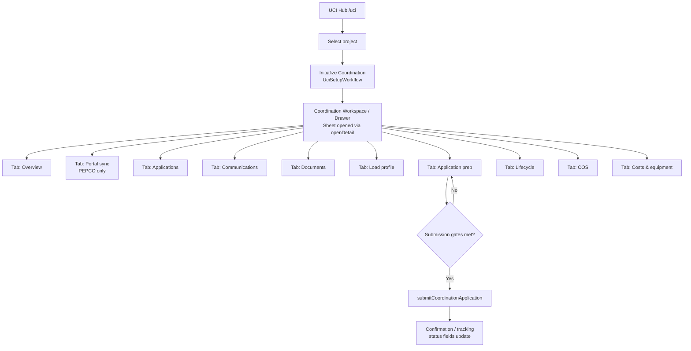
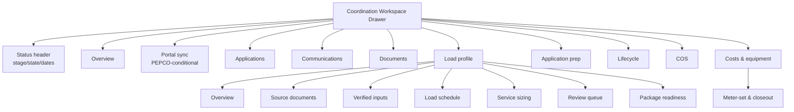
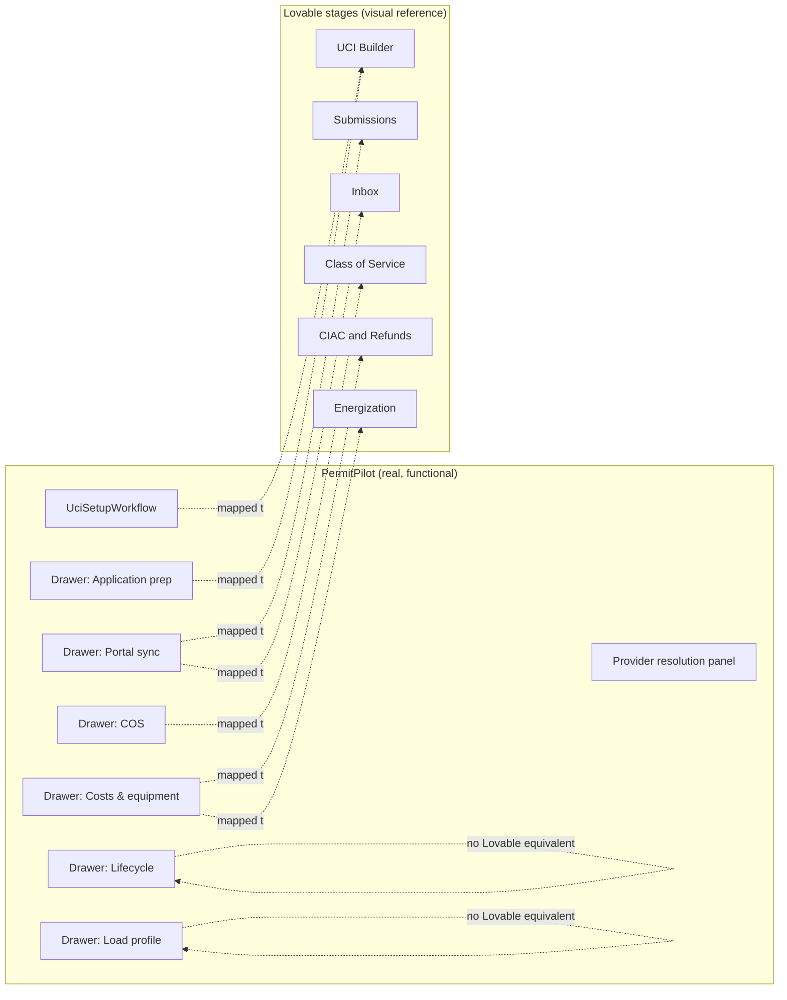
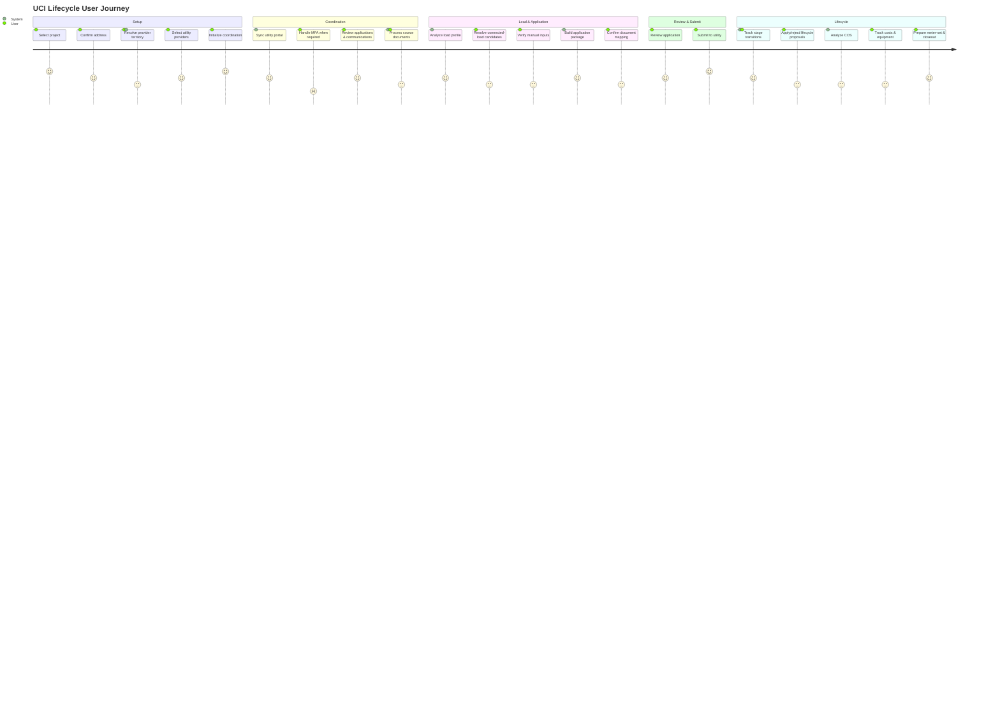

# UCI Navigation & Workspace Replication Plan

Status: **Implementation in progress on `feat/lovable-ui-replication`.**
Scope: `/uci` (Utility Coordination Intelligence) navigation, hub, coordination workspace/drawer, and related nav surfaces.

**Amendment (expandable sidebar):** Product direction supersedes the earlier “net sidebar diff: none / hide Lovable sub-items” proposal. Utility Coordination is now an **expandable** sidebar entry that lists every Lovable UCI nav item, each classified `Active` / `Partial` / `Mock`, deep-linked via `/uci?section=…` (or external PP routes). Unsupported items stay visible with a Soon badge and a non-functional Coming Soon panel — never fake records or actions.

**Golden rule for this entire document:** Lovable (`reference/lovable-ui/**`) is a *visual/flow reference only*. Every current PermitPilot (PP) UCI capability — components, `/api/uci/**` endpoints, statuses, permissions, lifecycle rules — remains the functional source of truth. Nothing below proposes deleting, hiding, or disconnecting an existing working PP option. Lovable-only surfaces are explicitly labeled as non-functional reference material unless a real PP backend already exists for them.

---

## 0. Evidence base (what was actually read)

**Current PermitPilot (PP):**
- `src/App.tsx` (routes, `/uci` mount at line 174‑183)
- `src/components/layout/AppSidebar.tsx`, `src/components/layout/hybridNav.ts` (nav model)
- `src/components/layout/DashboardLayout.tsx`, `src/components/navigation/CommandPalette.tsx` (global header + ⌘K search)
- `src/components/layout/MobileBottomNav.tsx` (mobile nav)
- `src/pages/UciDashboard.tsx` — 4,665 lines, read in full via targeted ranges (imports, hub render 2415‑2838, drawer render 2840‑3475, section components 3469‑4665)
- `src/components/uci/UciSetupWorkflow.tsx`, `UciProviderResolutionPanel.tsx`, `UciD13WorkflowPanels.tsx`, `PepcoApplicationDetailsPanel.tsx`, `PepcoPortalDrawerSection.tsx`, `PepcoProjectList.tsx`, `UciProjectContextBar.tsx`, `TenantContextBadge.tsx`, `LoadProfileWorkspace.tsx` (partial), `UciDocumentCoveragePanel.tsx` (partial) — all read
- `src/lib/uciApi.ts` (full, 1,417 lines — every exported endpoint function), plus `uciApplicationPrep.ts`, `uciLifecycleProposals.ts`, `uciNormalizedSync.ts`, `uciSetupWorkflow.ts`, `uciLoadProfile.ts`, `uciLoadProfileWorkspace.ts`, `uciProviderResolution.ts`, `uciProjectScopedRequest.ts`, `uciCommunicationClassifier.ts`, `pepcoApplicationDetailUi.ts` (all located; signatures reviewed)
- `src/types/uci.ts` (lines 1‑60 read for `CoordinationRecord`/`LifecycleState` shape)
- Consumers of `uciApi`: `src/pages/UciDashboard.tsx`, `src/components/uci/PepcoApplicationDetailsPanel.tsx`, `src/components/uci/UciDocumentCoveragePanel.tsx`, `src/components/settings/PortalCredentialsManager.tsx` (grep-confirmed, all 4 files)

**Lovable reference:**
- `reference/lovable-ui/src/pages/UciDashboard.tsx` (full, 763 lines — confirmed 100% mock data / `localStorage` / query-param demo state, zero backend calls)
- `reference/lovable-ui/src/pages/UciSubmissions.tsx`, `UciCommunications.tsx` (full)
- `reference/lovable-ui/src/pages/UciClassOfService.tsx`, `UciCiac.tsx`, `UciEnergization.tsx`, `UciMissUtility.tsx`, `UciKnowledgeGraph.tsx`, `UciApplicationBuilder.tsx` (headers + logic read)
- `reference/lovable-ui/src/components/permitpilot/data.ts` (`navGroups`, full)
- `reference/lovable-ui/src/App.tsx` (route table for `/uci/*` and `/utility/*`, `/scheduling/*`)
- `reference/lovable-ui/src/components/RequireUciAccess.tsx` (role-gate wrapper, not present in PP)

No PP application code, Lovable reference code, or non-doc file was modified while producing this plan.

---

## A. Final UCI architecture

### A.1 Guiding constraint

PP's `/uci` page already implements a **"hub is primary" pattern** (see `src/pages/UciDashboard.tsx:2451‑2456` code comment): a Lovable-style tile grid sits above a real records table, and the old step-by-step setup form is secondary. This plan **extends that pattern** rather than replacing it — it does not reintroduce a Lovable multi-page IA where no PP backend exists.

### A.2 Proposed structure

```
Main sidebar
 └─ Intelligence group
     └─ Utility Coordination  [expandable]
         ├─ Hub                          → /uci
         ├─ Overview              Active → /uci?section=overview
         ├─ Submissions           Partial → /uci?section=submissions&tab=application-prep
         ├─ Communications/Inbox  Partial → /uci?section=communications&tab=communications
         ├─ Class of Service      Partial → /uci?section=class-of-service&tab=cos
         ├─ CIAC & Refunds        Partial → /uci?section=ciac&tab=costs
         ├─ Energization          Partial → /uci?section=energization&tab=costs
         ├─ Load Profile          Active → /uci?section=load-profile&tab=load-profile
         ├─ Provider Map          Active → /jurisdictions/map
         ├─ Application Builder   Active → /uci?section=application-builder&tab=application-prep
         ├─ Meter Set             Partial → /uci?section=meter-set&tab=costs
         ├─ Miss Utility          Mock   → /uci?section=miss-utility  (Coming Soon panel)
         ├─ Knowledge Graph       Mock   → /uci?section=knowledge-graph
         ├─ Conflict Hunter       Mock   → /uci?section=conflict-hunter
         ├─ Easement / ROW        Mock   → /uci?section=easement
         └─ Portfolio / Quarter   Mock   → /uci?section=portfolio

/uci  — single hub route (no /uci/submissions etc. fake pages)
 ├─ Optional Coming Soon / Partial banner from ?section=
 ├─ Project context bar, KPIs, tiles, stage rail, records, attention, setup
 └─ Coordination Workspace (Sheet) — TABBED (§C)
      ?coordination=<id>&tab=<drawer-tab>
```

Source of truth for nav metadata: `src/lib/uciNavSections.ts`. Sidebar UI: `src/components/layout/UciSidebarNav.tsx`.

### A.3 Why deep links instead of Lovable multi-page routes

Lovable's separate `/uci/*` pages are **100% mock**. We surface every Lovable label in the expandable sidebar for IA parity, but **Active/Partial** items deep-link into real PP hub/drawer surfaces; **Mock** items open a Coming Soon panel with no fake data. No new Express routes or mock tables.

### A.4 Deep links

- `/uci` — hub.
- `/uci?section=<id>` — sidebar section (see `UCI_NAV_SECTIONS`).
- `/uci?coordination=<id>&tab=<drawer-tab>` — open drawer on a record/tab.
- No `/uci/submissions`-style child routes.

### A.5 Mobile nav behavior

- `src/components/layout/MobileBottomNav.tsx:9‑14` shows 4 fixed bottom-tab items (Home, Projects, Harvest, Filing) plus a "More" button that opens the full sidebar. **UCI has no direct mobile bottom-tab entry today** — it's only reachable via "More" → sidebar → Intelligence → Utility Coordination.
- Proposal: **do not** add a 5th bottom-tab slot (that changes an already-tuned mobile IA for a workspace that's desktop-heavy — wide tables, drawer with many stacked cards). Instead, keep current behavior and ensure the drawer (`SheetContent` at `UciDashboard.tsx:2841‑2848`) — already responsive (`w-full max-w-[100vw]` → `sm:max-w-[88vw]` → `xl:max-w-[1280px]`) — gets the same tab restructuring proposed in §C so mobile users scroll through fewer, better-organized sections instead of ~14 stacked cards.

---

## B. Current functionality placement map

Legend for "Risk of losing functionality": 🟢 none (pure relabel/regroup) · 🟡 low (state/URL plumbing only) · 🔴 requires care (touches business logic).

| Feature | Current component/file | Current API/service | Current entry point | Proposed Lovable nav location | Proposed drawer/tab/page | Stays in drawer or moves? | Dependencies | State preserved | Risk |
|---|---|---|---|---|---|---|---|---|---|
| Coordination initialization (project/address/provider select + init) | `UciSetupWorkflow.tsx` (full file), used from `UciDashboard.tsx:2794‑2836` | `initProjectCoordination` (`uciApi.ts:507`), `getProjectProviderSetup` (`:419`) | `/uci` → "Setup" hub tile (`UciDashboard.tsx:2569‑2585`) | `/uci` hub, "Setup" tile (unchanged) | Stays as in-page section (`#uci-setup-workflow`), not moved into drawer | Main workspace (unchanged) | `useProjects`, `useSelectedProjectOptional`, provider catalog | All (`projectId`, `initPick`, `providerSetupConfirmed`, etc.) | 🟢 |
| Project/provider selection | `UciSetupWorkflow.tsx:280‑376` (Step 1), `loadProviders` (`UciDashboard.tsx:584`) | `listUciProviders` (`uciApi.ts:373`) | Setup section, Step 1 | Same | Same | Main workspace | `useProjects` | `projectId` state | 🟢 |
| Provider mapping / territory resolution | `UciProviderResolutionPanel.tsx` (full) | `getProjectProviderResolution`, `resolveProjectProviderResolution`, `confirmProjectProviderResolution`, `overrideProjectProviderResolution` (`uciApi.ts:429‑505`) | Setup section, Step "2b" | Same | Same (kept as its own numbered step, not merged into provider picker) | Main workspace | EIA electric-territory dataset (backend) | `providerResolution`, `addressSourceAcknowledged` | 🟢 |
| Territory resolution (record-level banner) | `ProviderMappingBanner` (`UciD13WorkflowPanels.tsx:41‑67`) | reads `record.metadata.uci_provider_mapping` | Drawer, always visible | Drawer | **Tab: "Overview"** (see §C) | Stays in drawer | `getRecordProviderMapping` (`UciD13WorkflowPanels.tsx:627‑634`) | n/a (read-only) | 🟢 |
| Utility portal sync (PEPCO discovery/login/dashboard/resume) | `PepcoPortalHeaderSection` (`PepcoPortalDrawerSection.tsx:160‑346`) | `postPepcoDiscovery`, `resumePepcoDiscovery`, `postPepcoDashboardDiscovery`, `triggerCoordinationSync` (`uciApi.ts:914‑978`) | Drawer, PEPCO-only branch (`UciDashboard.tsx:2933‑3063`) | Drawer | **Tab: "Portal sync"** | Stays in drawer | `isPepcoCoordination` flag | All busy/session-id state | 🟡 |
| Login/MFA/resume | `PepcoDeveloperTools` (`PepcoPortalDrawerSection.tsx:348‑496`), MFA dialog (`UciDashboard.tsx:3377‑3410+`) | `submitPepcoMfaCode`, `resumePepcoApplicationDetailDiscovery` (`uciApi.ts:1031‑1222`) | Drawer, collapsed "Developer tools" + modal | Drawer | Stays under **"Portal sync" tab → Developer tools** collapsible (unchanged visibility default: collapsed) | Stays in drawer | Session id refs, Microsoft mailbox status (`getMicrosoftMailboxStatus`) | All session/progress state | 🟡 |
| Applications (portal + normalized) | `PepcoSelectedProjectDetailTabs` (`PepcoApplicationDetailsPanel.tsx:792‑899`), normalized-applications card (`UciDashboard.tsx:3184‑3230`) | `listCoordinationApplications` (`uciApi.ts:904`) | Drawer | Drawer | **Tab: "Applications"** (merges PEPCO detail tabs + normalized card) | Stays in drawer | `detail.applications` | Selected sub-tab (Overview/Status/Messages/Documents) | 🟡 |
| Communications | Communications card (`UciDashboard.tsx:3232‑3301`), `CommunicationReclassifyRow` (`UciD13WorkflowPanels.tsx:195‑237`) | `listCoordinationCommunications` (`:980`), `classifyCoordinationCommunications` (`:863`), `reclassifyCommunication` (`:1280`) | Drawer | Drawer | **Tab: "Communications"** | Stays in drawer | `UCI_COMMUNICATION_CATEGORIES` | `reclassifyCommId` busy state | 🟢 |
| Source documents (manifest, findings, fallback OCR/vision) | `UciDocumentCoveragePanel.tsx` (full) | `getCoordinationDocumentManifest`, `runCoordinationDocumentProcessing`, `getCoordinationDocumentFallbackEstimate`, `runCoordinationDocumentFallback` (`uciApi.ts:574‑664`) | Drawer, always rendered (`UciDashboard.tsx:3065‑3072`) | Drawer | **Tab: "Documents"** | Stays in drawer | `resolvePortalDocumentIndex` | Manifest/findings dialogs | 🟢 |
| Document candidate confirm/remove (application package mapping) | `ApplicationPrepSection` (`UciDashboard.tsx:3800‑4372`) | `listApplicationPackageDocumentCandidates`, `confirmApplicationPackageDocumentMapping`, `removeApplicationPackageDocumentMapping` (`uciApi.ts:767‑827`) | Drawer, "Application preparation" card | Drawer | **Tab: "Application prep"** | Stays in drawer | `packageApp`, `candidatesPayload` | Per-slot candidate selection | 🔴 (business-critical mapping state — do not restructure props, only relocate render position) |
| Verified inputs | `ConnectedLoadReviewPanel` + `LoadProfileWorkspace` "verified_inputs" section (`uciLoadProfileWorkspace.ts`, `LoadProfileWorkspace.tsx:56‑63`) | `addCoordinationManualVerifiedValue` (`uciApi.ts:731`), `resolveCoordinationLoadCandidate` (`:710`) | Drawer, "Load profile" section | Drawer | **Tab: "Load profile" → sub-section "Verified inputs"** | Stays in drawer | `MANUAL_VERIFIABLE_FIELD_OPTIONS`, `validateManualVerifiedInput` | Candidate resolve/edit state | 🔴 |
| Load profile (analyze) | `LoadProfileWorkspace.tsx` "overview" section | `analyzeCoordinationLoadProfile` (`uciApi.ts:538`) | Drawer | Drawer | **Tab: "Load profile" → "Overview"** | Stays in drawer | `getLoadProfileOverview` | analyze busy state | 🟡 |
| Load schedule | `LoadProfileWorkspace.tsx` "load_schedule" section (`buildLoadScheduleRows`, `getLoadScheduleTotals`) | (derived client-side from resolved candidates; no separate endpoint) | Drawer | Drawer | **Tab: "Load profile" → "Load schedule"** | Stays in drawer | resolved candidates | n/a | 🟢 |
| Service sizing | `LoadProfileWorkspace.tsx` "service_sizing" section (`buildServiceSizingFields`) | same as above | Drawer | Drawer | **Tab: "Load profile" → "Service sizing"** | Stays in drawer | resolved candidates | n/a | 🟢 |
| Review queue | `LoadProfileWorkspace.tsx` "review_queue" section | `listCoordinationLoadCandidates` (`:694`) | Drawer | Drawer | **Tab: "Load profile" → "Review queue"** | Stays in drawer | candidate extraction results | selected section persisted via `persistWorkspaceSection`/`readStoredWorkspaceSection` | 🟢 |
| Package readiness | `LoadProfileWorkspace.tsx` "package_readiness" section (`buildPackageReadinessChecklist`) | derived | Drawer | Drawer | **Tab: "Load profile" → "Package readiness"** | Stays in drawer | `packageStatus`, `hasProjectAddress`, `packageDocumentsComplete` | n/a | 🟢 |
| Review queue → application review | `ApplicationPrepSection` review controls | `reviewCoordinationApplication` (`uciApi.ts:829`) | Drawer, "Application preparation" | Drawer | **Tab: "Application prep"** | Stays in drawer | `applicationReviewNotes` | review notes textarea | 🟡 |
| Approvals (accept/reject lifecycle proposal) | `LifecycleProposalActions` (`UciD13WorkflowPanels.tsx:510‑544`) | `applyLifecycleProposal`, `rejectLifecycleProposal` (`uciApi.ts:1224‑1252`) | Drawer, "Lifecycle" collapsible | Drawer | **Tab: "Lifecycle"** | Stays in drawer | checksum-protected proposal payload | proposal busy state | 🔴 (checksum-protected — must not change apply/reject wiring) |
| Package readiness (submission gate) | `canSubmitApplication` (`uciApplicationPrep.ts`) gating `submitReady` in `ApplicationPrepSection` | n/a (client-side gate) | Drawer | Drawer | **Tab: "Application prep"** | Stays in drawer | `draft_status` | n/a | 🟢 |
| Application preparation | `ApplicationPrepSection` build/rebuild | `buildCoordinationApplicationPackage` (`uciApi.ts:748`) | Drawer | Drawer | **Tab: "Application prep"** | Stays in drawer | `getLoadProfileDraftApplication` | n/a | 🟡 |
| Submission gates + email submission | `ApplicationPrepSection` submit button | `submitCoordinationApplication` (`uciApi.ts:844`, supports `live_submission_confirmed`, `portal_populate`, `credential_id`) | Drawer | Drawer | **Tab: "Application prep"** | Stays in drawer | credential selection (Settings → Portal credentials) | submit busy state | 🔴 |
| Dry run | *Not found as a distinct feature.* `submitCoordinationApplication`'s `live_submission_confirmed` flag is the closest analog (submission occurs only when explicitly confirmed) — there is no separate "dry run" mode/endpoint in PP today. | — | — | — | — | — | — | — | See PD-1 |
| Confirmation/tracking | `application_submitted_at`, `acknowledgment_received_at` fields (`types/uci.ts:45‑46`), "Coordination status" grid (`UciDashboard.tsx:2873‑2931`) | part of `CoordinationRecord` | Drawer header | Drawer | **Header status strip** (kept out of tabs — always visible) | Stays in drawer, above tabs | n/a | n/a | 🟢 |
| Lifecycle stages (10-stage tracker + manual transition) | Hub stage rail (`UciDashboard.tsx:2590‑2622`), `LifecycleSection` (`:4372‑4600`) | `transitionCoordination` (`uciApi.ts:889`) | Hub (read-only rail) + Drawer (`LifecycleSection`, transitions list + "Update stage" form) | Hub unchanged; Drawer | **Tab: "Lifecycle"** | Hub rail stays on hub; drawer detail moves into "Lifecycle" tab | `STAGE_OPTIONS` (1‑10), `LIFECYCLE_OPTIONS` (`types/uci.ts:3‑9`) | `toStage`/`toState`/`reason` form state | 🟡 |
| Blockers & proposed transitions | `displayLifecycleProposal` / `getLifecycleProposalsFromMetadata` (`uciLifecycleProposals.ts`), rendered in `LifecycleSection` | reads `record.metadata` proposal payload; actions via `applyLifecycleProposal`/`rejectLifecycleProposal` | Drawer, "Lifecycle" collapsible | Drawer | **Tab: "Lifecycle"** | Stays in drawer | `computeLifecycleProposalChecksum` | n/a | 🔴 |
| Sync runs (durable job polling) | `SyncRunsPanel` (`UciD13WorkflowPanels.tsx:120‑193`), `useSyncRunPolling` (`:546‑625`) | `listCoordinationSyncRuns`, `getCoordinationSyncRun` (`uciApi.ts:1254‑1278`) | Drawer, "Durable sync runs" collapsible | Drawer | **Tab: "Portal sync" → "Sync runs"** | Stays in drawer | `UCI_SYNC_RUN_STORAGE_PREFIX` sessionStorage key | polling interval/backoff state | 🟡 |
| COS / design review analysis | `CosAnalysisPanel` (`UciD13WorkflowPanels.tsx:239‑288`) | `analyzeCoordinationCos` (`uciApi.ts:1295`) | Drawer | Drawer | **Tab: "COS"** (own tab — see PD-2 on whether to merge with Lifecycle) | Stays in drawer | `metadata.uci_cos_analysis` | n/a | 🟢 |
| Costs & equipment | `CostsEquipmentWorkflowPanel` (`UciD13WorkflowPanels.tsx:290‑422`) — **note:** a duplicate, unused `CostsEquipmentSection` also exists locally in `UciDashboard.tsx:4608‑4665` and is dead code (not referenced by the render tree) | `listCoordinationCosts`/`upsertCoordinationCost`, `listCoordinationEquipment`/`createCoordinationEquipment`/`checkInCoordinationEquipment` (`uciApi.ts:1305‑1368`) | Drawer | Drawer | **Tab: "Costs & equipment"** | Stays in drawer | n/a | cost/equipment form inputs | 🟢 (plus: delete dead `CostsEquipmentSection` function as tech-debt cleanup — see §G Phase 3) |
| Meter-set + closeout | `MeterSetCloseoutPanel` (`UciD13WorkflowPanels.tsx:424‑508`) | `prepareMeterSet`, `prepareCloseout` (`uciApi.ts:1370‑1393`) | Drawer | Drawer | **Tab: "Costs & equipment" → "Meter-set & closeout"** | Stays in drawer | `metadata.uci_meter_set_checklist`/`uci_closeout_package` | scheduled-date input | 🟢 |
| Normalized portal data (non-PEPCO applications/communications/status history) | Cards at `UciDashboard.tsx:3180‑3340`, gated by `!isPepcoCoordination` | Same endpoints as Applications/Communications above | Drawer | Drawer | **Tab: "Applications" / "Communications"** (unified with PEPCO path, branch stays internal) | Stays in drawer | `isPepcoCoordination` | n/a | 🟡 |
| Portfolio summary rollup | `PortfolioSummarySection` (`UciD13WorkflowPanels.tsx:69‑118`) — **note: defined but not rendered anywhere in `UciDashboard.tsx`** (dead/unused export) | `getProjectPortfolioView` (`uciApi.ts:1395`, actually used directly in `UciDashboard.tsx` for KPI row) | n/a today | Hub | Could be wired into hub KPI row as an optional richer summary card — **not required**, flag as PD-3 | Main workspace if adopted | `UciPortfolioViewResponse` | n/a | 🟢 |
| Recent UCI events | `listRecentUciEvents` (`uciApi.ts:1405`) | same | **Not consumed by any component** (grep-confirmed: only defined, never imported elsewhere) | — | Could power an "Activity" tab — flag as PD-4 | — | — | — | 🟢 |

**Summary:** every currently-built PP UCI feature has a home in the proposed structure. Nothing is removed. Two genuinely dead/unused code paths were discovered during this audit (`CostsEquipmentSection` in `UciDashboard.tsx`, `PortfolioSummarySection` unused, `listRecentUciEvents` unused) — these are pre-existing, not something this plan introduces, and are called out only as optional Phase-3 cleanup, not required for the nav/workspace restructuring itself.

---

## C. Coordination drawer map

### C.1 What opens it

- **"View" button** on any row in the Coordination records table (`UciDashboard.tsx:2709‑2717`, calls `openDetail(r.id)`).
- **"View" button** on any row in the Attention queue aside (`:2754‑2763`).
- **"Provider detail" hub tile** (`:2552‑2568`) — opens the first attention record or first record.

### C.2 What data it receives

`openDetail(id)` → `getCoordinationDetail(coordinationId)` (`uciApi.ts:879`) returns `UciRecordDetailResponse`, which the drawer destructures into: the `CoordinationRecord` itself (stage/state/dates/metadata), `applications[]`, `communications_recent[]`, `milestones[]`, `transitions[]`, `costs[]`, `equipment[]`. Plus client-side derived state: `isPepcoCoordination`, `pepcoMergedProjects`, `lifecycleProposalsPayload`, `providerMappingMetadata`, sync-run polling state.

### C.3 Current options inside it (functional status)

| Section (current render order) | Functional status |
|---|---|
| Coordination status fields (stage/state/submitted/ack/COS/energization) | ✅ Functional — real fields |
| PEPCO Portal header (login check, discover dashboard, re-sync, resume) | ✅ Functional (PEPCO-only; read-only per banner at `UciDashboard.tsx:2433‑2439`) |
| PEPCO project list + per-project scrape | ✅ Functional |
| PEPCO detail tabs (Overview/Status/Messages/Documents) | ✅ Functional, read-only (explicit `ReadOnlyNotice` for reply/upload) |
| PEPCO system data (applications/communications/milestones) | ✅ Functional |
| PEPCO developer tools (MFA, resume, technical log) | ✅ Functional, intentionally hidden by default |
| Document coverage panel (manifest, OCR/vision fallback) | ✅ Functional |
| Load profile workspace (7 sub-sections) | ✅ Functional |
| Application preparation (build/candidates/confirm/remove/review/submit) | ✅ Functional |
| Lifecycle (transitions, proposals, manual stage update) | ✅ Functional |
| Sync runs panel | ✅ Functional |
| Provider mapping banner | ✅ Functional, read-only |
| COS analysis panel | ⚠️ Partial — analyze call works; result is raw JSON dump (`<pre>{JSON.stringify(analysis...)}`, `UciD13WorkflowPanels.tsx:277‑279`), no structured UI yet |
| Normalized portal data (non-PEPCO path) | ✅ Functional |
| Costs & equipment | ⚠️ Partial — CRUD works, but presentation is minimal form + flat list (no cost-vs-actual variance visualization) |
| Meter-set & closeout | ⚠️ Partial — same pattern: generates/stores checklist metadata, displayed as raw JSON |

No option in the current drawer is "blocked" or non-functional — everything wired renders real data or calls a real endpoint. The ⚠️ items are **presentation-only** gaps (raw JSON), not missing backend capability.

### C.4 How options should be grouped in the Lovable-style UI

Convert the current ~14 stacked cards/collapsibles into a **tabbed workspace** (using the existing `Tabs`/`TabsList`/`TabsTrigger` primitives already used elsewhere in this file, e.g. `PepcoApplicationDetailsPanel.tsx:827‑860`) with this grouping:

1. **Overview** — status fields (always-visible header, not a tab) + provider mapping banner + lifecycle proposal summary (read-only glance)
2. **Portal sync** — PEPCO header/actions/project list/detail tabs/developer tools/sync runs (only rendered when `isPepcoCoordination`; non-PEPCO records show the "Applications"/"Communications" tabs directly, no "Portal sync" tab)
3. **Applications** — normalized + PEPCO applications
4. **Communications** — messages + reclassify
5. **Documents** — `UciDocumentCoveragePanel`
6. **Load profile** — `LoadProfileWorkspace`'s 7 sections stay as its own internal sub-tabs (already implemented that way — no change needed, just relocate the whole component under this parent tab)
7. **Application prep** — `ApplicationPrepSection` (build/candidates/review/submit)
8. **Lifecycle** — transitions + proposals + manual update
9. **COS** — analysis panel (kept separate per PD-2 pending decision)
10. **Costs & equipment** — costs, equipment, meter-set, closeout

This is a **container-level regroup only** — every child component keeps its existing props contract, its existing API calls, and its existing internal state. Only the *placement* changes (from `<div className="space-y-6">` stacking to `<TabsContent>` panels).

### C.5 Mermaid: coordination drawer flow



---

## D. Lovable-only features table

Classification legend — **Support**: existing backend support / partial / frontend-only / no backend support / mock-only / product decision required. **Treatment**: real active nav / disabled placeholder / coming-soon / admin preview / hidden / mapped to existing PP feature.

| Lovable feature | Lovable file | Support | Evidence | Treatment |
|---|---|---|---|---|
| Submissions hub (`/uci/submissions`) | `UciSubmissions.tsx` | Partial | PP has real submission tracking (`submitCoordinationApplication`, `application_submitted_at`, `acknowledgment_received_at`) but as per-record fields inside the drawer, not a cross-project table with SLA countdowns / portal-integration matrix. The Lovable page itself is `rows: Row[]` mock data (`:19‑25`). | **Mapped to existing PP feature** — no new route; "submission tracking" already lives in the drawer's Application prep + status fields. A cross-project rollup table is a legitimate future feature but needs a new `/api/uci` aggregation endpoint — flag as PD-6, do not ship a fake table meanwhile. |
| Inbox / communications center (`/uci/communications`) | `UciCommunications.tsx` | Partial | PP has real per-record communications (`listCoordinationCommunications`, classify/reclassify) but no cross-project inbox. Lovable page is `msgs: Msg[]` mock (`:18‑24`). | **Mapped to existing PP feature** — communications stay inside the per-record drawer tab. Cross-project inbox is PD-7. |
| Class of Service (`/uci/class-of-service`) | `UciClassOfService.tsx` | Partial | PP has `analyzeCoordinationCos` + `class_of_service_issued_at` field + `CosAnalysisPanel`, i.e. real per-record COS analysis. Lovable's page is a portfolio-wide *predicted* COS table (`determinations: Determination[]`, `:19‑24`, includes `confidence`, predicted voltage/transformer/CIAC) — a materially different, more ambitious feature (predictive determination before the utility issues its letter). | **Frontend-only in Lovable / no backend support for the predictive version.** Existing PP COS analysis stays as-is inside the drawer's "COS" tab (§C.4). Do not add a `/uci/class-of-service` route. |
| CIAC & refunds (`/uci/ciac`) | `UciCiac.tsx` | Partial | PP's generic `CostsEquipmentWorkflowPanel` supports `cost_type` rows (default seed value is literally `"ciac_estimate"`, `UciD13WorkflowPanels.tsx:311`) — i.e. CIAC can be recorded as a cost row today, but there is no dedicated refund-window/deposit-status tracker. Lovable page is mock (`rows: Ciac[]`, `:18‑23`) with `refundable`, `refundWindow`, `status` fields PP's `costs` table doesn't have. | **Partial → mapped to existing PP feature** (Costs & equipment tab) for what exists today; the refund-lifecycle tracker is PD-8 (schema change required — no migrations without approval per workspace rule). |
| Energization (`/uci/energization`) | `UciEnergization.tsx` | Partial | PP has `energization_target_date`/`energization_actual_date` fields and `prepareCloseout`/`prepareMeterSet`. Lovable's page is a mock multi-party choreography timeline (`phases: Phase[]`, `:7‑15`, with GC/DDOT/commissioning-agent owners) — richer than what PP tracks today. | **Mapped to existing PP feature** (Meter-set & closeout tab) for what exists; the multi-party choreography timeline is PD-9. |
| Miss Utility / 811 (`/uci/miss-utility`) | `UciMissUtility.tsx` | No backend support | No PP table, type, or endpoint reference to 811 tickets anywhere in `types/uci.ts` or `uciApi.ts`. Fully mock (`tickets: MU[]`, `:16‑75`). | **Hidden.** No nav entry. This is a genuinely new capability, not a UI-only gap — flag as PD-10 if the business wants it. |
| Knowledge graph (`/uci/knowledge-graph`) | `UciKnowledgeGraph.tsx` | No backend support | No graph/nodes/edges concept anywhere in PP schema types. Fully mock (`nodes`/`edges`, `:8‑28`). | **Hidden.** PD-11. |
| Provider map (`/utility/provider-map`, also aliased as "Provider Compare" in `data.ts:78`) | not in the `Uci*.tsx` set but linked from the UCI hub tiles | Existing backend support (partial) | PP already has a real, working `/jurisdictions/map` (`JurisdictionMapPage`) and `/jurisdictions/compare` (`JurisdictionComparison`) per `hybridNav.ts:148‑158`. | **Mapped to existing PP feature** — no new route; hub tile (if kept) should point at the real `/jurisdictions/map`, not a new mock page. |
| Application builder (`/uci/application-builder`) | `UciApplicationBuilder.tsx` | Frontend-only (mock) | Guided 6-section wizard with hardcoded `form` state (`:18‑26`), no submit/save wiring beyond local state. PP's real equivalent is `ApplicationPrepSection` (build/confirm-mapping/review/submit against real `/api/uci/applications/**` endpoints). | **Mapped to existing PP feature** — do not ship the Lovable wizard; the "Application prep" drawer tab already does this against real data. |
| Meter-set (`/utility/meter-set`, hub tile only, no dedicated page read) | referenced in `UciDashboard.tsx` (Lovable) hub tiles `:17` | Existing backend support | PP has `prepareMeterSet`/`MeterSetCloseoutPanel` already. | **Mapped to existing PP feature** — "Costs & equipment" tab. |
| Load Profile (hub tile, `/utility/load-profile`) | hub tile only | Existing backend support | PP's `LoadProfileWorkspace` already covers this comprehensively (7 sub-sections). | **Mapped to existing PP feature.** |
| Conflict Hunter (`/utility/conflict-hunter`) | hub tile only | No backend support | No conflict-detection concept in PP schema/endpoints. | **Hidden.** PD-12. |
| Easement / ROW manager (`/utility/easements`) | hub tile only | No backend support | No easement/ROW concept in PP schema. | **Hidden.** PD-13. |
| Long-Lead equipment (`/scheduling/long-lead`) | hub tile only | Partial | `CoordinationEquipment` type + `checkInCoordinationEquipment`/ETA tracking exist (real), but no P50/P90 procurement-forecast engine. | **Mapped to existing PP feature** (Costs & equipment → equipment check-in) for what exists; forecast engine is PD-14. |
| Predictive Impact / P50/P90 (`/scheduling/predictive-impact`) | hub tile only | Partial | `predicted_p50_date`/`predicted_p90_date` fields **already exist** on `CoordinationRecord` (`types/uci.ts:50‑51`) but are not populated or rendered anywhere in current PP UI/API surface (grep-confirmed no writer, no reader outside the type definition). | **Frontend-only today; schema is ready.** Do not build a fake confidence-band UI. PD-15: decide whether/how to populate these two columns (which agent/analysis writes them) before adding any UI. |
| Portfolio / quarter views (Mission Control drill, `quarter`/`metric` query params) | `UciDashboard.tsx` (Lovable) `:145‑259` | Mock-only | Entirely `localStorage`-backed demo state (`STORAGE_KEY`, `metricSeries` hardcoded by quarter). No PP equivalent exists (PP has no `/mission-control` route or quarterly metric series). | **Hidden.** Real portfolio aggregation exists partially via `getProjectPortfolioView` (project-scoped, not portfolio/quarter-scoped) — PD-16 if a firm-wide quarterly view is wanted. |
| Share link / QR code / compare-to-previous-quarter | `UciDashboard.tsx` (Lovable) `:234‑308`, `:395‑485` | Mock-only, presentation-layer only | Pure client-side (`navigator.clipboard`, `qrcode.react`), no data dependency — this specific pattern *could* be adopted for the real PP hub cheaply, but it's cosmetic, not a UCI data feature. | **Product decision, low priority** — PD-17 (nice-to-have, not required for this plan). |
| Agent live feed (dark terminal) | `UciDashboard.tsx` (Lovable) `:137‑143`, `:729‑749` | Mock-only | Hardcoded `feed` array of fake agent log lines. No PP equivalent event stream. | **Hidden.** Do not fabricate an activity feed; if wanted, it should read `listRecentUciEvents` (real, currently unused endpoint — see §B) instead of inventing content — PD-4 already covers wiring this endpoint. |
| RequireUciAccess role gating | `RequireUciAccess.tsx`, `config/uciAccess.ts` (Lovable-only) | No PP equivalent | PP's `/uci` route only checks `ProtectedLayoutRoute` (any authenticated user) + separate `isAdmin` gate used elsewhere in `AppSidebar.tsx`. No per-UCI-surface role rule exists in PP. | **Product decision required** — PD-18: decide whether UCI needs finer-grained role gating before/independent of this nav restructuring. Not required to ship §A–§C. |

---

## E. Sidebar mapping (expandable Utility Coordination)

Parent: **Utility Coordination** (Intelligence group) — expandable via `UciSidebarNav`. Collapsed icon mode → `/uci` only.

| Final label | State | Final deep link / route | Opens | Backend |
|---|---|---|---|---|
| Hub | Active | `/uci` | Hub | Full |
| Overview | Active | `/uci?section=overview` | Hub | Full |
| Submissions | Partial | `/uci?section=submissions` → drawer tab `application-prep` | Drawer tab | Per-record submit/track; no cross-project hub |
| Communications / Inbox | Partial | `/uci?section=communications` → tab `communications` | Drawer tab | Per-record comms; no cross-project inbox |
| Class of Service | Partial | `/uci?section=class-of-service` → tab `cos` | Drawer tab | `analyzeCoordinationCos`; no predictive portfolio table |
| CIAC & Refunds | Partial | `/uci?section=ciac` → tab `costs` | Drawer tab | Cost rows; no refund-window schema |
| Energization | Partial | `/uci?section=energization` → tab `costs` | Drawer tab | Dates + meter-set/closeout; no choreography timeline |
| Load Profile | Active | `/uci?section=load-profile` → tab `load-profile` | Drawer tab | Full `LoadProfileWorkspace` |
| Provider Map | Active | `/jurisdictions/map` | External page | Real map |
| Application Builder | Active | `/uci?section=application-builder` → tab `application-prep` | Drawer tab | Real Application prep |
| Meter Set | Partial | `/uci?section=meter-set` → tab `costs` | Drawer tab | `prepareMeterSet` / closeout |
| Miss Utility | Mock | `/uci?section=miss-utility` | Coming Soon panel | None |
| Knowledge Graph | Mock | `/uci?section=knowledge-graph` | Coming Soon panel | None |
| Conflict Hunter | Mock | `/uci?section=conflict-hunter` | Coming Soon panel | None |
| Easement / Right of Way | Mock | `/uci?section=easement` | Coming Soon panel | None |
| Portfolio / Quarter View | Mock | `/uci?section=portfolio` | Coming Soon panel | Hub KPIs live; quarterly Mission Control not connected |

Jurisdiction Map and Provider Compare remain separate Intelligence siblings (unchanged).

---

## F. Mermaid diagrams

### F.1 UCI navigation architecture

```mermaid
flowchart LR
    Sidebar[Intelligence · Utility Coordination expandable]
    Sidebar -->|Hub / Overview Active| Hub[/uci Hub/]
    Sidebar -->|Partial Active sections| DeepLink["/uci?section=&tab="]
    Sidebar -->|Mock sections| Soon[Coming Soon panel]
    Sidebar -->|Provider Map Active| MapPage[/jurisdictions/map]
    DeepLink --> Drawer[Coordination Workspace Drawer tabs]
    Hub --> RecordsTable[Records table]
    RecordsTable -->|View| Drawer
```

### F.2 Coordination workspace and drawer architecture



### F.3 Existing feature-to-Lovable-stage mapping



### F.4 UCI lifecycle user journey



---

## G. Implementation sequence

Order chosen to go **cosmetic → structural → business-logic-adjacent**, so early phases are trivially revertible and late phases (which touch checksum-protected/gated logic) happen last with the most context.

### Phase 1 — Sidebar/nav audit (no code change expected)
- **Files:** none (this plan itself is the deliverable). If §A.5's mobile "More" reachability is deemed insufficient later, revisit `MobileBottomNav.tsx`.
- **Functionality to preserve:** current `hybridNavGroups` order, labels, hrefs, `comingSoon`/`adminPreview` flags.
- **Acceptance criteria:** stakeholder sign-off that no new nav items are needed (per §E, net diff is zero).
- **Tests:** none (no code change).

### Phase 2 — Drawer tab-container restructuring (cosmetic/structural)
- **Files:** `src/pages/UciDashboard.tsx` (the `<Sheet>`/`<SheetContent>` body, lines ~2840‑3368) — wrap existing child sections in `<Tabs>`/`<TabsContent>` per §C.4 grouping. No child component (`PepcoPortalHeaderSection`, `UciDocumentCoveragePanel`, `LoadProfileWorkspace`, `ApplicationPrepSection`, `LifecycleSection`, `CosAnalysisPanel`, `CostsEquipmentWorkflowPanel`, `MeterSetCloseoutPanel`, etc.) changes its props or internals.
- **Functionality to preserve:** every prop currently passed to each child section (verified exhaustively in §B) stays identical; only the JSX wrapper changes.
- **Acceptance criteria:** all existing `data-testid` attributes still resolve (e.g. `uci-provider-search`, `uci-init-button`, `uci-resolution-*` — none of these live inside the drawer's restructured region, but any drawer-region testids, if added later, must be preserved across this change); manual smoke test of opening a PEPCO record and a non-PEPCO record, confirming each of the 10 tabs renders its expected content.
- **Tests required:** run existing suite — `src/pages/uciDashboard.authDeps.test.ts`, `uciDashboard.documentMapping.test.ts`, `uciDashboard.projectLoading.test.ts`, `uciDashboard.projectLoadingFlow.test.ts`, `uciDashboard.setupWorkflow.test.ts` — all must stay green since none of them assert on DOM structure incompatible with tab wrapping (confirm during implementation; if any test queries by DOM position rather than testid/role, update the test, not the assertion's intent).

### Phase 3 — Dead-code cleanup (optional, low-risk)
- **Files:** `src/pages/UciDashboard.tsx` (remove unused `CostsEquipmentSection` function, §B), decide on `PortfolioSummarySection` (`UciD13WorkflowPanels.tsx`) and `listRecentUciEvents` (`uciApi.ts`) per PD-3/PD-4 (either wire them in or leave as intentionally-unused public API surface — do not silently delete a working endpoint wrapper without a decision).
- **Functionality to preserve:** all current render output (this only removes code that renders nothing today).
- **Acceptance criteria:** `tsc`/build has zero new errors; no visual diff on `/uci`.
- **Tests required:** full existing UCI test suite (all files listed in Phase 2, plus `src/lib/uciApi.*.test.ts`).

### Phase 4 — Deep-link support (additive)
- **Files:** `src/pages/UciDashboard.tsx` (mirror `detailId` into `?coordination=` query param via `useSearchParams`, read on mount to auto-open drawer).
- **Functionality to preserve:** drawer still opens via row "View" buttons unchanged; new behavior is purely additive (URL reflects state, doesn't drive it exclusively).
- **Acceptance criteria:** opening `/uci?coordination=<valid-id>` auto-opens that record's drawer; navigating away and back preserves/clears correctly; invalid/missing id fails gracefully (hub renders normally, no error thrown).
- **Tests required:** new test in `src/pages/` mirroring the pattern of `uciDashboard.projectLoading.test.ts` (project-id-from-URL precedent already exists there — reuse the pattern for `coordination`).

### Phase 5 — Placeholder handling for Lovable-only concepts (only if a PD below is approved to become a visible "coming soon" nav item)
- **Files:** would follow the existing `AdminPreviewPlaceholder`/`comingSoon`/`adminPreview` pattern already used in `App.tsx:147‑165` and `hybridNav.ts` (e.g. `Authorizations`, `Members`, `Audit` placeholders) — **do not build new placeholder infrastructure**, reuse `src/pages/placeholders/AdminPreviewPlaceholders.tsx`.
- **Functionality to preserve:** placeholders must never claim functionality that doesn't exist (per critical rule); each placeholder's copy must state the current backend-support level from §D's table.
- **Acceptance criteria:** any newly-visible placeholder nav item is clearly labeled "Coming soon" / "Preview", is non-destructive, and links back to the real `/uci` hub.
- **Tests required:** N/A until a specific PD is approved — this phase is currently **not scheduled** (zero PDs are pre-approved by this plan).

### Phase 6 — Responsive/mobile verification
- **Files:** none expected to change beyond Phase 2's tab wrapper (Tabs primitive is already responsive elsewhere in the codebase).
- **Functionality to preserve:** drawer's existing responsive breakpoints (`w-full max-w-[100vw] sm:max-w-[88vw] lg:max-w-[78vw] xl:max-w-[1280px]`).
- **Acceptance criteria:** manual check at mobile width (375px) that `TabsList` wraps/scrolls horizontally (matching the existing pattern in `PepcoApplicationDetailsPanel.tsx:832` — `overflow-x-auto sm:flex-nowrap`) rather than overflowing.
- **Tests required:** manual/visual only (no existing automated viewport tests in this suite).

### Phase 7 — Regression testing & sign-off
- **Files:** none (verification phase).
- **Functionality to preserve:** all of §B's feature list.
- **Acceptance criteria:** full existing UCI unit-test suite green; manual end-to-end walkthrough of the coordination lifecycle journey (§F.4) on both a PEPCO-flagged and non-PEPCO coordination record; confirm the "Functional-preservation rule" and "Shared-data warning" from workspace rules (demo accounts only, no live utility submissions during testing).
- **Tests required:** `npm run test` (or project's equivalent) across all files listed in Phases 2‑4, plus a manual smoke pass per the Lovable UI workflow rule's Phase Completion Rule (build/typecheck, smoke-test affected routes, confirm no lost options, commit to `feat/lovable-ui-replication`, push, report Vercel Preview).

**No phase in this sequence requires a Supabase migration, a new backend endpoint, or a change to lifecycle/permission logic.** Phases that touch 🔴-risk items from §B (Application prep, Verified inputs, Lifecycle proposals) are explicitly **relocated, not rewritten** — the checksum-protected proposal apply/reject flow and the document-slot mapping flow keep their exact current wiring.

---

## Search bar audit (required)

### Where it is

There is **no search bar embedded inside `UciDashboard.tsx` itself** for records/projects/documents. What exists is the **global header search trigger**, rendered on every authenticated page (including `/uci`) via `DashboardLayout.tsx` → `AppHeader`:

```110:125:src/components/layout/DashboardLayout.tsx
          <button
            type="button"
            onClick={onOpenCommand}
            className="hidden min-w-48 items-center gap-2 rounded-md border border-border bg-card px-3 py-2 text-left lg:flex"
            aria-label="Open command palette"
          >
            <Search className="h-4 w-4 shrink-0 text-muted-foreground" />
            <span className="flex-1 truncate text-sm text-muted-foreground">
              Search projects, permits, documents
            </span>
            <kbd className="pointer-events-none hidden h-5 select-none items-center gap-1 rounded border border-border bg-muted px-1.5 font-mono text-[11px] font-medium text-muted-foreground sm:flex">
              ⌘K
            </kbd>
          </button>
```

It opens `CommandPalette` (`src/components/navigation/CommandPalette.tsx`), triggered by ⌘K or the click handler above.

There is a **second, unrelated search input** inside the UCI *setup* flow: the provider picker's "Search providers" field (`UciSetupWorkflow.tsx:494‑505`, `:535‑539`). That one is scoped, correctly labeled, and functions correctly (filters `providers` client-side by name/legal-name/type via `filterProvidersForPicker`) — it is **not** the subject of this audit's concern, since its label matches its behavior exactly.

### Intended purpose (per its own label)

The header search's placeholder text explicitly promises: **"Search projects, permits, documents."**

### What it actually searches (read the logic)

`CommandPalette.tsx:43‑76` defines five **hardcoded, static arrays** of *navigation destinations* — `navigationItems`, `toolItems`, `jurisdictionItems`, `resourceItems`, `settingsItems` — roughly 20 fixed entries total (e.g. `{ name: "Dashboard", href: "/dashboard", ... }`). The `CommandInput` (line 93) filters against each item's `value = item.name + " " + item.keywords.join(" ")` — i.e. it fuzzy-matches typed text against a **fixed list of page names and manually-curated keyword tags**. Selecting a result calls `navigate(item.href)` (line 104) — it **never queries any project, permit, document, coordination record, application, or communication data**. Confirmed by reading the full component: there is no `fetch`, no `supabase` call, no `useProjects`/`useProjectsQuery` import, nothing beyond the static arrays.

Notably: **zero UCI-specific entries exist in the palette.** The only UCI-adjacent item is the generic "Utility Coordination" nav link (`toolItems` list, via `Code Analyzer`/`Response Matrix`/etc. — actually "Utility Coordination" itself is not even in `toolItems`; grep-confirmed the string "Utility Coordination" does not appear anywhere in `CommandPalette.tsx`). So today, from `/uci`, ⌘K cannot even navigate *to* `/uci`-adjacent destinations by name, let alone search UCI data.

### Why current behavior is insufficient

1. **Label/behavior mismatch.** The button explicitly says "Search projects, permits, documents" — a reasonable user on `/uci` would expect to type a project name, a permit number, a coordination record's utility name, or a document filename and get a result. Instead they get a curated list of ~20 *page names*, most of which have nothing to do with data search.
2. **No real-data search exists anywhere in the app for projects/permits/documents.** This is not a UCI-specific gap — it's a global gap the label overpromises against.
3. **No UCI-domain coverage at all** — not projects, not coordination records, not applications, not communications, not documents, not providers (the provider picker's own scoped search is a separate, correctly-labeled control).

### Correct search scope, result types, actions, and empty state (proposed)

This is a **cross-cutting global-search gap**, not something to fix by adding a second search box on `/uci`. Recommended scope for a corrected implementation (flagged as **PD-19** — requires product/eng scoping since it needs new query endpoints, not just UI):

- **Result categories** (grouped, matching `CommandGroup` pattern already used):
  - **Navigation** (existing static list — keep, it's genuinely useful for page-jump)
  - **Projects** — query `useProjects`/project search by name, address, permit number
  - **UCI coordination records** — query by provider name, utility type, stage, project
  - **Applications** — query by external application id, provider, status
  - **Documents** — query filename/document type within a coordination or project scope
  - **Communications** — query subject/sender/classification
- **Result actions:** selecting a Project result navigates to `/projects/:id` (or opens it); selecting a coordination record navigates to `/uci` and opens that record's drawer (reusing the Phase 4 deep-link `?coordination=` param from §G); selecting a document/application opens the relevant drawer tab.
- **Empty state:** when a query matches no data rows but does match static nav items, show nav-only results (current behavior, unchanged). When a query matches nothing at all, keep the existing `<CommandEmpty>No results found.</CommandEmpty>` (line 95) but its copy should not imply "no data exists" — it should suggest trying a different term, since users will now expect data results.
- **Scope:** should search **multiple categories at once** (not a single toggle) — mirroring the grouped-sections pattern the palette already uses for static items, just adding live-data groups alongside the static "Navigation" group.

**Interim fix shipped:** header copy and Command palette placeholder now say **“Search navigation…”** / **“Search navigation pages…”** (no longer claim projects/permits/documents). Empty state notes that live project/permit search is not connected. UCI hub + Load Profile + Application Prep entries were added to the palette. Full live multi-domain search remains **PD-19**.

---

## Unresolved product decisions (PD list)

| # | Decision needed |
|---|---|
| PD-1 | Does PP need a distinct "dry run" submission mode, or is `submitCoordinationApplication`'s `live_submission_confirmed` flag sufficient? |
| PD-2 | Should the "COS" tab be merged into "Lifecycle" or stay standalone in the drawer? |
| PD-3 | Should `PortfolioSummarySection` (currently unused/dead) be wired into the hub, or removed? |
| PD-4 | Should `listRecentUciEvents` (currently unused/dead) power an "Activity" tab, or remain unused? |
| PD-5 | *(reserved — placeholder numbering continuity with existing `App.tsx` PD-5 references for Members/Audit, not part of this plan)* |
| PD-6 | Build a cross-project submissions/SLA rollup table (new aggregation endpoint required)? |
| PD-7 | Build a cross-project communications inbox (new aggregation endpoint required)? |
| PD-8 | Build a dedicated CIAC deposit/refund-window tracker (schema change — costs table extension)? |
| PD-9 | Build a multi-party energization choreography timeline (new data model for GC/DDOT/commissioning-agent parties)? |
| PD-10 | Build Miss Utility / 811 ticket tracking (net-new capability)? |
| PD-11 | Build a utility/jurisdiction knowledge graph (net-new capability, likely out of scope long-term)? |
| PD-12 | Build cross-utility conflict detection ("Conflict Hunter")? |
| PD-13 | Build easement/ROW management? |
| PD-14 | Build long-lead equipment P50/P90 procurement forecasting? |
| PD-15 | Decide who/what populates `predicted_p50_date`/`predicted_p90_date` (columns exist, unused) before building any predictive-schedule UI. |
| PD-16 | Build a firm-wide quarterly portfolio view (Mission Control style)? |
| PD-17 | Adopt share-link/QR-code affordances on the real hub (cosmetic, low priority)? |
| PD-18 | Add per-surface role gating to UCI (Lovable's `RequireUciAccess` has no PP equivalent today)? |
| PD-19 | Scope and fund a real cross-domain data search (projects/coordination/applications/documents/communications) to replace or supplement the static-nav-only Command Palette. |

---

## Summary

- **No fake routes added.** All 8 Lovable UCI sub-pages + the utility/scheduling hub-tile targets are either mapped into the existing drawer's tabs (where real PP backend exists) or explicitly hidden (where none exists) — see §D and §E.
- **No functionality removed.** Every one of the ~25 current PP UCI features/panels/endpoints in §B has a named destination in the proposed structure; two components (`PortfolioSummarySection`, part of dead code) and one endpoint (`listRecentUciEvents`) were found to be pre-existing unused code, flagged as optional Phase-3 cleanup only, not touched by the nav restructuring itself.
- **The riskiest current-state items** (checksum-protected lifecycle proposals, document-slot mapping, load-candidate verified inputs) are explicitly called out as "relocate only, do not rewrite" in §B and §G.
- **The search bar problem is real but out of scope for a UCI-only fix** — it's a global Command Palette label/behavior mismatch, captured as PD-19.
